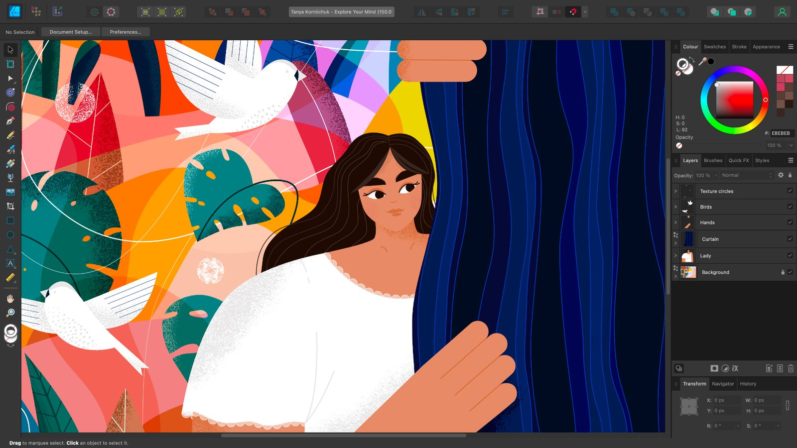

# What is Affinity Designer 2?

Affinity Designer 2 is a powerful vector design application coupled with pixel-based textures and retouching, all brought together in the same user interface. You'll benefit from lightning fast performance, ultimate flexibility and beautifully designed professional-level features.

### About Affinity Designer 2

The product possesses an impressive selection of professional-level concepts and features aimed at pushing the boundaries of your design experience.

#### Key concepts

- Ultimate flexibility with seamless mixed discipline creativity
- Different tool sets, called Personas, for different design needs
- Best in class performance
- Real-time dynamic tools and effects
- Accessible professional-level tools and features
- High-end file format support
- Built from the ground up to take full advantage of modern hardware, resulting in a smooth, fast user experience
- Multiple applications rolled into one! Combined seamlessly, avoiding time-consuming flipping between separate vector and pixel applications
- Combined vector and pixel editing in the same document, retaining vector editing throughout
- Non-destructive operations

Why not review the product's [key features](02-features.md) in detail?

### System requirements

Please see [this link](https://affinity.serif.com/designer/full-feature-list/) for up-to-date system requirements.

#### SEE ALSO:

- [Key features](02-features.md)
- [Personas](03-personas.md)
