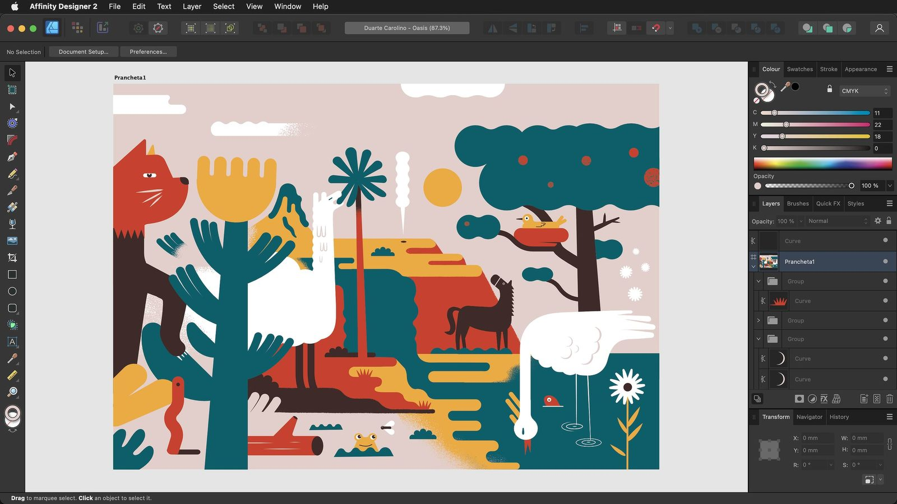

# Interface Visual Reference

Hover over any highlighted area to display a tooltip and identify it.

Designer

Pixel

Export

## Persona Toolbar

#### Allows you to switch between Personas: different workspaces for various tasks. The active Persona's icon appears with saturated colours.

## Toolbar

#### This contains commonly used functions. Its contents change depending on the active Persona and are customisable.

## Context Toolbar

#### This presents options for the currently selected tool.

## Tools Panel

#### Gives access to various tools for editing. The tools change based on the Persona that is selected. The panel's contents can be customised.

## Right Studio

#### Various panels providing essential functionality for controlling settings. Panels may differ between Personas. Additional panels can be toggled via the Window menu.

## Status bar

#### Highlights available keyboard modifiers for the selected tool.

## Document view

#### The area that displays your current document. If you are using artboards, it will display them surrounded by a pasteboard.

## Menu bar

#### The menu bar shows commands appropriate to the selected Persona, organised by task or category.

## Persona Toolbar

#### Allows you to switch between Personas: different workspaces for various tasks. The active Persona's icon appears with saturated colours.

## Toolbar

#### The toolbar contains commonly used functions. Its contents change depending on the active Persona and are customisable.

## Context Toolbar

#### The Context toolbar presents options for the currently selected tool.

## Tools Panel

#### Gives access to various tools for editing. The tools change based on the Persona that is selected. The panel's contents can be customised.

## Right Studio

#### Various panels providing essential functionality for controlling settings. The panels displayed may change to reflect the selected Persona. Additional panels can be toggled via the Window menu. Their layout can be customised.

## Status bar

#### Highlights available keyboard modifiers for the selected tool.

## Document view

#### The area that displays your current document. If you are using artboards, it will display them surrounded by a pasteboard.

## Menu bar

#### This shows commands appropriate to the selected Persona, organised by task or category.

## Persona Toolbar

#### Allows you to switch between Personas: different workspaces for various tasks. The active Persona's icon appears with saturated colours.

## Toolbar

#### The toolbar contains commonly used functions. Its contents change depending on the active Persona and are customisable.

## Tools Panel

#### Gives access to various tools for editing. The tools change based on the Persona that is selected. The panel's contents can be customised.

## Right Studio

#### Various panels providing essential functionality for controlling settings. The panels displayed may change to reflect the selected Persona. Additional panels can be toggled via the Window menu. Their layout can be customised.

## Status bar

#### Highlights available keyboard modifiers for the selected tool.

## Menu bar

#### The menu bar shows commands appropriate to the selected Persona, organised by task or category.

## Export Slice

#### An area of your current document designated for export to its own file.

## Export Slice

#### An area of your current document designated for export to its own file.

On Windows and earlier versions of macOS, Affinity Designer's toolbar and title bar are presented as separate elements but otherwise function the same.

#### SEE ALSO:

- [Toolbar](02-toolbar.md)
- [Persona toolbar](03-persona-toolbar.md)
- [Context toolbar](04-context-toolbar.md)
