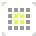
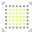
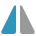
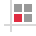
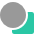

# Toolbar

The Toolbar hosts commonly used tools and functions to keep them at your fingertips. Options are placed in logical groups to improve ease of use.

### Settings

The following options are available from the Toolbar.

#### Defaults:

- 

   **Synchronise defaults from selection**—the default settings are updated to those of the currently selected object.
- 

   **Revert defaults**—synchronised defaults are reverted to saved defaults. If an object is currently selected, its attributes revert to the default settings.

#### Viewing mode:

- 

   **Pixel view mode**—activates Pixel mode to display vector designs as individual pixels.
- 

   **Retina pixel view mode**—activates Pixel (Retina) mode to display vector designs as individual pixels, representing viewing on retina and high DPI displays.
- 

   **Outline view mode**—activates Outline mode to display design as paths only. Use **View>View Mode>Wireframe** to choose an alternative 'Filled' wireframe option that displays both outlines and semi-transparent fills.

#### Order:

- 

   **Move to Back**—repositions the selected object(s) at the bottom of the layer. Alternatively, repositions the selected layer(s) at the bottom of the Layers panel.
- 

   **Back One**—moves the selected object(s) down one position in the layer. Alternatively, moves the selected layer(s) down one position in the Layers panel.
- 

   **Forward One**—moves the selected object(s) up one position in the layer. Alternatively, moves the selected layer(s) up one position in the Layers panel.
- 

   **Move to Front**—repositions the selected object(s) at the top of the layer. Alternatively, repositions the selected layer(s) at the top of the Layers panel.

> **Note:** The above options are also available from the **Layer** menu's **Arrange** submenu.

#### Transforms:

- 

   **Flip Horizontal**—flips the selected object(s) left to right.
- 

   **Flip Vertical**—flips the selected object(s) top to bottom.
- 

   **Rotate Anti-clockwise**—rotates the selected object(s) to the left by one 90° increment.
- 

   **Rotate Clockwise**—rotates the selected object(s) to the right by one 90° increment.

> **Note:** The above options are also available from the **Layer** menu's **Transform** submenu.

#### Align:

- 

   **Alignment**—displays a pop-up dialog allowing you to align and distribute selected object(s). The **Align to** pop-up menu sets the alignment criteria for the operation. For example, you can align in relation to Selection Bounds, page Spread, page Margin or the first (or last) object selected during a multi-object selection (by marquee drag over or selection with `Shift` ). If margins are not set, alignment is to the page edge instead.

#### Snapping:

- 

   **Force Pixel Alignment**—when selected (default), vector content will snap to full pixels when created, moved or modified. If this option is off, vector content can occupy partial pixels.
- 

   **Move by whole pixels**—allows you to constrain the movement of vector objects, nodes and handles to whole pixels.
- 

   **Snapping**—when selected, selected objects will obey the snapping rules defined by the current snapping options. If this option is off (default), snapping is disabled.
- Snapping options—customise settings from the pop-up menu.

#### Operations:

- 

   **Add**—creates a new object from the sum of the selected objects.
- 

   **Subtract**—removes sections from the lowest object based on the overlap with objects higher up in the selection. All other selected objects are discarded.
- 

   **Intersect**—creates a new object from the overlapping sections of selected objects.
- 

   **Xor**—merges selected objects into a composite object with transparent area where filled regions overlap.
- 

   **Divide**—splits object areas into separate objects; the object from the intersecting area retains the colour of the upper object.

> **Note:** New objects adopt the properties of the lowest object in the selection.

> **Note:** The above options are also available from the **Layer** menu's **Geometry** submenu.

#### Insert Target:

- 

   **Insert behind the selection**—when selected, new objects are added below the currently selected object(s).
- 

   **Insert at the top of the layer**—when selected, new objects are added at the top of the layer.
- 

   **Insert inside the selection**—when selected, new objects are added inside the current selection.

#### Account:

- 

   

   **Account**—registers your app, accesses your Affinity account and synchronises with purchased content. The icon will show green when signed into your account.

> **Note:** If all target options are off (default), new objects are added above the currently selected object(s).

#### SEE ALSO:

- [Customising the Toolbar](../21-workspace/customise/04-toolbar.md)
- [Object defaults](../08-object-control/26-object-defaults.md)
- [Viewing](../03-get-started/12-viewing.md)
- [Ordering objects](../08-object-control/12-ordering-objects.md)
- [Transforming objects](../08-object-control/16-transforming-objects.md)
- [Snapping](../17-design-aids/11-snapping.md)
