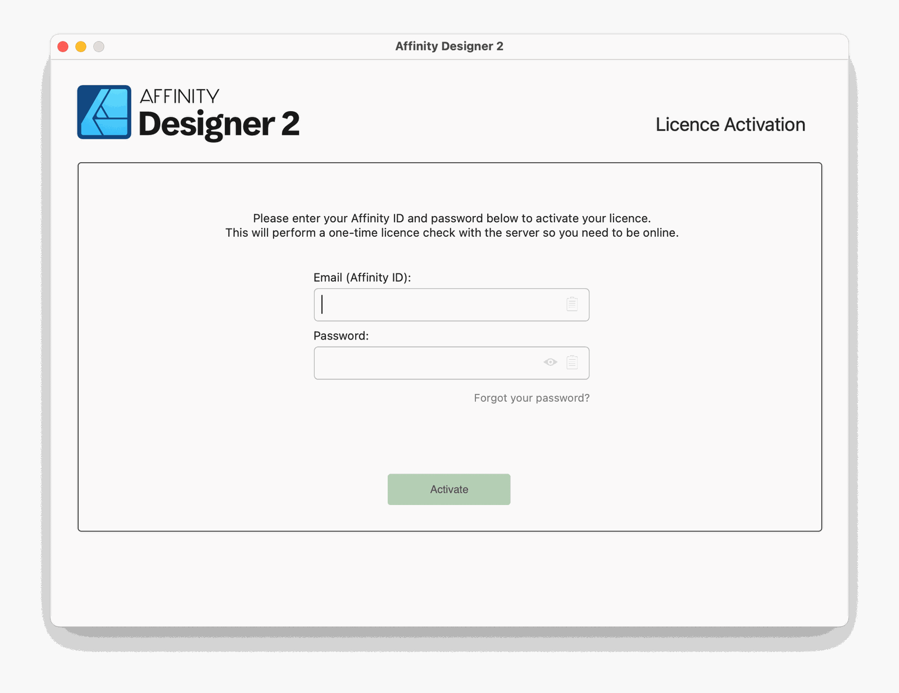
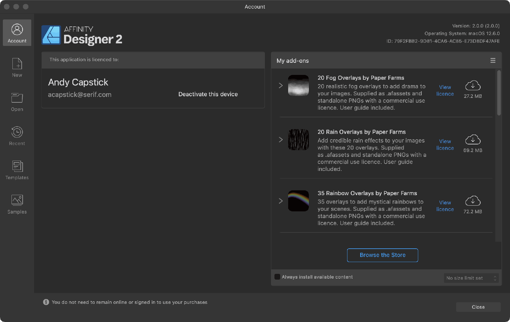

# App activation and installing content

If you've purchased from the [Affinity Store](https://affinity.serif.com/store) you'll need to activate your application's licence to be able to access your Affinity account. You can do this by entering your Affinity ID and password at startup.

App purchases via the App Store or Microsoft Store can be registered at startup by creating a new Affinity ID or by signing into an existing Affinity account. You do not have to register payment information to create an Affinity ID.

Content purchased from the Affinity Store, such as brush packs and .afassets files, is easily installed—manually or automatically—and available to use at all times. A persistent Internet connection is not required.

## Activating your app

The activation window is presented the first time your Affinity app is opened. If you deferred activation at that time, select **Account** on the **Toolbar** to reopen the window.

From the window, you can sign in using your existing Affinity ID.

## Managing your Affinity ID

With your app signed in to your account, the window changes to show all the content registered to your Affinity ID.

From here, you can access the Affinity Store, purchase content, choose which content is installed, and deactivate your device's Affinity app licences.

For content, the default behaviour is never to automatically download content, which avoids unwanted consumption of any metered data allowance.

To open this window at a later time, select **Account** on the **Toolbar**.

**To automatically install Affinity Store purchases:**

You might do this if your Internet connection is unmetered or your device is only ever online via Wi-Fi.

1. Check **Always install available content**.
2. From the adjacent menu, choose the maximum size for each piece of automatically installed content.

**To manually install content:**

1. (Optional) Select **View licence** next to each required item to review its usage terms.
2. Do one of the following:
   - Click each required item's adjacent cloud icon to download the item.
  - 

     Select the icon at the top right of **My add-ons** and then select **Download All**.

A green tick indicates the adjacent item is installed and available for use in your app.

A red cross indicates the adjacent item failed to download. Click it to retry.

> **Tip:** 
>
>  If an Affinity Store purchase that is compatible with the Affinity app in use is not listed, select the icon at the top right of **My purchases** and then **Resync library**.

> **Tip:** 
>
>  By default, only Affinity Store purchases compatible with the Affinity app in use are listed. To see all your content purchases, select the icon at the top right of **My purchases** and then **List incompatible packs**.

**To uninstall content:**

1. Do one of the following:
   - Click each unwanted item's adjacent green tick.
  - Select the icon at the top right of **My purchases** and then **Uninstall all**.
2. Select **Yes** on the confirmation dialog.

#### SEE ALSO:

- [Toolbar](../02-user-interface/02-toolbar.md)
