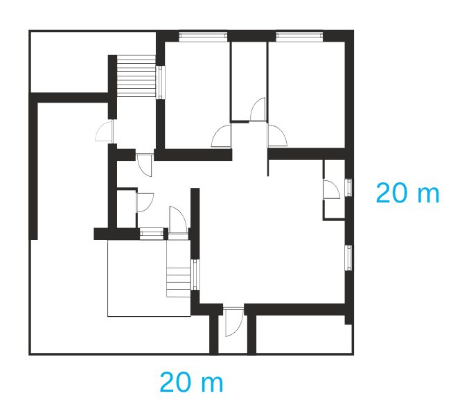

# Drawing scale

You can set a drawing scale if you want your design to use real world dimensions, typically for an architectural plan, engineering prototype or home DIY building project.

*Architectural plan showing scaled measurements.*

## About document scaling

Affinity Designer lets you set a drawing scale on any new document or open unscaled document; the drawing scale of imported CAD-based DWG/DXF documents is also honoured. This means page dimensions, object readouts (on creation/resizing/moving), measurements, guides, grids and rulers will all display 'real world' scaled values by default.

For documents with artboards, any selected artboard can have its own independent drawing scale applied.

Scale settings are saved with your document; as a result loading different designs (and jumping between artboards) may change your scaling and working document units.

As you import CAD documents, an **Apply Drawing Scale** setting lets you adopt the drawing scale of the original CAD file if set.

### Scale factors

When you set a scale factor you are setting a ratio between the basic document (unscaled) and the scaled document. For example, 1:10 means the document measurements will be scaled up x10 in the currently set document units, so a measurement of 1 cm will display as 10 cm when scaled.

| Example | Setting | Scaled result |
| --- | --- | --- |
| Room plans | Scaled (centimetres) 1 : 20 | 1 cm gives 20 cm (0.2 m) |
| Floor, elevation and section plans | Scaled (centimetres) 1 : 100 | 1 cm gives 100 cm (1 m) |
| Site plans | Scaled (centimetres) 1 : 200 | 1 cm gives 200 cm (2 m) |
| Prototype Engineering models | Scaled (metre) 1 : 5 | 1 m gives 5 metres |
| Craft models | Scaled (inches) 1 : 72 | 1 inch gives 72 inches (6 feet) |
| Cartography (small-scale maps) | Scaled (inches) 1 in : 1 mi | 1 inch gives 1 mile |
| Cartography (medium-scale maps) | Scaled (centimetres) 1 cm : 1 km | 1 cm gives 1 kilometre |
| Computer microchips | Scaled (millimetre) 1 : 0.025 | 1 mm gives 25 microns |
| Scientific microscopy | Scaled (millimetre) 1 : 0.001 | 1 mm gives 1 micron |

### Scaling by known distances

Instead of picking a set scale factor you can base your scaling on a known distance, e.g. a building that you know has to be 100 metres long. In doing so, the scale factor will be automatically calculated by measuring along the length of the drawn object (e.g., rectangle) that represents the building and setting that distance to your known measurement. That measurement will be reported as 100 metres.

### Measuring

You can use the **Measure** tool in conjunction with scale drawings for on-the-page measurements, which present real world measurements automatically as you move objects.

**To apply scaling to a new document:**

1. On the **File** menu, select **New**.
2. Choose a preset, then set up the document using the **Layout**, **Colour**, **Margins** and **Bleed** tabs.
3. On the **Scale** tab, check **Use Drawing Scale**.
4. Set a **Scale** factor (e.g., 1 : 10, 1 mm : 1 m) from the pop-up menu or enter your own scale factor.
5. Choose the **Readout Units**, either the currently chosen Document units or units independent of the document's units.

**To apply scaling to an open unscaled document:**

1. On the **File** menu, select **Document Setup**.
2. On the **Scale** tab, configure settings as described above.

Document units and object dimensions will update and scale accordingly.

> **Note:** 
>
>  Instead of using Document Setup, the Measure Tool lets you change a drawing scale factor at any time using the **Drawing Scale** option.

**

 To scale to a known distance:**

1. Select the **Measure Tool**.
2. Drag between two points that are of a known distance apart.
3. On the context toolbar, click **Assign Drawing Scale**.
4. Enter the real-world distance that is known to you, e.g. 100 m.

**To swap between scaled and unscaled measurements:**

- On the **Transform** panel, click the **Use current drawing scale** readout, which will display, e.g. 1:100.

#### SEE ALSO:

- [Create new documents](02-create-new-documents.md)
- [Document setup](10-document-setup.md)
- [Importing CAD documents](07-importing-cad-documents.md)
- [Measuring](../17-design-aids/09-measuring.md)
- [Measure Tool](../22-tools/design-tools/19-measure-tool.md)
