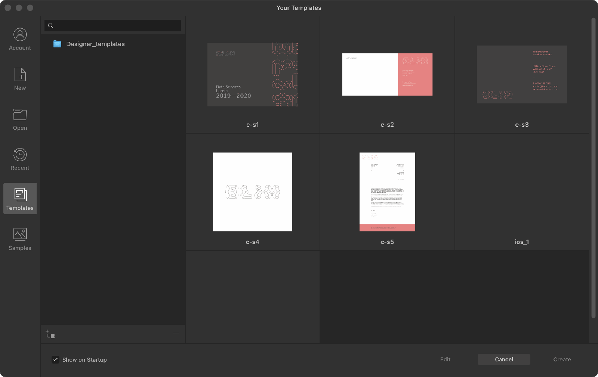

# Document templates

Templates are predesigned documents from which new documents can be created and then edited.

*Templates folder showing available templates in New Document dialog.*

> **Note:** No templates are shipped with your app by default.

## About document templates

Affinity Designer allows you to create (export) and open document templates, which typically contain placeholder content. Templates have a .aftemplate file extension.

When saving a template, a preferred set of defaults will be saved with it. Text attributes, object properties, stroke/fill colour, ruler and column guides, as well as grid setup, and more can be associated with a template.

From the **New Document** dialog, you can browse, search for, preview and edit existing document templates, as well as set up target template folders.

Template folders establish a 'target' folder in advance of exporting placeholder-rich files to it. It can be useful to store templates in a globally accessible location from which a design team can access a pool of managed documents.

If the template folder also contains Affinity documents (.afdesign, .afphoto or .afpublisher) you can treat those documents as templates too.

**

 To set up a target template folder:**

- From the **New Document** dialog, with **Templates** selected from the left-hand side, click **Add template folder**.

A file browser window will appear, allowing you to specify a folder location.

> **Tip:** Using a single template folder shared between all Affinity apps means your templates can be kept in one place; if a template is edited it will be synchronised across all apps.

**To save a file as a template:**

- From the **File** menu, select **Export as Template**.

A pop-up dialog will appear, prompting you to enter a name and choose a location for your template (saved with an .aftemplate file extension). By default, the target template folder you set up previously will be used.

**Windows:**

> **Note:** You can also save a file using **File>Save As** if you name it with a .aftemplate file extension.

**To create an untitled document from an Affinity template (or any Affinity document):**

- From the **New Document** dialog, with **Templates** selected from the left-hand side, double-click on a chosen template thumbnail or click **Create**.

> **Note:** A search bar in the dialog allows you to locate templates.

**To open a template for editing:**

- From the **New Document** dialog, with **Templates** selected, select a template thumbnail and choose **Edit**.

**

 To remove a template folder:**

- From the **New Document** dialog, with **Templates** selected, select a folder, then click **Remove template folder**.

> **Note:** The **Remove template folder** option won't be visible if the folder is a sub-folder of the top level folder that was added and therefore cannot be removed.

#### SEE ALSO:

- [Create new documents](02-create-new-documents.md)
- [About add-ons](../16-add-ons/01-about-add-ons.md)
