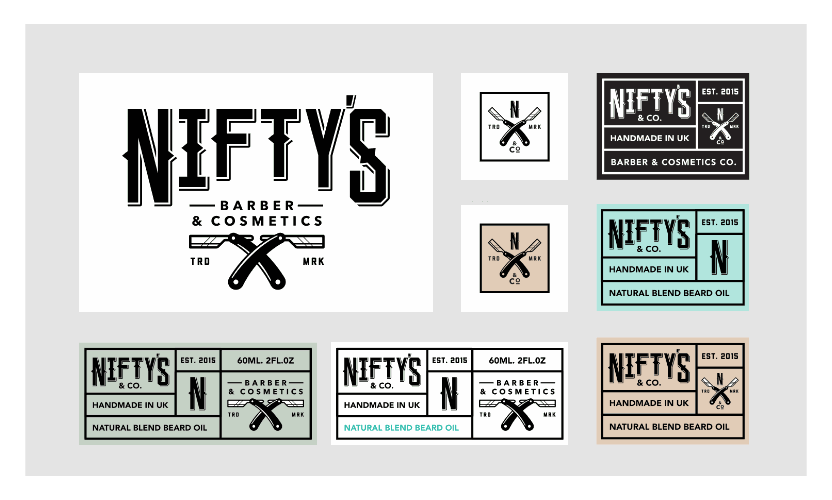

# Artboards

Artboards are discrete design areas, of any shape and size, within the same document, on which you can place design elements. Objects which extend beyond the boundary of an artboard are clipped to the edge of the artboard's design area.

*Artboards displaying a branding concept for a fictional company.*

## About artboards

Using artboards, you can convert a single page document into a multi-page, multi-product design project. Their true power lies within their flexibility—artboards have limitless uses.

The size of artboards can be based on presets or customised to suit your needs. They can be moved and resized just like other objects in a document and can be arranged in any way you want—sometimes this will be important to the outcome of the design, other times it simply helps you organise your work.

Artboards also possess their own colour and opacity properties, so these can be adjusted at any time during the design process.

Artboards can be exported and printed together or separately, but are all saved together in their parent document.

You can apply a drawing scale to any artboard. Different artboards can adopt their own drawing scale independently of other ones.

> **Note:** Artboards come complete with a dedicated [Artboard Tool and context toolbar](../22-tools/design-tools/13-artboard-tool.md).

### Artboard topics:

- [Adding and removing artboards](02-adding-and-removing.md)
- [Selecting, moving and resizing artboards](03-selecting-moving-and-resizing.md)
- [Renaming and viewing artboards](04-renaming-and-viewing.md)
- [Aligning and distributing artboards](05-aligning-and-distributing.md)
- [Artboard colour and opacity](07-colour-and-opacity.md)
- [Exporting artboards](09-exporting.md)
- [Printing artboards](10-printing.md)

**Some uses for artboards**

- Two artboards of equal size might represent two sides of a page.
- Several artboards of varying sizes could be used to create a branding concept including a company logo, letterheaded paper, compliment slip, envelope, business card and brochure.
- Various sized artboards might be placed together for an advertising campaign which includes a billboard poster, full- and half-page ads, flyers, as well as web banners and rich-graphic emails.
- Numerous artboards of equal size showing different screen displays of a mobile app.
- Two equal sized artboards could be used to design the back and front of a book cover, with a third, changeable width artboard in the middle to accommodate the spine.
- Numerous artboards of equal size could be created to allow for the design of a pack of cards.
- Progressive mockup artboards might be placed together leading to the final, signed off design artboard.
- Several artboards displaying colour variants of an identical design.
- Various sized artboards arranged logically to form the basis of a concept sheet for character design.

#### SEE ALSO:

- [Artboard Tool](../22-tools/design-tools/13-artboard-tool.md)
- [Create new documents](../03-get-started/02-create-new-documents.md)
- [Open documents and images](../03-get-started/04-open-documents-and-images.md)
- [Drawing scale](../03-get-started/09-drawing-scale.md)
