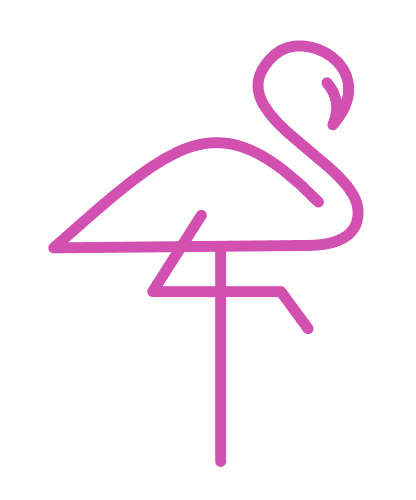
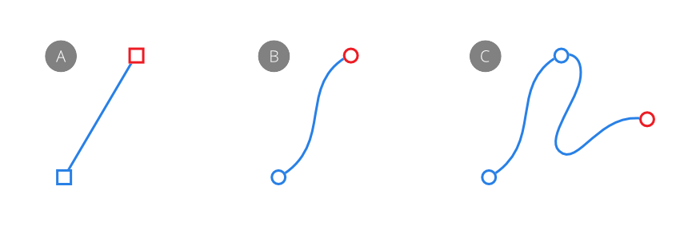
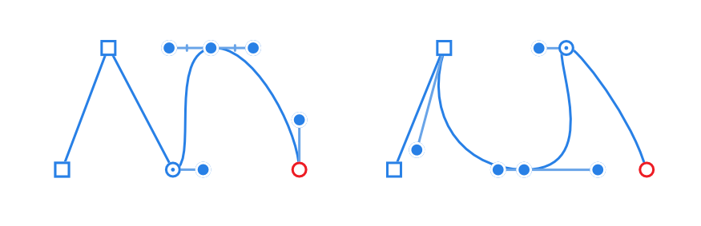
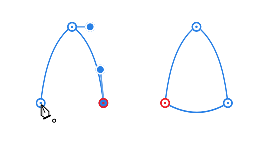

# About lines, curves and shapes

When you want to draw vector shapes and curves you'll need to use the [Pen](../22-tools/design-tools/06-pen-tool.md), [Pencil](../22-tools/design-tools/07-pencil-tool.md), [Vector Brush](../22-tools/design-tools/09-vector-brush-tool.md) and [shape](06-draw-and-edit-shapes.md) tools. Editing curves and shapes is done with the [Node](../22-tools/design-tools/02-node-tool.md) tool or the `Cmd`  as you draw.

> **Note:** Curves and shapes have both stroke and fill properties. These can be defined before creation and can be modified at any point afterwards.

## Curves and lines

A curve is an open path that has a distinct start and end. These end stops are defined by nodes. A curve with just two nodes is referred to as a line.

The path between nodes is known as a segment and can be straight (A) or arched (B). Complex curves are created from multiple nodes connected by segments (C). Lines and curves generally have a stroke applied.

The type of node controls the connected segments. There are three basic types of node:

- Sharp (A)—causes an abrupt change in direction between segments, creating a point.
- Bézier (smooth) (B)—creates a continuous curve between segments.
- Smart (C)—creates a continuous curve but uses a line of best fit.

When drawing curves, any combination of nodes can be used. Each node also has control handles. These appear when the node is selected. The length and slope of the control handles determine the shape of the segment. A node can be edited at any time.

## Shapes

A shape is a closed path with no discernible start or end. It is made up of multiple nodes and segments.

You can also easily create geometric shapes using the [Shape tools](06-draw-and-edit-shapes.md). These have special properties that enable you to quickly create otherwise difficult to draw shapes, such as circles, rectangles and polygons.

#### SEE ALSO:

- [Edit curves and shapes](03-edit-curves-and-shapes.md)
- [Draw and edit shapes](06-draw-and-edit-shapes.md)
