# Draw curves and shapes

Curves and shapes are easily created using the Pen Tool. The Pen Tool has several modes that change the way the path is drawn.

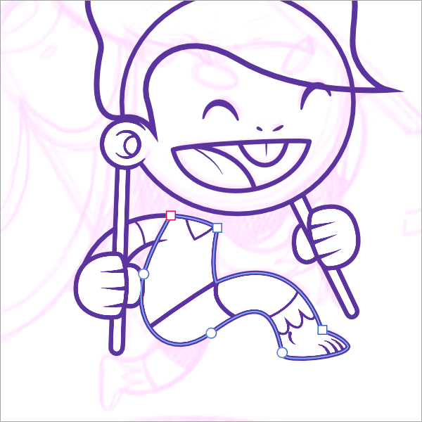

**

 To draw precise curves with the Pen Tool:**

1. Select the **Pen Tool**.
2. On the context toolbar, select a **[Mode](../22-tools/design-tools/06-pen-tool.md)**:

  - 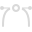

     **Pen Mode**—click-drag on the page to create repeated nodes; repositioning the displayed off-curve control handles at each node defines the shape of the next segment as you lay down nodes.
  - 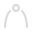

     **Smart Mode**—click repeatedly on the page to lay down each node; a best fitting curve is created without need for control handle adjustment.
  - 

     **Polygon Mode**—click repeatedly on the page to lay down each node; a line is created with sharp nodes made up of straight segments.
  - 

     **Line Mode**—click and drag on the page to create a simple single-segment straight line that self-terminates.
3. To complete the curve without closing it, press the `Esc` . To close the curve, click on the starting node.

> **Note:** To draw a straight line of a specific rotation and/or length, with a single uncurved line selected using the **Move Tool**, on the **Transform** panel, adjust the **Rotation** and/or **Length** values.

> **Note:** Other context toolbar options can be used *in conjunction* with any one of the four modes above:
>
>
> - 
>
>    **Preserve Selection When Creating New Curves**—when enabled, it keeps the previously drawn curve(s) selected so that their nodes and geometry can be more easily snapped to as you draw.
> - 
>
>    **Add New Curve to Selected curves object**—when enabled, the mode creates additional curves on the same layer as the initial curve—this gives better management of a multitude of curve layers. For example, the character 'a' is made up of two curves that can be a single 'curve object'. From **Layer>Geometry**, choose **Separate Curves** to separate each curve into separate layers or **Merge Curves** to consolidate selected curves into one layer.
> - 
>
>    **Rubber Band Mode**—when enabled, it previews the next segment to be drawn before placement of the new leading node. Use with `Ctrl`  pressed for straight-line segment previews.
> - 
>
>    **Rubber Band Mode**—when enabled, it previews the next segment to be drawn before placement of the new leading node.

A number of cursor types may appear when using this tool, indicating the outcome of the next click.

| Cursor type | Description |
| --- | --- |
| 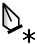 | Asterisk—creates a new curve |
|  | Plus—creates a new node and curve segment |
| 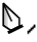 | Slope—converts to sharp corner or drag to recreate node |
|  | Circle—creates a closed shape |
| 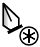 | Circled asterisk—creates a new curve from an existing curve’s node. |
| 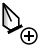 | Circled plus—creates a new node overlapping an existing curve’s node. |

**

 To continue an existing curve:**

1. Press the `Cmd`  to edit curve or select the curve with the **Node Tool**.
2. Place the cursor over the final node on the path that you want to continue.
3. Click once to select the node.
4. Release the `Cmd`  (or select **Pen Tool**) and click/drag to place new nodes as needed. This can be placed over an existing node on the same curve, creating coincidental overlapping nodes.

**To change a curve or shape's stroke width:**

Do one of the following:

- On the **Stroke** panel, adjust the **Width** via slider or input absolute values, expressions and formulas (percentages).
- Use the [ or ] s (decrease or increase width, respectively) as you draw or edit a curve.

**

 To close curves to create a custom shape:**

Do one of the following:

- With the curve selected with the **Pen** or **Node Tool**, click **Close Curve** on the context toolbar.
- When creating the curve with the Pen Tool, click on the starting node to join it to the final node and create the shape.

**To simulate pressure-sensitive pen strokes:**

- On the **Stroke** panel, click **Pressure**.
- From the displayed profile chart, select an end node on the profile's line and drag it vertically to a new position; nodes can be added by clicking on the line and then positioned freely.
- Repeat for other nodes as needed.

*Example pressure profiles, all superimposed with expected stroke.*

**To add arrowheads to a stroke:**

1. With a line or curve selected, from the **Stroke** panel, select an arrowhead style from the **Start** and/or **End** pop-up menus.
2. Choose where to position the start and end styles from **Place arrow within the line** and **Place arrow at the end of the line**.
3. With arrowhead styles selected, you can then enter a percentage to the **Start** and **End** styles to adjust the size of your selected arrowheads in proportion with the stroke width.

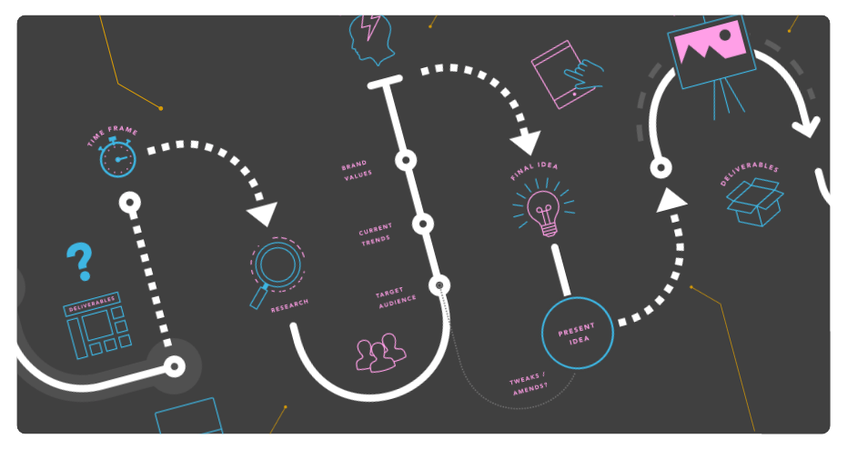
*Example arrowheads added to strokes.*

### About dot/dash line styles

The **Stroke** panel allows you to change your stroke into a dotted or dashed line. For either, the **Dash Pattern** controls appear when the Dash Line Style is set.

A section of the panel sets the line's pattern using three number pairs:

- The first two **dash** and **gap** values set the length of the initial dot/dash and subsequent space, respectively. This gives a uniform pattern.
- The third/fourth and fifth/sixth pair values, when set, introduce a more complex pattern by setting a different size for additional dots/dashes and spaces.

To configure, you can enter values directly or drag the dash (white) or gap (black) strips to the left or right under the number sequence to adjust in 0.1 increments.

 When enabled, **Balanced Dash Pattern** applies the pattern to the shape's outline so it appears seamless along the outline and is symmetrical at all corners. When **Balanced Dash Pattern** is disabled, you can set the **phase** value to manually 'shift' the dot/dash line style along so the design begins at a different point in the style's sequence.

> **Note:** You can choose between dots or dashes by setting the **Cap** type on the **Stroke** panel. Use **Round Cap** for dots and rounded dashes, **Butt Cap** for squared dashes.

> **Note:** All values are based on the current line width, e.g. a value of 2 is twice the line width.

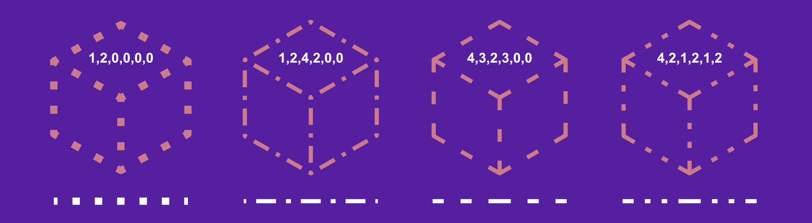
*Dashed line style examples with **Butt Cap** and **Balanced Dash Pattern** enabled.*

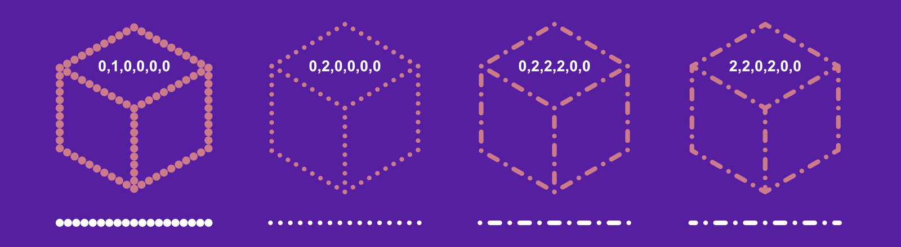
*Dotted and dashed line style examples with **Round Cap** and **Balanced Dash Pattern** enabled. The value 0 shows as a dot because it is zero length and formed from a pair of round caps.*

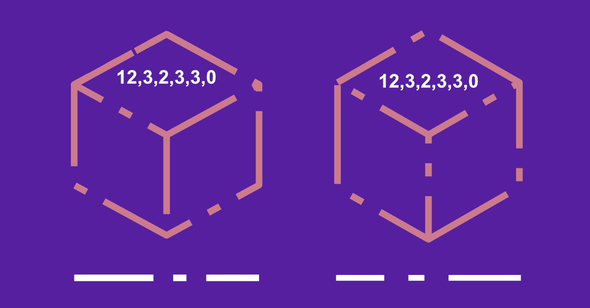
*Dashed line style examples with **Butt Cap** enabled, **Balanced Dash Pattern** disabled and **Phase** settings **0** (left) and **2** (right), respectively.*

> **Note:** ### Modifier keys
>
>
> When using the Pen Tool, the following modifier s can be used to speed up the workflow as you draw:
>
>
> - The `Cmd`  temporarily activates the Node Tool.
> - The `Shift`  constrains control handles to 45° intervals in Pen Mode. In Smart Mode, node positioning is constrained instead.
> - The `Alt`  forces the node into cusp mode.
> - Pressing the `Spacebar` while clicking and dragging lets you reposition the last drawn node without affecting control handle position which maintains curvature in and out of the node.
>
>
> For Pen Tool, Node and shape tools, the following modifier s can be used as you draw or when editing the object:
>
>
> - To decrease or increase stroke width by percentage, use the [ or ] s, respectively. For smaller absolute increments instead, use an additional `Shift`  modifier.

#### SEE ALSO:

- [Draw and edit shapes](06-draw-and-edit-shapes.md)
- [Edit curves and shapes](03-edit-curves-and-shapes.md)
- [Pen Tool](../22-tools/design-tools/06-pen-tool.md)
- [Pencil Tool](../22-tools/design-tools/07-pencil-tool.md)
- [Node Tool](../22-tools/design-tools/02-node-tool.md)
- [Pressure sensitivity](14-pressure-sensitivity.md)
- [Stroke panel](../23-panels/16-stroke-panel.md)
- [Keyboard shortcuts for curve drawing operations](../26-keyboard-shortcuts/01-keyboard-shortcuts.md)
