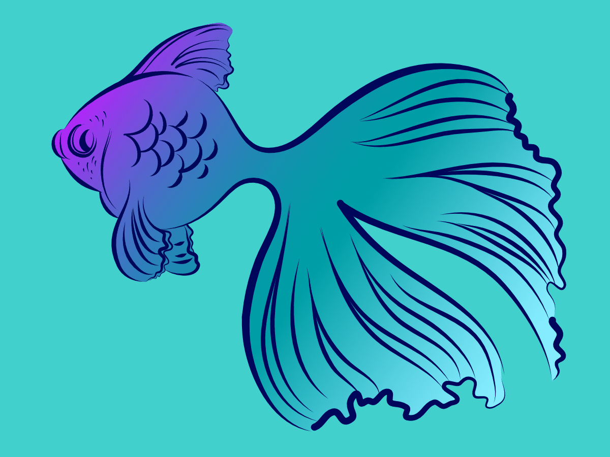
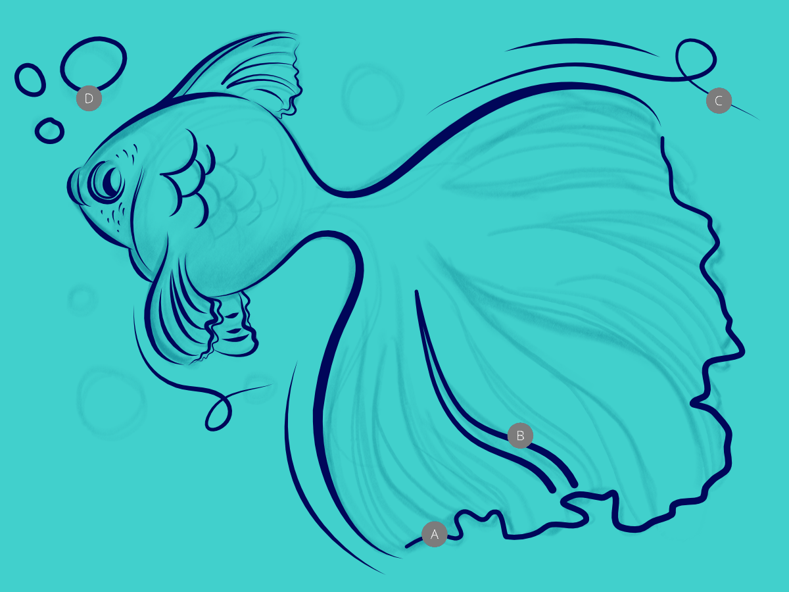
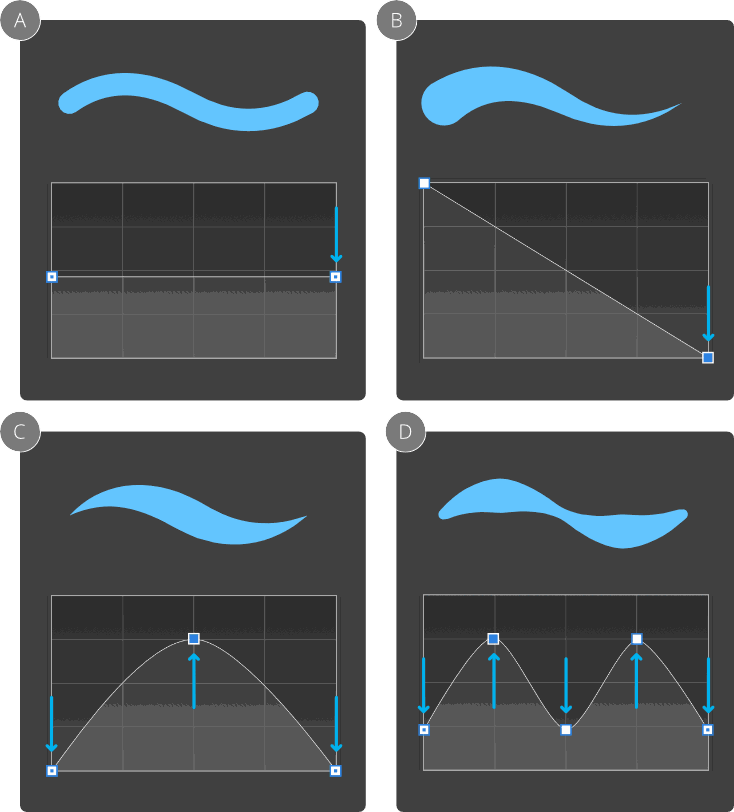

# Drawing pencil lines

Use the **Pencil Tool** to apply pencil lines, giving a hand-drawn effect to your design. A range of settings can be enabled to fine-tune the pencil stroke's appearance.

## Stroke stabilisation

Affinity Designer's stroke stabiliser smooths pencil lines as you draw, helping you to produce a more aesthetically pleasing stroke.

A **Rope** stabiliser or **Window** stabiliser mode can be used; the former drags the stroke end by a 'rope' to smooth the stroke, but lets you introduce sharp corners at increasing rope **Length** (radius) values by redirecting the slackened rope; the latter will smooth the stroke by averaging sampled input positions within a **Window** whose size is configurable.

*(A) Pencil line without stabilisation, (B) with Rope mode stabilisation, (C) with Window mode stabilisation and (D) auto-closed pencil line.*

## Pressure sensitivity

The stroke's width can be tapered either by velocity—most useful when drawing with a mouse—or by [pressure](14-pressure-sensitivity.md)—for use when drawing with a pressure-sensitive pen tablet.

**

 To draw freehand lines:**

1. Select the **Pencil Tool**.
2. (Optional) On the context toolbar, do one (or more) of the following:
   - Enable **Sculpt** to reform or continue a previous pencil stroke.
  - (Optional) Enable a **Stabiliser** option to smooth the stroke using different smoothing modes (Rope or Window).
  - (Optional) Enable a **Controller** to have the stroke respond automatically to a pen tablet's **Pressure** input or speed of mouse movement (**Velocity**), or manually to the **Stroke** panel's Pressure profile chart (**None**).
  - Check **Use fill** to automatically fill the concave area created by the curve with the current fill colour.
  - Check **Auto Close** to close the curve, creating a closed shape. A natural curve will be formed between the end nodes on closing.
3. Drag on the page in the direction that you want the path to follow.

> **Note:** You can pick up colour as you design by using the `Alt`-key and dragging.

**To simulate pressure-sensitive pencil strokes:**

- On the **Stroke** panel, click **Pressure**.
- From the displayed profile chart, do one of the following:
   - Drag either end node downwards to reduce the stroke width uniformly along the stroke length.
  - Select either end node twice (or press the `Alt` ), then drag it downwards to taper the stroke in that direction. The stroke will taper linearly.
  - Drag either end node downwards, then click halfway along the profile line to add a node which can be dragged upwards to taper the stroke according to the curvature of the graph.
  - Drag either end node downwards, then click repeatedly along the profile line to add multiple nodes which can be positioned vertically and horizontally to form a variable width stroke.
  - Repeat for other nodes as needed.

*Example pressure profiles, all superimposed with expected stroke.*

> **Note:** ### Modifier keys
>
>
> When using the Pencil Tool, the following modifier keys can be used to speed up the workflow as you draw:
>
>
> - To decrease or increase stroke width by percentage, use the [ or ] s, respectively. For smaller absolute increments instead, use an additional `Shift`  modifier.
> - Drawing with the `Ctrl`  pressed creates a straight pencil stroke. Click to start your initial stroke with the  pressed, then click at the position where your stroke is to end.
> - Drawing with the right-mouse button pressed creates a straight pencil stroke. Click to start your initial stroke with the  pressed, then click at the position where your stroke is to end.
> - The `Shift`  constrains a straight pencil stroke to 45° intervals, including to horizontal and vertical.
> - The `Cmd`  temporarily activates the [Node](03-edit-curves-and-shapes.md) Tool.
> - To reposition the stroke on the page, press the `Spacebar` as you draw.

#### SEE ALSO:

- [Draw and edit shapes](06-draw-and-edit-shapes.md)
- [Edit curves and shapes](03-edit-curves-and-shapes.md)
- [Pencil Tool](../22-tools/design-tools/07-pencil-tool.md)
- [Node Tool](../22-tools/design-tools/02-node-tool.md)
- [Pressure sensitivity](14-pressure-sensitivity.md)
- [Stroke panel](../23-panels/16-stroke-panel.md)
