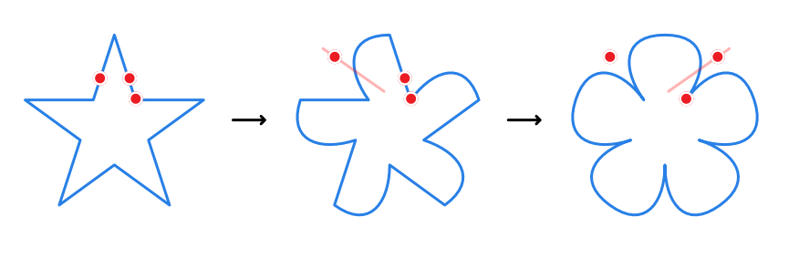
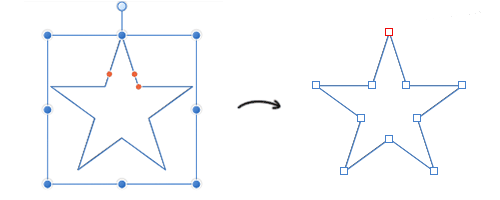

# Draw and edit shapes

Geometric and other special shapes that would be otherwise hard to draw can be easily created using one of the corresponding shape tools. Once drawn, both the shape and its stroke can be made into curves for more freeform design.

**

 To draw a new shape:**

1. Choose one of the shape tools, e.g., **Rounded Rectangle** from the Tools panel.
2. Drag on the page to create the shape and use the `Shift` modifier to constrain the shape's proportions if needed.

  
3. Modify options as required, either by changing the values on the context toolbar or by dragging the red handle(s) (if available).

  

> **Tip:** When you hover over a handle, a red guide line will appear to suggest the direction of drag needed to modify your shape.

> **Tip:** Shapes can be converted to text frames via **Layer>Convert to Text Frame**.

**To reset a shape handle to its initial position:**

- Double-click the red handle that has been previously moved. Any other repositioned handles on the shape will not be affected.

**

 To edit an existing shape:**

1. Click the **Node Tool**.
2. Select the shape, either by clicking the shape or by clicking the layer entry in the **Layers** panel.
3. Edit the shape as required by either by directly dragging the red handle(s), or by changing the values on the context toolbar.

> **Tip:** Shapes have special snapping properties which allow lines to snap to various angles within the shape.

**

 

 To convert a shape to curves:**

- Click **Convert to Curves**, found in either the **Layer** menu or on the context toolbar.

  

The shape is now made from curves and the **Node Tool** is automatically selected. Segments and nodes can be modified with the Node Tool.

> **Tip:** Applying a rounded corner to a geometric shape using the **Corner Tool** will automatically convert that shape to curves. From that point, you won't be able to make use of the shape tool's inherent 'morphing' behaviour.

> **Note:** ### Modifier keys
>
>
> As you create shapes, the following modifier keys can be used while the shape is being drawn:
>
>
> - The `Shift`  constrains shape's proportions at the time of creation.
> - The `Cmd`  draws or resizes from centre (can be combined with the `Shift` ).
> - Where appropriate, on many shapes, the `Cmd`  moves the red handles in pairs.
> - The `Ctrl`  lets you rotate a shape about its opposite handle.
> - Pressing the right mouse button lets you rotate a shape about its opposite handle.
> - The `Spacebar` lets you reposition a shape at the time of creation.
> - You can pick up colour as you design by using the `Alt`-key and dragging.

## Presets

Presets can be applied to shape tools from the context toolbar. These allow you to take variations of standard shapes and reuse them instantly. A number of master presets have been supplied, but you can also create and define your own presets using the **Presets Manager**.

**

 To apply tool presets:**

1. Select the shape you wish to access presets for.
2. From the shape's context toolbar, click the **Presets** icon.
3. A pop up panel containing a list of available presets for the shape will be displayed. By clicking on a preset, you can apply it to the selected shape.

> **Note:** Master presets which have been supplied by Affinity will have an Affinity logo in the bottom right hand corner; user defined or custom presets will have a user logo in this corner instead.

**

 

 To create new custom tool presets:**

1. Select the shape you wish to create a new preset for and edit it to your liking.
2. From the shape's context toolbar, click the **Presets** icon.
3. From the pop up panel, select **Create Preset** from the preferences menu. Enter a name and category for your new preset, then click **Create**.

**

 

 To manage tool presets:**

1. Select the shape you wish to access presets for.
2. From the shape's context toolbar, click the **Presets** icon.
3. A pop up panel containing a list of available presets for the shape will be displayed. From this panel, select **Manage Presets** from the preferences menu.
4. The **Preset Manager** will be displayed. From here, you can do the following:
   - Drag and drop preset thumbnails into an existing category to move them into that category.
  - Right-click on a preset to rename it, delete it, export it, or revert any changes you have made to it.
  - Click on a category menu to rename it, delete it, restore master presets to it, import user presets directly to it, or export presets from it.
  - To create a new preset category, select **Create Category** and enter a name for your new category.
  - To return all master presets to their original uncategorised state, select **Restore Master Presets to Category**.
  - To export any user defined presets from the **Presets Manager**, select **Export User Presets**. Type a name for the exported file along with any tags you would like it to have, choose the disk location you want to save it to and click **Export** or **Save**.
  - To import presets to the **Presets Manager**, select **Import Presets**. Locate the .aftoolpresets file you want to import and click **Import**.
  - To view presets for a different shape, select the shape from the **Filter:** menu.

#### SEE ALSO:

- [About geometric shapes](05-about-geometric-shapes.md)
- [About lines, curves and shapes](01-about-lines-curves-and-shapes.md)
- [Edit curves and shapes](03-edit-curves-and-shapes.md)
- [Frame text](../12-text/04-frame-text.md)
- [Keyboard shortcuts for curve drawing operations](../26-keyboard-shortcuts/01-keyboard-shortcuts.md)
