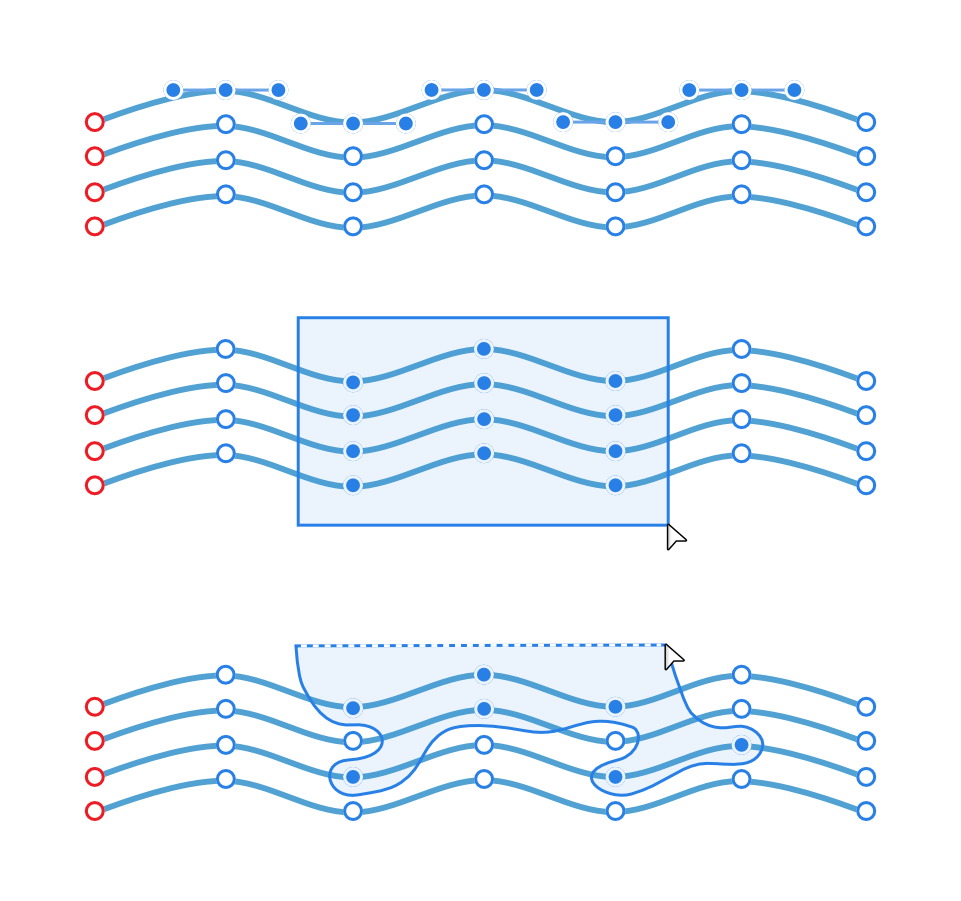
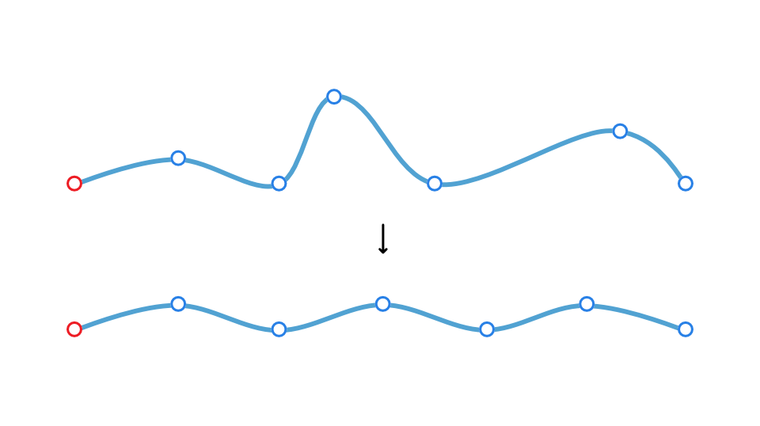

# Selecting and aligning nodes

When editing curves or shapes you can select multiple nodes in different ways. With selection control, you can then align and distribute nodes as you would with multiple selected objects, as well as [transform](08-transforming-curves-and-shapes.md) selected nodes.

*Selecting node-by-node, by marquee and by lasso.*

*Aligning and distributing selected nodes.*

> **Note:** Use the [ and ] keys to jump forwards and backwards through nodes on a curve.

**

 To select multiple nodes:**

- With the **Node Tool** and curve/shape selected, do one of the following:
   - Node-by-node selection: With the `Shift`  pressed, click individual nodes in turn.
  - Marquee selection: Drag a marquee selection area over nodes to include them in your selection.
  - Lasso selection: With the `Alt`  pressed, either:
     - Draw freehand around nodes to encompass them in the blue selection area.
    - Draw a polygonal area around nodes taking a click-by-click approach.

> **Note:** To deselect a node from a multiple selection, click it while the `Shift`  is pressed.

**

 To align/distribute multiple nodes:**

1. With the **Node Tool** and curve/shape selected, select one or more nodes on the curve or shape as above.
2. On the Toolbar, click **Alignment**, set the **Align To** option, then an **Align Horizontally** or **Align Vertically** option from the pop-up panel. To distribute, choose a **Space Horizontally** or **Space Vertically** option from the end of the icon row.
3. Click **Apply**.

#### SEE ALSO:

- [Node Tool](../22-tools/design-tools/02-node-tool.md)
- [Transforming curves and shapes](08-transforming-curves-and-shapes.md)
