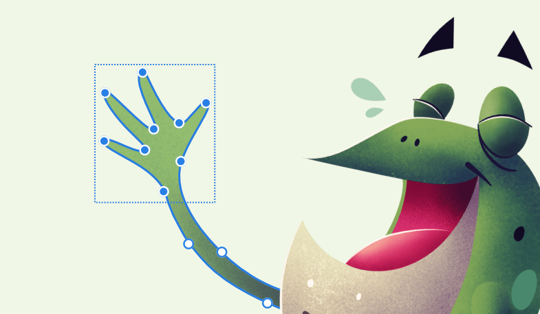
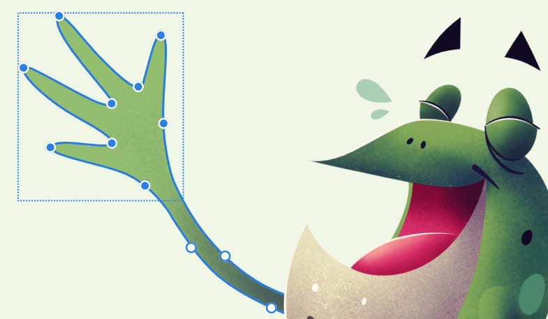
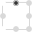
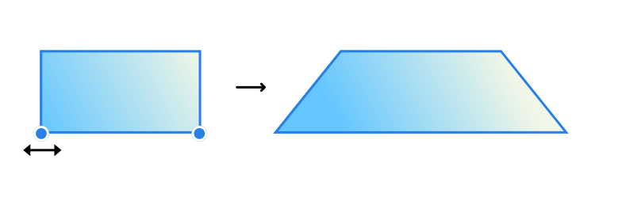

# Transforming curves and shapes

Just as objects can be transformed, the nodes of curves and shapes can be transformed too.

*Selection box around selected nodes being transformed*

Node transformation works by forming a selection box around selected nodes. In doing so the box can be transformed in the same way that an object's selection box can be. As a result, the position of nodes relative to each other is altered in the transformation process which reshapes the curve or shape in different ways.

Many nodes can be transformed simultaneously or you can transform two selected nodes

> **Note:** Transformation is possible on both two-dimensional and axonometric designs (e.g., isometric).

**

 

 To transform multiple nodes:**

1. With the **Node Tool**, select one or more nodes on a curve or shape.
2. On the context toolbar, enable **Transform Mode** in the **Transform** section.
3. Resize, rotate and skew either directly on the curve or shape using selection box handles or use the **Transform** panel for absolute precision.

> **Tip:** With the **Transform** panel you can transform in relation to a configurable anchor point.

> **Tip:** The **Transform** section also offers some options to hide selection when dragging, switch on alignment handles within the selection box for more precise transforms, control selection areas to encompass all the curve outline and cycle the type of selection box.

**To transform shapes for a simple distortion effect:**

1. Select two nodes on the shape.
2. Enter **Transform Mode**.
3. With the `Cmd`  pressed, drag any selected node inwards or outwards.

This is particularly effective on simple shapes such as rectangles.

#### SEE ALSO:

- [Node Tool](../22-tools/design-tools/02-node-tool.md)
- [Selecting and aligning nodes](07-selecting-and-aligning-nodes.md)
- [Transforming objects](../08-object-control/16-transforming-objects.md)
- [Transform panel](../23-panels/22-transform-panel.md)
- [Keyboard shortcuts for transforming operations](../26-keyboard-shortcuts/01-keyboard-shortcuts.md)
