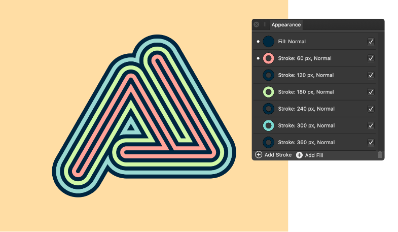

# Using multiple strokes and fills

From the **Appearance** panel, you can add a number of separate strokes and fills to any selected object. These can be gradients or solid colours. This combined with the ability to alter the transparency and blend mode for each stroke and fill applied, can be used to produce a range of different colour interactions between upper and lower strokes and fills.

Strokes and fills listed in the **Appearance** panel are arranged by z-order (like layers in a layer stack) and can be dragged and dropped to reposition them within the panel.

> **Tip:** By setting a decreasing stroke width on strokes higher up in the stack, you can easily create interesting decoupage effects, which work especially well with varying blend modes (for example, the erase mode).

**To add additional strokes or fills:**

1. With an object selected, click on the **Appearance** panel.
2. From the panel, select **Add Stroke** or **Add Fill**.

**To edit a stroke or fill:**

- Select the stroke or fill in the **Appearance** panel.
- Click on the stroke/fill colour selector to alter the colour or apply a gradient.
- For strokes, click on the stroke width value to alter the stroke properties.
- Click on the current blend mode to swap it for another using the pop-up menu.

**To make a stroke or fill active for editing:**

- With an object selected, click on a stroke or fill from within the **Appearance** panel.

> **Note:** When a fill or stroke is made active, this will be denoted by a white dot to the left of that stroke/fill in the **Appearance** panel. This fill or stroke can then be edited directly via the **Colour** and/or **Stroke** panels. Strokes and fills can also be saved as styles within the **Styles** panel.

**To reorder strokes and fills:**

- Drag and drop strokes and fills within the **Appearance** panel.

> **Note:** The **Stroke** panel's **Order** button can also be used to place the active stroke either in front of or behind the object's fill(s).

#### SEE ALSO:

- [Appearance panel](../23-panels/02-appearance-panel.md)
- [Stroke panel](../23-panels/16-stroke-panel.md)
- [Styles panel](../23-panels/17-styles-panel.md)
