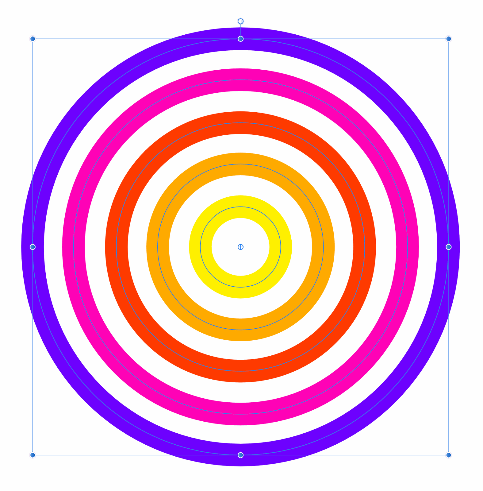
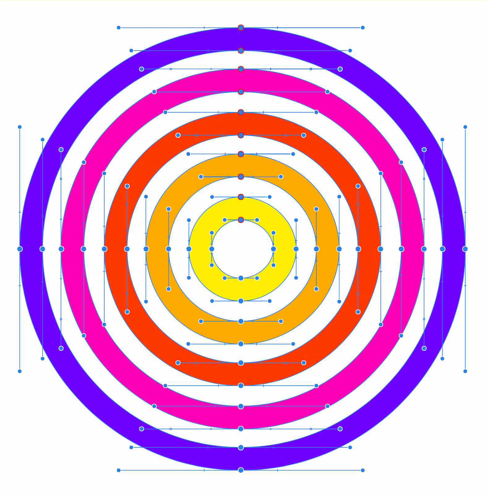

# Expand stroke

Expand stroke expands the stroke of a shape or line, converting the line's boundaries into paths forming a closed shape.

*Before and after expand stroke is applied.*

Drawing a line creates an open path with a skeletal structure that can be adjusted. The boundaries of a line, on the other hand cannot be edited. Expanding the stroke converts the line's boundaries into paths forming a closed shape, so you can edit them individually in the same way as a regular shape.

The expand stroke feature has a range of uses. It can be used to:

- Modify the shape of strokes by adjusting its curves and nodes.
- Separate a shape into its two components: its stroke and fill (without stroke outline)
- Convert strokes to flattened shapes that can scale better as a flattened image, which looks more consistent across browsers.
- Flatten strokes prior to SVG export in web development.

**

 

 To expand a stroke:**

1. Select the shape with either the **Move Tool** or the **Node Tool**.
2. Click **Expand Stroke** on the **Layer** menu.

The shape's stroke is now detached from the object and made into curves. As with **Convert to Curves**, the resulting curves can then be manipulated with the **Node Tool**.

> **Tip:** Pixel brush strokes, either as standalone strokes or on object outlines, cannot be expanded as they are based on pixels rather than being vector.

#### SEE ALSO:

- [About geometric shapes](05-about-geometric-shapes.md)
- [Draw and edit shapes](06-draw-and-edit-shapes.md)
- [Edit curves and shapes](03-edit-curves-and-shapes.md)
