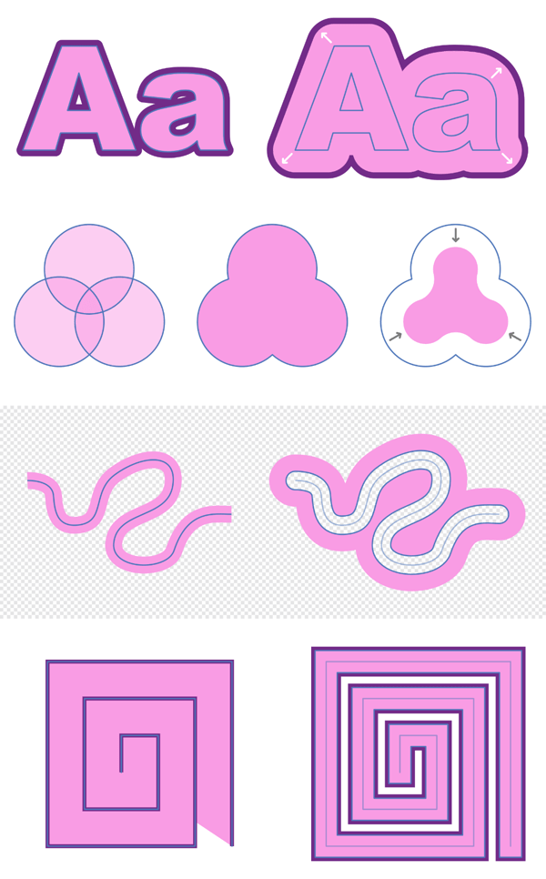

# Contouring curves and shapes

Contouring lets you offset the object outline and stroke of a curve or shape non-destructively.

With contouring, the object outline can be grown or shrunk in relation to the original outline—if a stroke is applied to the object it will also appear offset as it follows the object outline.

You can control the size of the contour by dragging; the stroke will resize itself and be offset as you drag inwards or outwards. You can also adjust the stroke's joins and alter the fill type of a shape, making it hollow or closed.

The underlying geometry is outlined to offer a better understanding of the effects of contouring and to optionally help you edit your object with the **Node Tool**.

**

 To create a contour:**

1. Select the **Contour Tool**.
2. With the curve or shape selected, drag left or right anywhere on the page to contract or expand the contour, respectively. For example, the more you drag right, increasing the radius, the more pronounced the contour.
3. (Optional) Adjust the context toolbar settings to:
   - Set a precise amount of contouring (**Radius**).
  - Control the join appearance of sharp nodes on the already contoured curve or shape (**Contour type**).
  - (With **Mitre Joins** contour type selected) Adjust the extension of joins to create either sharp or flat corners.
  - Control the line ending appearance on curves (**Cap**).
  - Control how the shape is filled (see below).

**To make a shape hollow or filled:**

1. Select the already contoured shape.
2. From the context toolbar, select a **Fill** option of **Force open**, **Force closed** or **Auto closed**. Auto closing will automatically keep open the interior area of an open curve, while shapes will automatically be kept closed; this setting can be overridden with the other options.

> **Note:** The Force commands let you achieve different results, and change how the contour is performed.

**To reset the contours:**

1. Select the shape.
2. From the context toolbar, set the **Radius** option to 0 px.

#### SEE ALSO:

- [Contour Tool](../22-tools/design-tools/04-contour-tool.md)
- [About geometric shapes](05-about-geometric-shapes.md)
