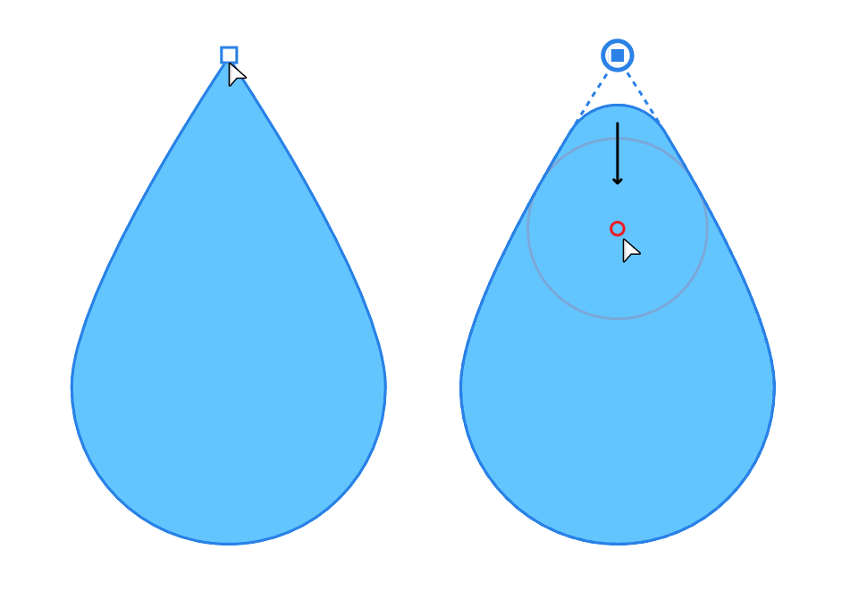

# Cornering shapes

Cornering lets you selectively round sharp corners on closed shapes.

Ideal for rounding corners on geometric shapes or on closed shapes drawn with the Pen Tool, the Corner Tool lets you selectively apply cornering as and when you need it. A pre-requisite is that the corner must be a sharp corner, so geometric shapes such as polygons, stars, and triangles are great candidates for corner rounding.

Using an on-screen red "shaping" ring you can control the size of the corner by dragging; the corner will shape itself around the ring's circumference for precise and perfect results. You'll see the ring only as you drag from a sharp corner node.

**

 To create a rounded corner:**

1. Select the **Corner Tool**.
2. (Optional) On the context toolbar, select a different **Corner Type** instead of **Corner Rounded** as default, e.g. Corner Concave.
3. Hover over the sharp corner node to be edited and drag inwards or outwards. A ring is shown around which the corner will be automatically adjusted. The more you drag, increasing the radius, the more pronounced the corner.

> **Tip:** You can apply corners simultaneously to multiple nodes that have been selected previously.

> **Note:** Applying a corner to a shape created with any of Affinity's shape tools will convert that shape to curves. From that point, you won't be able to make use of the shape tool's inherent 'morphing' behaviour.

**To edit a corner:**

1. Select the shape.
2. With the **Corner Tool** active, click on the sharp corner node. (Although the corner is already rounded, the original shape's outline is retained.)
3. Drag the centre of the ring to resize the corner as needed.

> **Tip:** By default, the shape's outline is not affected by the tool (apart from at the corner). However, dragging the shape's outline with the `Cmd`  pressed will reshape the shape; the corner radius is not affected by reshaping.

> **Note:** ### Modifier keys
>
>
> The following modifier s can be used as you adjust corners:
>
>
> - To decrease or increase stroke width by percentage, use the [ or ] s, respectively. For smaller absolute increments instead, use an additional `Shift`  modifier.

#### SEE ALSO:

- [Corner Tool](../22-tools/design-tools/05-corner-tool.md)
- [About geometric shapes](05-about-geometric-shapes.md)
- [Edit curves and shapes](03-edit-curves-and-shapes.md)
