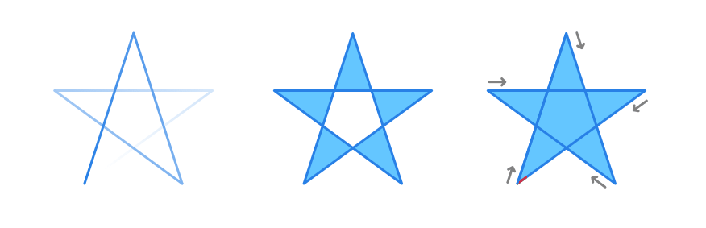

# Fill modes

Shapes which have been constructed using self-intersecting lines can be filled in two different ways: **Alternate** or **Winding**.

*Unfilled shape, and filled shapes showing Alternate and Winding fill modes, respectively.*

> **Note:** The last shape's red-line indicator leading up to the end node shows drawing direction. This is enabled by default to help identify the start node position and winding orientation—in this case, clockwise.

Fill mode is a property of any polycurve that has intersecting lines. Because a polycurve is a complex shape, what is considered inside and outside the shape can becomes unclear. The fill mode is an algorithm that decides the shape's inside and outside so that filling can be understood when exporting complex shapes to SVG document fragments for use in web applications.

- The **Alternative** mode determines whether a segment of the shape will be filled by drawing a ray from that point to infinity in any direction, and counting the number of segments within the given shape that the ray crosses through. If this number is odd, the segment exists in the fill region; if even, the segment is outside the fill region.
- The **Winding** mode determines whether a segment of the shape will be filled by drawing a ray from that point to infinity in any direction, and counting the number of instances in which a segment of the shape crosses the ray. Starting from zero, one count is added each time a segment crosses the ray from left to right and one count is subtracted each time a path segment crosses the ray from right to left, from the perspective of the ray. After the number of crossings has been counted, if the result is zero, then the point is considered to be outside the fill path. Otherwise, it is inside the path.

> **Note:** Imported Adobe Illustrator objects will have the **Winding** mode set by default.

**To set Fill Mode:**

- With the object selected, from the **Layer** menu, select an option from the **Fill Mode** submenu.

**To show the winding orientation:**

- On the Pen or Node Tool context toolbar, check **Show Orientation**. The end of the segment leading up to the start node will show in red; the drawing direction is away from the red-line indicator.

#### SEE ALSO:

- [About lines, curves and shapes](01-about-lines-curves-and-shapes.md)
- [Edit curves and shapes](03-edit-curves-and-shapes.md)
