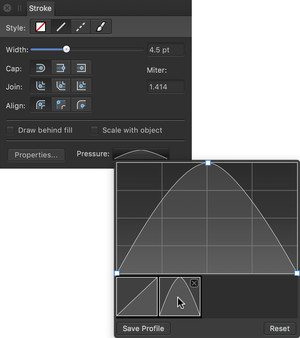

# Pressure sensitivity

**macOS:**

Affinity Designer offers complete flexibility when using pen tablets or Force Touch-enabled devices for real pressure-sensitive drawing and painting. If you prefer a mouse or trackpad (not Force Touch), Affinity Designer offers simulated pressure sensitivity.

**Windows:**

Affinity Designer offers complete flexibility when using pen tablets for real pressure-sensitive drawing and painting. If you prefer a mouse, Affinity Designer offers simulated pressure sensitivity.

Whether you're using vector-based Pen, Pencil or brush tools, or pixel-based brush or retouch tools, you can simply connect your device and you're ready to go.

For mouse users, Affinity Designer lets your mouse become velocity sensitive by default. The same brush tools can be used but with simulated pressure sensitivity based on the speed (velocity) of your mouse movements.

This automatic response is governed by the brush controller which is set to automatic by default—it senses the type of input device and varies brush size, flow, etc. as you paint according to a particular input: 'Pressure', 'Velocity', 'Brush Defaults', or 'None'. If set to 'None', the brush is always a fixed size, flow setting, etc. Otherwise, the brush stroke properties will vary from a minimum to maximum amount (e.g. the full brush width).

While you get the response you need from either input, you'll still be able to fine-tune brush settings for pressure/velocity.

- For vector brush settings: jitter options let you control how brush size and flow are affected by your pressure-sensitive device or mouse.
- Pixel brush settings: as for vector brush options, but additional jitter options are provided that affect brush hardness, shape, colour, and the scatter and rotation of nozzles.

If you want to create a custom pressure profile that can be applied to a previously drawn stroke, you can design it and apply it from the Stroke panel. This can be optionally saved as is, or modified before saving.

**To create a pressure profile:**

1. On the **Stroke** panel, click the **Pressure** input box.
2. Using the displayed chart, do one of the following:
   - Drag either end node downwards to reduce the stroke width uniformly along the stroke length.
  - Select either end node twice (or press the `Alt` ), then drag it downwards to taper the stroke in that direction. The stroke will taper linearly.
  - Drag either end node downwards, then click halfway along the profile line to add a node which can be dragged upwards to taper the stroke according to the curvature of the graph.
  - Drag either end node downwards, then click repeatedly along the profile line to add multiple nodes which can be positioned vertically and horizontally to form a variable width stroke.
3. Begin drawing your pen or pencil strokes.

*Example pressure profiles created via instructions above, all superimposed with expected stroke.*

**To save a pressure profile:**

- Under the chart, click **Save Profile**. The profile shows under the chart.

**To apply a custom pressure profile to a selected stroke:**

1. From the **Stroke** panel, click the **Pressure** option.
2. Select a custom profile from below the chart. The chart will update, showing the chosen profile.

**To reset the pressure profile:**

- Select **Reset** below the chart.

The profile reverts to its default.

> **Note:** Click on any node to select it. Any added nodes can be deleted by pressing `Delete`.

#### SEE ALSO:

- [Painting brush strokes](../10-vector-painting/01-painting-vector-brush-strokes.md)
- [Painting pixel brush strokes](../11-pixel-painting/01-painting-pixel-brush-strokes.md)
- [Draw lines and shapes](02-draw-curves-and-shapes.md)
- [Stroke panel](../23-panels/16-stroke-panel.md)
