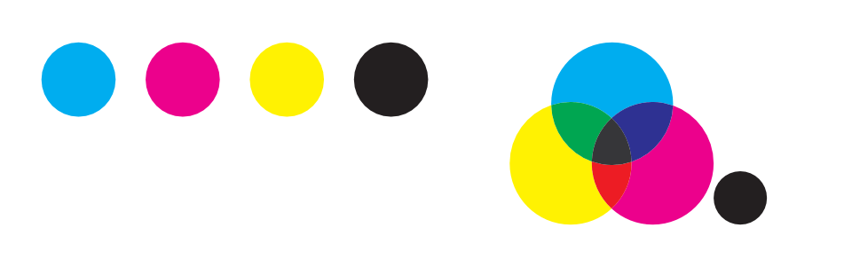

# Colour models

A screen uses varying amounts of light to create the colours that you see. In the physical world, inks are used to create the colour on the page. Colour is stored by turning colours into numbers. A colour model is used to describe the numerical system used.

As not all devices have the same ability to display colour, a colour space is used to define the gamut (available range) of colour. By working within a colour space suitable for the intended output device, you can be confident that your colours will be able to be displayed as intended.

In Affinity Designer, you can take advantage of an end-to-end CMYK or Lab colour-managed workflow as you create a new document.

## About colour models

Different colour models represent colour as numbers in different ways. When working in Affinity Designer, you can choose one of four colour models.

### RGB model

The RGB model is an additive colour model. The primary colours of light, Red, Green and Blue, are combined in various degrees to make other colours in the spectrum.

*A representation of the RGB colour model. This model is universal within digital cameras and electronic displays.*

### CMYK model

The CMYK model is a subtractive model. Cyan, Magenta and Yellow are combined to make each colour. A fourth ink, Black, is also used for extra control and can be used either on its own for a true black, or combined with the other inks for a rich black.

*A representation of the CMYK colour model. When the three colours combined they make black. Black is also added as a separate colour for extra tonal control.*

> **Note:** The way that the colour model is implemented is defined by the [colour space](03-about-colour-spaces.md) that is chosen; this is possible by selecting a colour profile.

### Lab

Lab colour represents the theoretical range of human vision using three channels: Lightness (L), and two colour channels of opposing values of 'red - green' (a) and 'yellow - blue' (b). It can be very useful when used creatively, especially as Lightness can be adjusted without any change to hue or saturation.

*A representation of the Lab colour opposition model. Lightness (L) is controlled separately to the two colour channels (a, b).*

**To select a new document's colour model:**

- As you create a [new document](../03-get-started/02-create-new-documents.md), select a colour format and profile from the **Colour** tab.

> **Note:** The **Colour Format** of a document is a combination of a colour model and a bit depth setting (8 or 16).

**To change your document's colour model at any time:**

1. From the **File** menu, select **Document Setup** and choose the **Colour** tab.
2. From the **Colour Format** pop-up menu, select any of the available models as described above.
3. Designer converts each colour from the old format to the new one—colour/pixel values may change as a result.

#### SEE ALSO:

- [About colour spaces](03-about-colour-spaces.md)
- [Colour management](04-colour-management.md)
- [About bit depth](../03-get-started/11-about-bit-depth.md)
