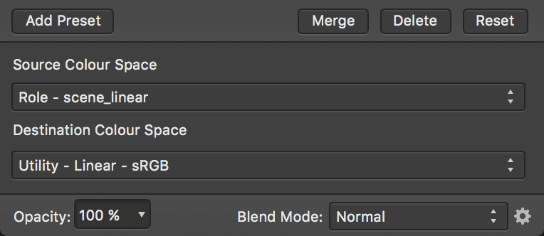

# Using OpenColorIO

In addition to 32-bit editing support, Affinity Designer also implements OpenColorIO; a colour management system that provides a full colour-managed workflow. It is predominantly used for motion picture production but can be used for any situation where accurate end-to-end colour management is required.

## Setting up OpenColorIO

By default, Designer's OpenColorIO features are not immediately usable. An **.ocio** configuration file is required alongside a number of supporting files such as lookup tables.

The OpenColorIO website ([http://www.opencolorio.org](http://www.opencolorio.org)) contains some sample configurations that provide a number of suitable input and output profiles, including several Academy Colour (ACES) configurations.

**To configure OpenColorIO:**

1. Download and extract your chosen OpenColorIO configuration to a folder.
2. From the **Affinity Designer** menu, select **Settings** (or **Preferences**).
3. From the **Edit** menu, select **Settings**.
4. On the **Colour** tab, under **OpenColorIO Configuration File**, choose **Select** and navigate to the extracted folder. Choose the **.ocio** configuration file within this folder.
5. Under **OpenColorIO Search Folder**, click **Select** and choose the extracted folder (it should already be the current highlighted folder from when the **.ocio** configuration file was selected).
6. You will be prompted to restart the app, which is necessary for the OpenColorIO settings to take effect.

## Using OpenColorIO

OpenColorIO is exposed through two methods:

- The **32-bit Preview** panel contains a **Display Transform** option that only becomes available with a valid OpenColorIO configuration. This can be used to achieve a non-destructive, colour managed workflow. See [32-bit Preview](../23-panels/01-32-bit-preview-panel.md) for more information.
- An **OCIO** adjustment layer (see [OCIO Adjustment](../19-adjustments/14-opencolorio-adjustment.md)) can be added to losslessly convert between colour spaces. You can have multiple **OCIO** adjustment layers within a document, which allows you to accommodate composite layers from different colour spaces. An example layer stack might be (in hierarchical order):
   - **OCIO Adjustment**—from ***Utility - Linear - sRGB*** back to ***Role - scene_linear***
  - **sRGB Pixel Layer**—composite element
  - **OCIO Adjustment**—from ***Role - scene_linear*** to ***Utility - Linear - sRGB***
  - **Pixel Layer**—original layer

*An OCIO Adjustment layer going from **Role - scene_linear** to **Utility - Linear - sRGB**.*

> **Note:** When loading OpenEXR documents, Designer always converts from the source colour space to **scene_linear**. With a valid OpenColorIO configuration, Designer will also present a message to let you know which colour profile it has converted from. This is usually determined by a filename affix, for example **"render_acescg.exr"**.

#### SEE ALSO:

- [32-bit Preview](../23-panels/01-32-bit-preview-panel.md)
- [OCIO Adjustment](../19-adjustments/14-opencolorio-adjustment.md)
