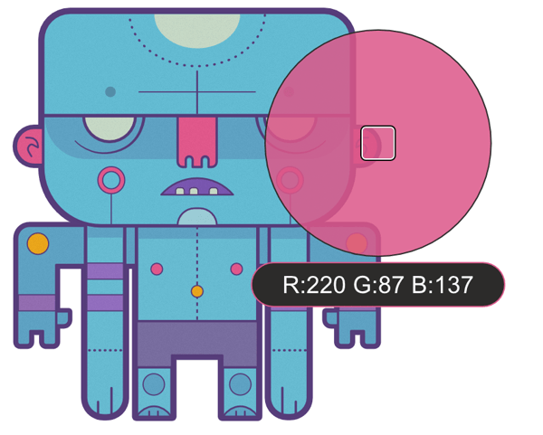

# Sampling colours

The act of colour picking lets you sample colours within or outside Affinity Designer, then use them throughout your design.

## About sampling colours

Colour sampling appears in two slightly different forms within Affinity Designer. It exists as a 'component' of selected panels as well as a standalone tool.

Both versions function in slightly different ways:

- A colour picker appears on the **Colour** and **Swatches** panels (and other colour-related pop-up panels) in Designer and Pixel Persona.
- The standalone **Colour Picker Tool** appears on the **Tools** panel in Designer Persona only.

Regardless of which you use, a sampled colour is stored and applied from the swatch next to the colour picker's icon on the **Colour** or **Swatches** panel.

> **Note:** ### Screen recording permission
>
>
> The first time you sample colour, your operating system may ask whether to grant permission for your Affinity app to record the screen. If you deny it, you can still sample from the app's windows but not other screen areas. Refer to your operating system's documentation if you need to grant permission at a later time.

**

 To use the Colour Picker Tool:**

1. On the **Tools** panel, select the **Colour Picker Tool**.
2. Adjust the settings on the context toolbar.
3. Do one of the following:
   - (For on-page sampling) Click to pick up any colour on the page.
  - (For screen-wide 'magnified' sampling) Drag to select any colour under a magnifier anywhere within or outside the app.

**

 To use a panel's colour picker:**

- From the **Colour** panel or **Swatches** panel, drag from the colour picker icon to select any pixel on your screen.

**To apply a sampled colour to an object:**

1. Select one or more objects.
2. On the **Colour** or **Swatches** panel, click the selector (e.g. Fill or Stroke) to which you want to apply the colour.
3. Click the swatch next to the colour picker icon on the panel.

**

 To automatically apply a sampled colour to an object:**

1. Select one or more objects.
2. On the **Colour** or **Swatches** panel, click the selector (e.g. Fill or Stroke) to which you want to apply the colour.
3. On the **Tools** panel, select the **Colour Picker Tool**.
4. On the context toolbar, ensure **Apply to Selection** is selected.
5. Do one of the following, to apply to selected objects:
   - Click a colour on the page.
  - Drag to select any colour under a magnifier anywhere within or outside the app.

> **Note:** ### Gesture(s)
>
>
> With brush, shape, pencil and fill tools, you can sample colour by dragging with the `Alt`  pressed.
>
>
> With brush, shape, pencil and fill tools, you can sample colour by dragging with the `Alt`  pressed.

#### SEE ALSO:

- [Colour Picker Tool](../22-tools/design-tools/17-colour-picker-tool.md)
- [Selecting colours](06-selecting-colours.md)
