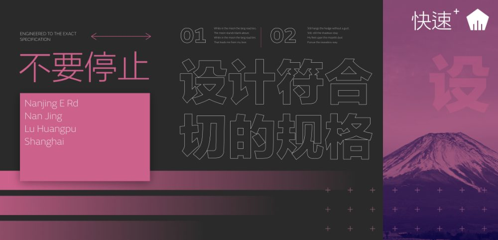
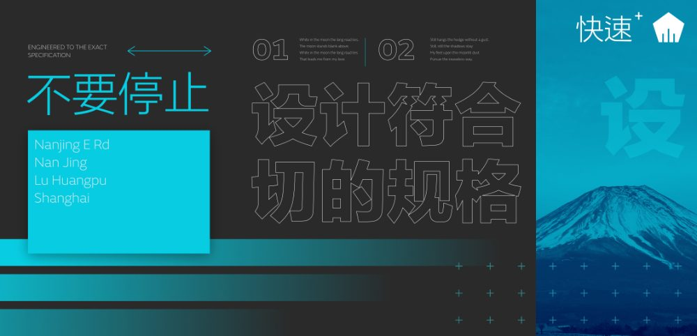

# Global colours

Global colours can be created and applied to different objects in your design. If you want to change the colour across your design at a later time, you can simply edit the global colour in the Swatches panel and all objects update with the new colour automatically and simultaneously.

## About global colours

The global colour could be applied as a solid fill, stroke, or a colour used in a gradient fill; gradients cannot be saved as global colours as they are made up of more than one colour. Global colours can be made while in RGB, CMYK, HSL, LAB, Greyscale, or Tint colour modes.

Global colours are added to the currently selected document palette in the Swatches panel. If a document palette does not exist when your document's first global colour is created, a new document palette is automatically created for you in which the colour will be stored. Once created, you can apply the global colour to your design.

The tint of an applied global colour can be adjusted using the **Colour** panel.

> **Note:** 
>
>  A global colour is indicated by a tab in the bottom-left corner of its colour swatch.

> **Tip:** You can check if a global colour has been assigned to an object's stroke or fill by using the **Colour** panel.

**macOS:**

> **Note:** If you're [importing a document palette](../16-add-ons/04-importing-add-ons.md) containing global colours as a System or Application palette, the global colours will be converted to standard colours.

**Windows:**

> **Note:** If you're [importing a document palette](../16-add-ons/04-importing-add-ons.md) containing global colours as an Application palette, the global colours will be converted to standard colours.

**

 To create a global colour from an existing object:**

Do one of the following:

- Select the object, choose a Document palette in the **Swatches** panel, set the Stroke/Fill colour selector, then click **Add current colour to palette as a global colour**.
- `Click`-click the object and select **Add to Swatches**, then **From Fill as Global**, **From Line as Global** or **From Both as Global** depending on the object property you want to save.

**

 To create a global colour from scratch:**

1. On the **Swatches** panel, select a Document palette from the palette pop-up menu. If no Document palette exists you can create one from the panel's Panel Preferences menu.
2. From **Panel Preferences**, select **Add Global Colour**.
3. Adjust the settings in the dialog.
4. Click **Add**.

**To edit a global colour:**

1. On the Swatches panel, `Click`-click the chosen colour swatch and select **Edit Fill**.
2. From the dialog, select a colour.

All objects using the global colour will be updated automatically.

#### SEE ALSO:

- [Overprinting](10-overprinting.md)
- [Spot colours](09-spot-colours.md)
