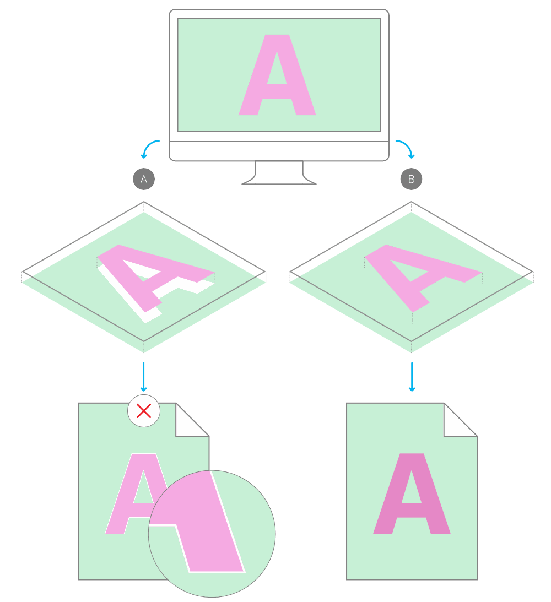

# Overprinting

For professional printing, [global colours](08-global-colours.md) can be made to overprint. By applying an overprint colour to objects selectively you can control overprinting.

## About overprinting

Overprinting means that you can print one ink colour on top of another instead of, by default, the underlying colour being 'knocked out' (removed). This prevents unwanted fringing being left around objects, e.g. text.

*(A) Unwanted knockout behaviour (default) showing white fringing vs. (B) overprinting.*

As a professional printing feature, overprint works when publishing PDFs using a CMYK colour space and PDF/X compatibility.

You don't need to explicitly make an overprint for black, for black text or black graphics, as this is set by default. On PDF publishing, you can control black overprinting using the **Overprint black** option in the Export Options panel (for any PDF export options).

> **Note:** 
>
>  An overprint colour swatch is indicated by a curved tab in the top-right corner of its colour swatch.

> **Tip:** You can check if an overprint colour has been assigned to an object's stroke or fill by using the **Colour** panel.

> **Tip:** Overprinting it will cause colours to appear darker due to the opacity of inks used in professional printing. Some PDF viewers can simulate how this would appear, but always consult with your print provider for advice on its use.

**

 To create an overprint colour from scratch:**

1. On the **Swatches** panel, select a Document palette from the palette pop-up menu. If no Document palette exists you can create one from the panel's Panel Preferences menu.
2. From **Panel Preferences**, select **Add Global Colour**.
3. Adjust the settings in the dialog.
4. Select the **Overprint** option.
5. Click **Add**.

**To make an existing global colour overprint:**

- On the **Swatches** panel, `Click`-click the global colour swatch's thumbnail, then select **Overprint**.

#### SEE ALSO:

- [Global colours](08-global-colours.md)
- [Spot colours](09-spot-colours.md)
