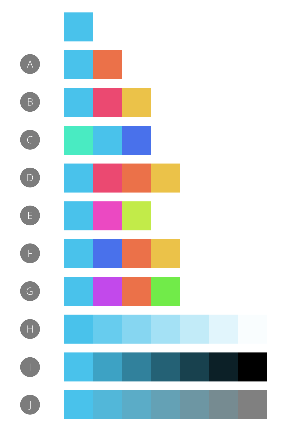

# Colour chords

A colour chord is a spread of harmonious colours which can be used in conjunction with each other to produce appealing designs.

*Example colour chords created by applying different chord types to the base colour in the top row.*

## About colour chords

Colour chords are created by first choosing a base colour and then picking a chord type (built on professional colour theory). A spread of colours is then populated and stored in the current palette in the **Swatches** panel. You can then select from these colours as you design.

Chord types are based on the HSL colour wheel and include:

- (A) **Complementary**—the base colour and its opposite on the colour wheel.
- (B) **Split Complementary**—the base colour and the colours adjacent to its opposite on the colour wheel.
- (C) **Analogous**—the base colour and the colours adjacent to it on the colour wheel.
- (D) **Accented Analogic**—as for Analogous but, like Complementary, also includes the base colour's opposite.
- (E) **Triadic**—three colours spaced equally around the colour wheel starting from the base colour.
- (F) **Tetradic**—four colours arranged around the colour wheel in two complementary colour pairs, starting from the base colour. Otherwise known as 'Rectangle'.
- (G) **Square**—four colours spaced equally around the colour wheel starting from the base colour.
- (H) **Tints**—colours which vary in lightness from the base colour to white.
- (I) **Shades**—colours which vary in lightness from the base colour to black.
- (J) **Tones**—colours which vary in saturation from the base colour to grey.

> **Tip:** You'll find a wide range of colour theory websites on the Internet.

**

 To create a colour chord using the Swatches panel:**

1. From the category list pop-up menu, select a palette containing the base colour.
2. From the palette, `Click`-click the base colour swatch and then select a chord type from the **Create Colour Chord** pop-up menu.

**

 To create a colour chord using the Colour panel:**

1. (Optional) On the **Swatches** panel, click Panel Preferences and choose an 'Add Palette' option.
2. Do one of the following:
   - With no content selected, select a colour from the colour model's **Wheel** (HSL only), **Sliders**, or **Boxes**, or click the picked colour swatch.
  - Select page content containing the base colour. Remember to select the appropriate colour selector on the **Colour** or **Swatches** panel.
3. On the **Colour** panel, click the Panel Preferences menu and select a chord type from the **Add Chord to Swatch** pop-up menu.

#### SEE ALSO:

- [Selecting colours](06-selecting-colours.md)
- [Colour panel](../23-panels/06-colour-panel.md)
- [Swatches panel](../23-panels/18-swatches-panel.md)
