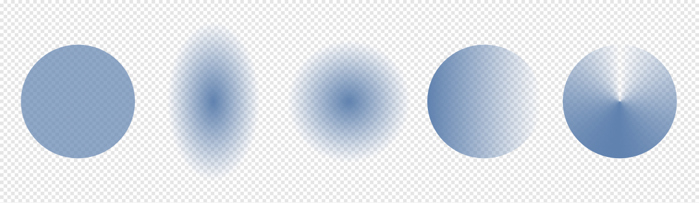

# Transparency

Transparency can be applied in lots of ways in Affinity Designer.

*(From left to right) Solid, Elliptical, Radial, Linear and Conical transparency types applied to a basic shape.*

Here are the typical methods for its use.

- As solid Opacity, applied to strokes, fills and brush strokes.
- As a transparency gradient, again applied to either stroke or fill. Using the same principles as gradient editing, you can introduce an independent gradient transparency path using the alpha channel in your design. You can introduce more than two alpha levels along the gradient path, adjust where each stop is positioned and/or control alpha transitions.
- As layer opacity.
- As a layer effect property.

Opacity is a term you'll see in Affinity Designer—this is the opposite of transparency. An object with 0% transparency is fully opaque (100% opacity), while 100% transparency means the object is invisible (0% opacity).

## Opacity quick keys

You can use the numerical keys to set the layer opacity of a selected layer(s) or object(s).

This quick access to opacity settings also applies to brush tools in Pixel Persona.

**To change the solid opacity of an object:**

1. From the **Colour** panel, choose stroke or fill from the Stroke/Fill colour selector.
2. Drag the **Opacity** slider.

**

 To apply a transparency gradient to an object:**

1. From the **Tools** panel, select the **Transparency Tool**.
2. Drag across your object to apply a transparency gradient.

> **Note:** As well as adding transparency gradients to objects, you can group those objects and then apply additional transparency to the group without affecting the individual objects' transparency.

**To apply layer opacity:**

1. From the **Layers** panel, select a layer.
2. Click the panel's **Opacity** down arrow and drag the slider to adjust.

**To use opacity quick keys:**

1. Do one of the following:
   - Select a single layer or object, or multiple layers or objects.
  - Select a brush tool in Pixel Persona.
2. Press a numerical key, or two numerical keys in quick succession, to set the opacity. For example:
   - Press **4** for 40% opacity.
  - Press **0** for 100% opacity.
  - Press **4** and **5** for 45% opacity.
  - Press **0** and **7** for 7% opacity.

**

 To apply layer effect opacity:**

1. From the **Layers** panel, click **Layer Effects**.
2. From the dialog, adjust the **Opacity** slider if available. Not all layer effects have the Opacity setting.

#### SEE ALSO:

- [Colour panel](../23-panels/06-colour-panel.md)
- [Transparency editing](14-transparency-editing.md)
