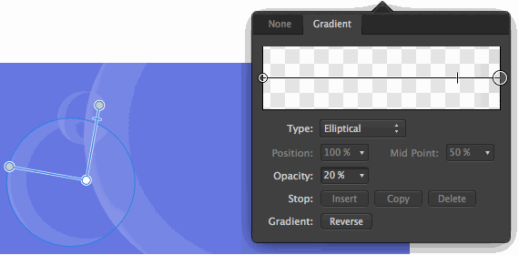

# Transparency editing

Using the same principles as gradient editing, transparency editing lets you customise a gradient but just on the alpha channel in your design. This allows for more complex transparency gradients to be made, and then applied to object fills and strokes.

You can introduce more than two alpha levels along the gradient path, adjust where each stop is positioned and/or control alpha transitions. You can do this in two ways.

- Directly on the object.
- Via the tool's context toolbar.

Using the former, you modify the transparency gradient by eye; the latter lets you design with precision and absolute control.

*Complex gradient applied directly on the object and then adjusted using the pop-up panel from the context toolbar.*

### Settings

The following settings can be adjusted in the dialog:

- **Type**—determines the gradient type used. Select from the pop-up menu.
- **Position**—controls the position of the stop along the gradient from left (0%) to right (100%), with 50% representing a central point.
- **Mid Point**—adjusts the alpha spread between the selected stop and the stop to its right.
- **Opacity**—controls how see through the stop is. 100% represents fully opaque, 0% represents fully transparent.
- **Insert**—adds a new stop between the selected stop and the stop to its right. The stop adopts an alpha level at its new position.
- **Copy**—duplicates the selected stop, positioning it between the selected stop and the stop to its right.
- **Delete**—removes the selected stop from the gradient.
- **Reverse**—the gradient is reversed, i.e. like a mirror image.

**To modify the gradient (directly on an object):**

- See the [Gradient editing](12-gradient-and-bitmap-fills.md) topic for the procedure but use the Transparency Tool instead of the Fill Tool.

**To modify the gradient directly (via context toolbar):**

- See the [Gradient editing](12-gradient-and-bitmap-fills.md) topic for the procedure but use the Transparency Tool instead of the Fill Tool.

#### SEE ALSO:

- [Transparency](13-transparency.md)
- [Gradient editing](12-gradient-and-bitmap-fills.md)
