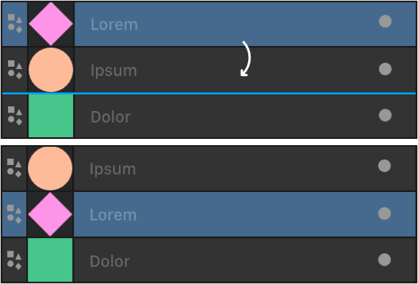
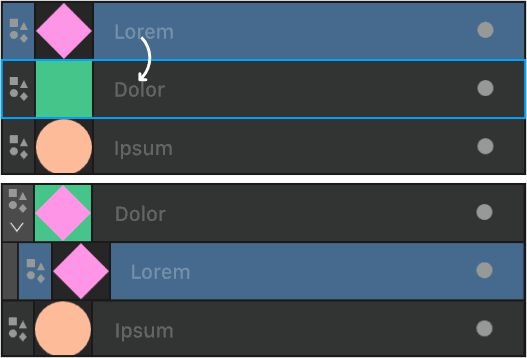
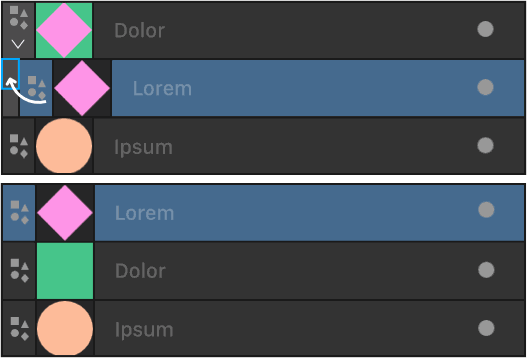
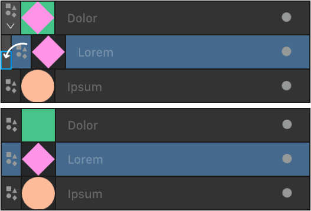
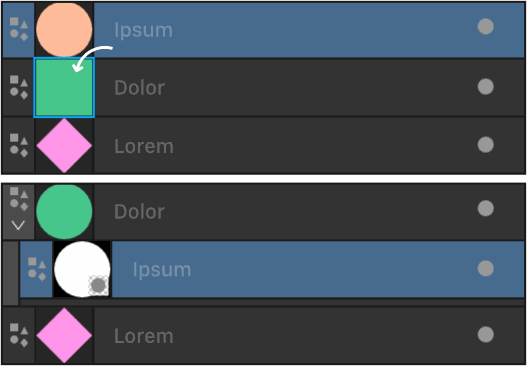

# Layer drop zones

Layer drop zones indicate suggested positions in your layer stack that a currently moved object or layer can be dropped.

## About layer drop zones

Objects or layers in your Layers panel can be a simple arrangement of only a few objects or layers stacked together in front to back order (from the top to the bottom of stack). Any can be reordered in relation to others by moving them up or down. However, for layer operations such as clipping or masking it's useful to understand the type of drop zones possible and where these appear in the Layers panel.

Clipping involves dragging one object or layer inside another so the clipped object (layer) is contained within the outline of the clipping object (layer). This creates a parent - child layer relationship, i.e. a two 'level' arrangement.

| Action | How to | Visual |
| --- | --- | --- |
| Change order | by dragging to a position between two objects (layers). |  |
| Clipping (making a child layer) | by dragging onto another object's (layer's) name. |  |
| Return above parent | by dragging a clipped object (layer) to above its Parent Bar. You can drag to a Grandparent Bar, Great Grandparent Bar, etc. |  |
| Return below parent | by dragging a clipped object (layer) to below its Parent Bar. You can drag to a Grandparent Bar, Great Grandparent Bar, etc. |  |
| Mask | by dragging the masking object (layer) onto the target layer's thumbnail |  |

#### SEE ALSO:

- [About layers](01-about-layers.md)
- [Ordering](../08-object-control/12-ordering-objects.md)
- [Layer clipping](10-layer-clipping.md)
- [Layer masks](11-layer-masking.md)
