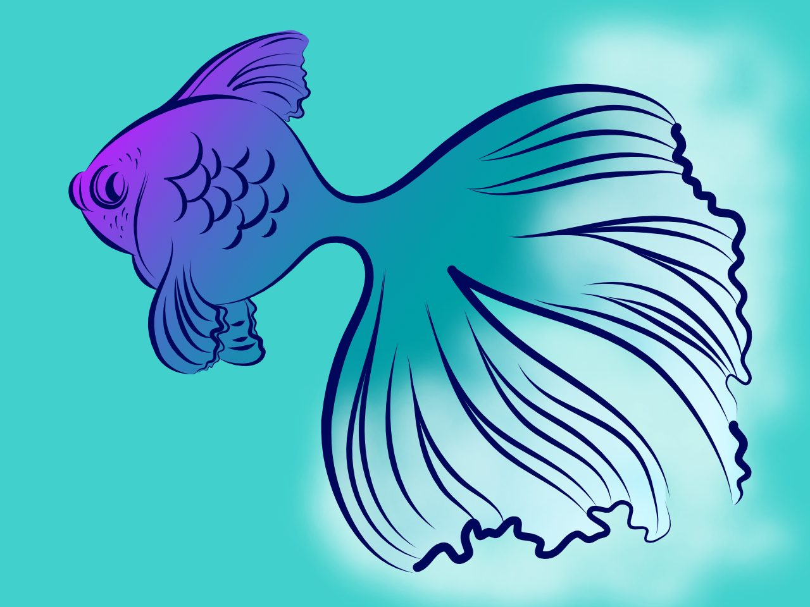
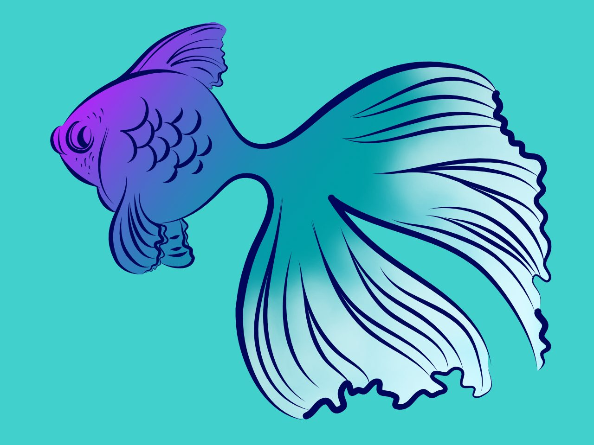
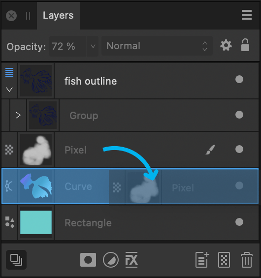

# Layer clipping

Clipping involves positioning one object inside another. The path of the parent object becomes the new boundaries for the child object. Any areas of the child object which lie outside the parent object's path are masked (hidden).

*Pixel brush strokes clipped within the fish's vector outline.*

*Layers panel showing white brush stroke layer being dragged onto the fish's outline layer (above).*

## About clipping

Any object can act as a parent or child in clipping relationships. Both vector objects and pixel layer content can be either clipped or clipping objects. In Affinity Designer, it is popular to clip pixel brush textures to a vector object's outline (see example above).

When scaling a parent object, child (clipped) objects scale to maintain the correct aspect ratio. Scaling a clipped object has no effect on the parent object. A clipped object can be edited independently from its parent, e.g. adjusting colour, opacity, and/or blend mode.

> **Note:** Objects can be clipped on creation by drawing directly inside a selected object. This is controlled by **Insert inside the selection** object targeting. For more information, see the [Targeting objects](../08-object-control/13-targeting-objects.md) topic.

**To clip objects:**

1. On the page, position the object to be clipped so it overlaps the object which will perform the clipping.
2. Do one of the following, with the object to be clipped being selected:
   - On the **Layers** panel, drag it on top of the object which is to perform the clipping. A blue highlight appears to target the layer.
  - On the **Layer** menu, select **Arrange>Move Inside**. This moves the object inside the object above it on the **Layers** panel.

The clipped object is nested within the clipping object in the Layers panel. The clipped object has become a child of the clipping object.

**To unclip an object:**

Do one of the following:

- On the **Layers** panel, drag the clipped object from inside the parent object to a layer.
- Select the clipped object, then select **Layer>Arrange>Move Outside**.

#### SEE ALSO:

- [Targeting objects](../08-object-control/13-targeting-objects.md)
- [Layers panel](../23-panels/11-layers-panel.md)
- [Layer blending](07-layer-blending.md)
