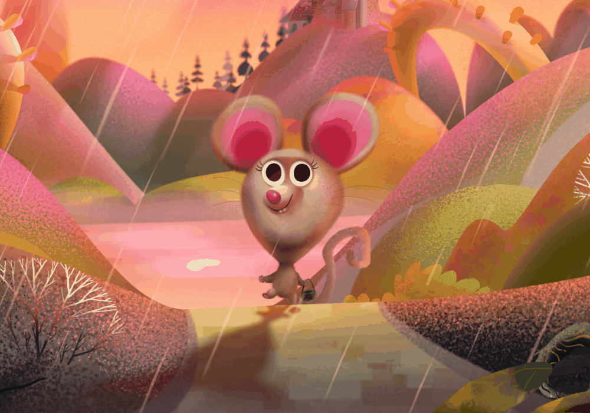
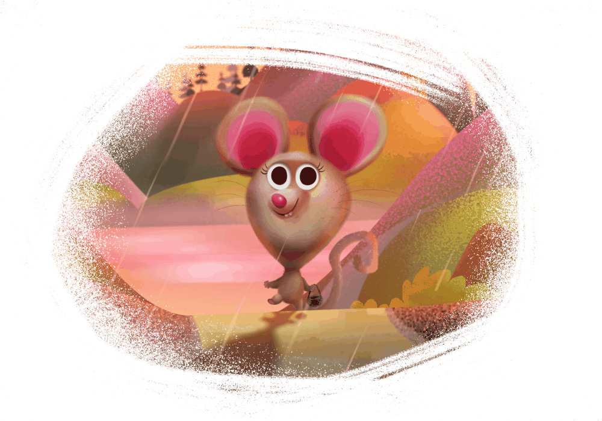
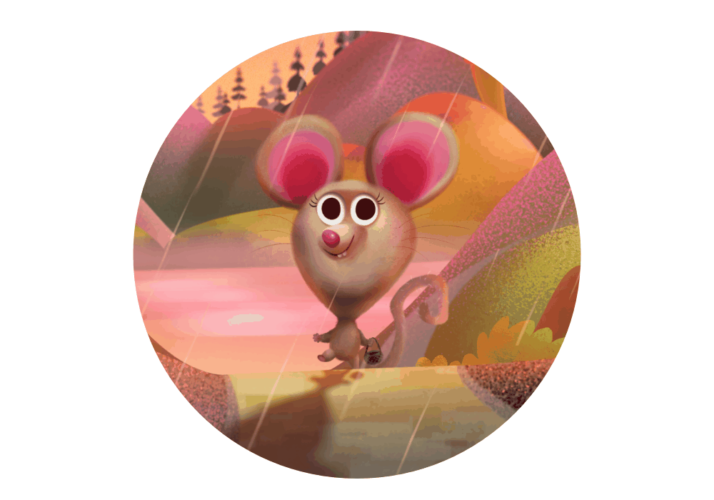

# Layer masking

A layer mask is used to reveal a portion of a layer while the rest of the layer remains hidden. This means that you can use a mask layer to 'delete' areas of a layer that you don't want.

In Affinity Designer, two types of masking are possible: pixel masking and vector masking.

 

**Pixel masking*: performs a similar task to the erase tools with one important difference; a pixel mask can be modified, or even discarded, at any point in time.*

**Vector masking*: this involves using a line or shape as a mask over another object that crops to the line or shape's outline.*

## The non-destructive power of masking

Masks are applied to designs as a separate layer, allowing them to be freely edited and moved. Mask layers affect any object below them within the same parent layer. They can also be [clipped](10-layer-clipping.md) to individual objects so that only that object is affected.

[Adjustment layers](12-using-adjustment-layers.md) also have mask layer properties. Areas of an adjustment layer can be revealed or hidden in the same way as with a mask layer.

Once a mask layer is created, you can apply different levels of greyscale or opacity to the mask layer—apply White (or 100% Opacity) to reveal; apply Black (or 0% Opacity) to conceal; apply intermediate greyscale levels for partial masking. Try drawing a gradient (with Fill Tool) across a mask layer and assign different greyscale levels or opacity to end stops to experiment.

Mask layers can have a unique [blend mode](07-layer-blending.md) assigned.

> **Note:** 
>
>  Layer effects cannot be applied to layer masks.

**

 

 

 To add a pixel mask to a vector layer:**

1. On the **Layers** panel, select the chosen vector layer.
2. Jump to Pixel Persona.
3. Do one of the following:
   - To 'erase', paint on the page using the **Erase Brush Tool**. A mask layer is created on painting.
  - To 'restore' the mask, paint on the page using the **Paint Brush Tool**. A white fill completely restores, while greyscale fills partially restore the mask by varying amounts.

> **Note:** Selecting a pixel mask's thumbnail automatically switches the **Colour** panel to **Greyscale** mode.

> **Note:** The Erase Brush Tool always erases using 100% black (ignoring the current fill swatch).

**

 To create an empty mask layer:**

1. On the **Layers** panel, select the layer you wish to mask.
2. Hold `Alt`  and, at the bottom of the panel, click **Mask Layer**.
3. Hold `Alt`  and, at the bottom of the panel, click the mask icon.

> **Note:** By default, a created mask layer is applied to the current layer, but it can be moved by dragging outside the current layer, applying the mask to all layers below. Alternatively, the mask can be moved onto an object, applying the mask just to that object.

**

 To edit a pixel mask:**

1. In the **Layers** panel, select the mask thumbnail representing the mask layer.
2. Paint using the above tools.

> **Note:** Note the **Fill Tool** is found in the Designer Persona.

**To change pixel mask properties:**

- As you erase on the pixel mask, adjust Width, Opacity, Flow and Hardness from the Erase Brush Tool's context toolbar.

**To add a vector mask:**

1. Draw a filled vector object, e.g., a line or shape, which is to be your mask.
2. Do one of the following:
   - On the **Layers** panel, drag the created object entry directly onto the thumbnail of a 'target' object.
  - `Click`-click the object and select **Mask to Below**, if the object to be masked is directly below the masking object.
  - On the **Layer** menu, select **Mask to Below**.

The thumbnail of the target object changes to indicate that a mask and crop have been applied.

The masking object is clipped to the target object using a "crop to top object" operation.

The masking object can be a group of objects which will remain as independent objects after masking; the group can be expanded/collapsed and its objects will remain editable.

> **Note:** Vector masks can be used layer to layer, layer to object, object to layer, or object to object (as above).

**To hide/show a collapsed child mask layer:**

- `Shift`-click on the mask thumbnail when collapsed to its parent layer.

The hidden mask will show a red line through its thumbnail.

**To delete a mask:**

1. In the **Layers** panel, select the mask's thumbnail.
2. Press the `Backspace` .

#### SEE ALSO:

- [Using adjustment layers](12-using-adjustment-layers.md)
- [Layer clipping](10-layer-clipping.md)
