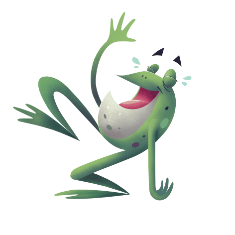
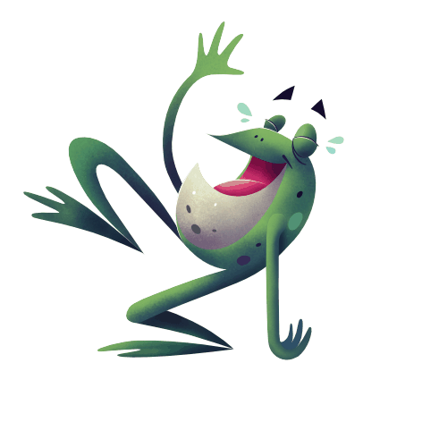

# Using adjustment layers

Use adjustment layers to apply an adjustment to your vector/pixel layer (or object). This is carried out non-destructively (i.e., without permanently affecting the original layer or object).

*Adjustment layer applied to an image.*

## About adjustment layers

Adjustments are applied from the **Layers** panel and most include customisable settings alongside general adjustment options. Once applied, they can be identified as both an adjustment and a specific adjustment type by using unique symbols.

*Curves adjustment layer indicating it is an adjustment (A) and a Curves adjustment type (B).*

**Available adjustments:**

- 

  [Black & White](../19-adjustments/02-black-and-white-adjustment.md)
- 

  [Brightness / Contrast](../19-adjustments/03-brightness-contrast-adjustment.md)
- 

  [Channel Mixer](../19-adjustments/04-channel-mixer-adjustment.md)
- 

  [Colour Balance](../19-adjustments/05-colour-balance-adjustment.md)
- 

  [Curves](../19-adjustments/06-curves-adjustment.md)
- 

  [Exposure](../19-adjustments/07-exposure-adjustment.md)
- 

  [Gradient Map](../19-adjustments/08-gradient-map-adjustment.md)
- 

  [HSL](../19-adjustments/09-hsl-adjustment.md)
- 

  [Invert](../19-adjustments/10-invert-adjustment.md)
- 

  [Lens Filter](../19-adjustments/11-lens-filter-adjustment.md)
- 

  [Levels](../19-adjustments/12-levels-adjustment.md)
- 

  [LUT](../19-adjustments/13-lut-adjustment.md)
- 

  [OCIO (OpenColorIO)](../19-adjustments/14-opencolorio-adjustment.md)
- 

  [Posterise](../19-adjustments/15-posterise-adjustment.md)
- 

  [Recolour](../19-adjustments/16-recolour-adjustment.md)
- 

  [Selective Colour](../19-adjustments/17-selective-colour-adjustment.md)
- 

  [Shadows / Highlights](../19-adjustments/18-shadows-highlights-adjustment.md)
- 

  [Soft Proof](../19-adjustments/19-soft-proof-adjustment.md)
- 

  [Split Toning](../19-adjustments/20-split-toning-adjustment.md)
- 

  [Threshold](../19-adjustments/21-threshold-adjustment.md)
- 

  [Vibrance](../19-adjustments/22-vibrance-adjustment.md)
- 

  [White Balance](../19-adjustments/23-white-balance-adjustment.md)

When an item is selected, the adjustment layer is applied to just that item, i.e. it is [clipped](10-layer-clipping.md). With no selection in place, the adjustment is applied to the entire spread.

Adjustment layers also have mask layer properties. Areas of an adjustment layer can be revealed or hidden in the same way as with a mask layer.

> **Note:** If you have a [pixel selection](../13-selections/01-creating-pixel-selections.md) in place when you add an adjustment layer, the area selected is automatically masked. If you have a vector object selected, then the adjustment layer is created as a child of the object layer. This behaviour can be changed in Assistant Settings.

> **Note:** Adjustment layers can have a unique [blend mode](07-layer-blending.md) assigned.

**

 To apply an adjustment:**

1. On the **Layers** panel, do one of the following:
   - Select a layer to add the adjustment as a child of the layer. It will affect all objects on the selected layer.
  - Select an object, group or image to add the adjustment to the item, affecting just that item only.
  - Deselect all items to add the adjustment at the top of the layer stack, applying the adjustment to all items below it (the entire spread).
2. Click **Adjustments** and select an adjustment from the pop-up menu.
3. If a dialog appears for the adjustment, follow the steps below:
   1. Adjust the settings in the dialog.
  2. Click **Close**.

**To modify, merge or delete an adjustment layer:**

1. In the **Layers** panel, double-click the adjustment layer that you want to modify.
2. Adjust the settings in the dialog.
3. Click **Close** to apply the changes, **Merge** to apply the changes and merge the adjustment with the layer beneath, or **Delete** to remove the adjustment layer entirely.

**To move an adjustment layer:**

Do one of the following:

- Drag the adjustment to the top of the **Layers** panel so it affects all layers below it.
- Drag the adjustment above or below objects within a layer to affect more or fewer objects on the layer.
- Drag the adjustment onto an object to make it a child of that object and confine the affect of the adjustment to that object only.

**

 

 To mask an adjustment layer:**

1. In the **Layers** panel, select the Adjustment layer.
2. Do any of the following:
   - To 'erase' from the mask, paint with the **Erase Brush Tool**.
  - To 'restore' the mask, select the **Paint Brush Tool** and paint.

#### SEE ALSO:

- [Applying adjustments](../19-adjustments/01-applying-adjustments.md)
- [Layer masking](11-layer-masking.md)
- [Creating pixel selections](../13-selections/01-creating-pixel-selections.md)
- [Assistant Settings](../27-settings-preferences/01-settings-preferences.md)
