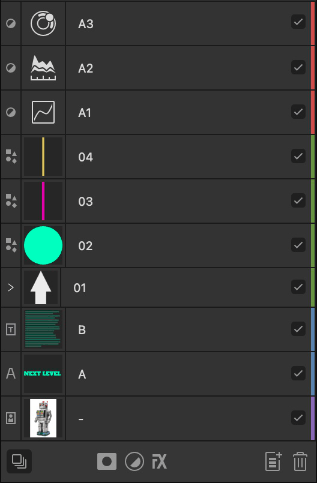

# Tagging layers

Layers can be tagged with a colour to help differentiate specific layer content in the Layers panel.

*Layers showing colour tagging as vertical coloured strips at the end of each entry.*

Tagging provides a useful additional means of organising layer content beyond grouping layers, as it allows you to organise a set of layers without affecting the layer order. All layers that share the same tag colour can be [selected at once](04-selecting-and-editing-layers.md) from the **Layers** panel or **Select** menu.

**To assign a tag colour to a layer(s):**

1. (Optional) On the **Layers** panel, select multiple layers.
2. Do one of the following:
   - 

     `Click`-click **Toggle Visibility**, and select a colour tag from the pop-up menu. For multiple selected layers, any of the selected layers can be targeted.
  - `Click`-click a layer and select a colour swatch from the pop-up menu.

> **Note:** When you assign a tag colour to a layer group, it is also applied to layers within the group *except* any that have a colour tag already.

**To remove a tag colour:**

- With a layer (or multiple layers) selected, on the **Layers** panel, `Click`-click and choose the first colour swatch (white with a red line through it). Tag colours are removed from the entire selection.

> **Note:** When you remove a tag colour from a layer group, it is also removed from any layers of the same colour within the group.

#### SEE ALSO:

- [Selecting and editing layers](04-selecting-and-editing-layers.md)
- [Layers panel](../23-panels/11-layers-panel.md)
- [Selecting](../08-object-control/01-selecting-objects.md)
