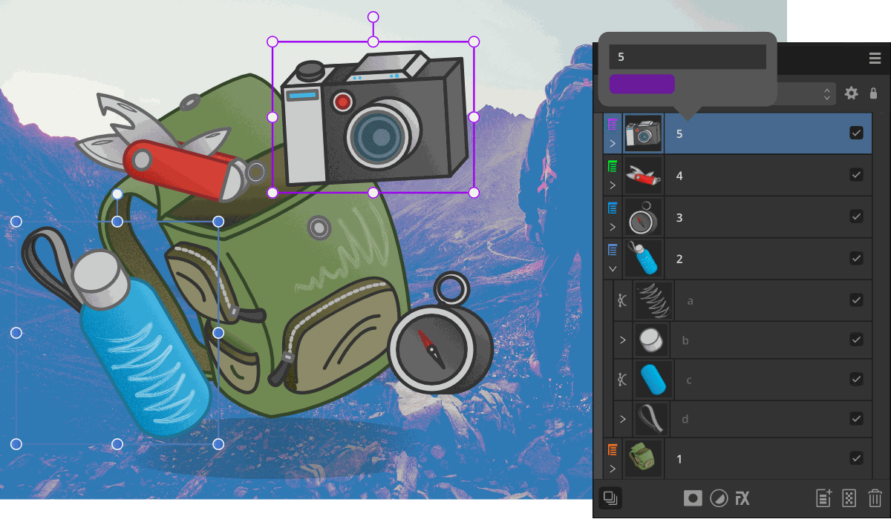

# Layer colours

Use layer colours to change the UI display colour of all object's path, nodes and handles within a chosen layer.

*Different layer colours showing on the bounding boxes of objects (the panel's layer icon also shows the layer colour).*

## About layer colours

Objects drawn outside of layers will adopt a default blue wireframe path, nodes and handles. For any layer you create, it will be assigned the same default blue colour but you can assign a different colour to the layer at any time. This means that any tool you use while drawing new objects or editing objects in that layer will adopt the current layer colour.

> **Tip:** This isn't the object's fill or stroke but the path, node or handle colour that shows only on object selection.

For reference, the layer colour is used to colour the layer type icon for the layer entry in the **Layers** panel.

Use layer colours to either help visually identify which layer you're working on or to help distinguish an object's path, nodes and handles from low colour-contrast surroundings. For the latter, if you're drawing something blue (for example), the default layer colour of blue would mean that your object's path, nodes or handles could be hard to see, so choosing a different layer colour, e.g. orange, would improve UI visibility when you worked with objects on that layer.

> **Note:** Layer tagging differs from using layer colours as tagging involves visually identifying layers by colour in the **Layers** panel to show those layers are related in some way.

**To assign a layer colour to a specific layer:**

1. On the **Layers** panel, `Click`-click a chosen layer and select **Properties**.
2. Click the swatch and select a colour from the pop-up menu.

Any object drawn in the layer will display paths, nodes and handles in that layer's layer colour.

#### SEE ALSO:

- [Layers panel](../23-panels/11-layers-panel.md)
- [Tagging layers](13-tagging-layers.md)
