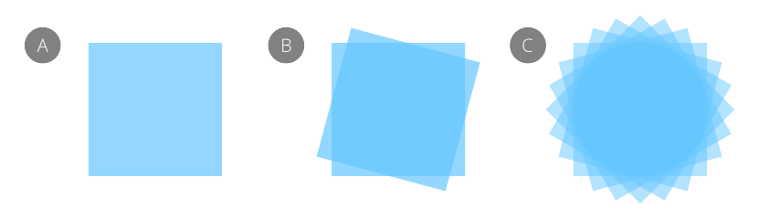

# Duplicating objects

Increase your efficiency by duplicating objects or groups.

Affinity Designer lets you make copies of your original object. Once duplicated, you can modify the duplicate to create design variations.

**To duplicate:**

Do one of the following:

- On the page, drag a selected object with the `Cmd`  pressed. While dragging, release the key to move the object instead, or press the key while moving to duplicate rather than move.
- On the **Layers** panel, `Click`-click a layer, group or object and select **Duplicate**.
- On the **Layers** panel, press the `Alt`  down and drag the layer you would like to duplicate into its position.

> **Note:** You can also duplicate a selected layer using the same command from the **Edit** menu.

## Power duplicate

If you duplicate an object and then transform the duplicate, you can immediately duplicate this transformed object. If you do, the newly created object will adopt the transform of the duplicate and will be also transformed again using the same settings. In other words, the transform is applied accumulatively to subsequent duplicates.

*(A) original object, (B) original object duplicated and rotated by 15°, (C) transformed duplicate duplicated numerous times.*

**To power duplicate:**

1. Select one or more objects or groups.
2. From the **Edit** menu, select **Duplicate**.
3. Transform the duplicated object or group.
4. From the **Edit** menu, select **Duplicate**.

  A duplicate is created and the transform is automatically applied to the duplicate.
5. Repeat step 4 to create more duplicates with the transform accumulatively applied.

#### SEE ALSO:

- [Arrange/manage layers](../07-layers/05-arrange-manage-layers.md)
- [Keyboard shortcuts for object control](../26-keyboard-shortcuts/01-keyboard-shortcuts.md)
