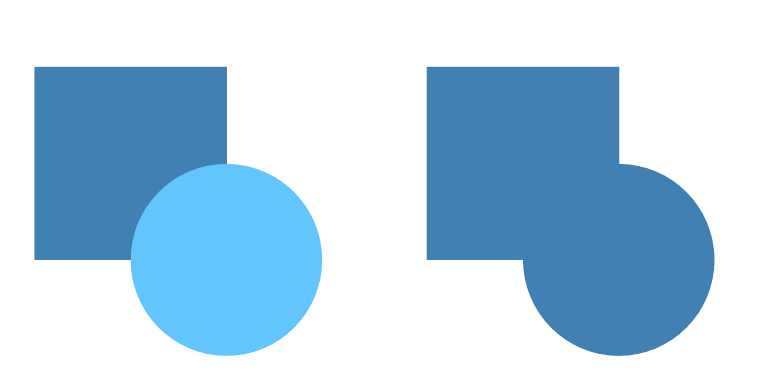
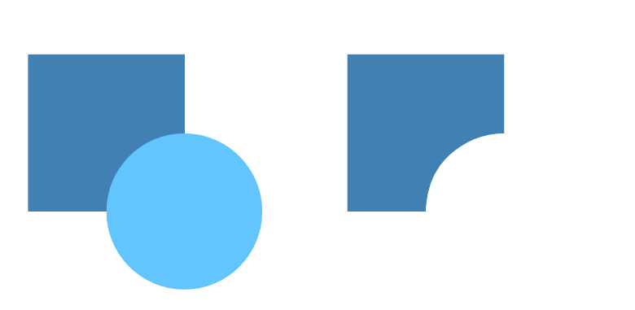
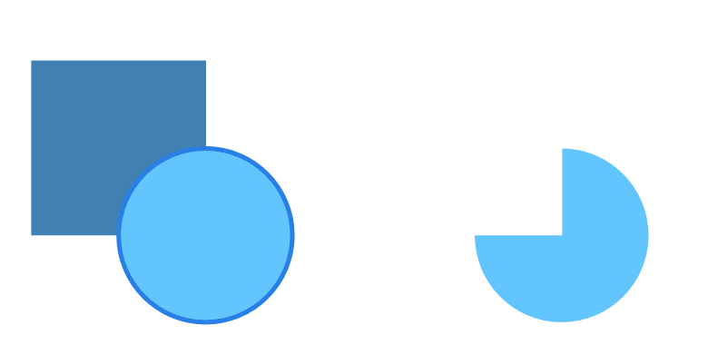
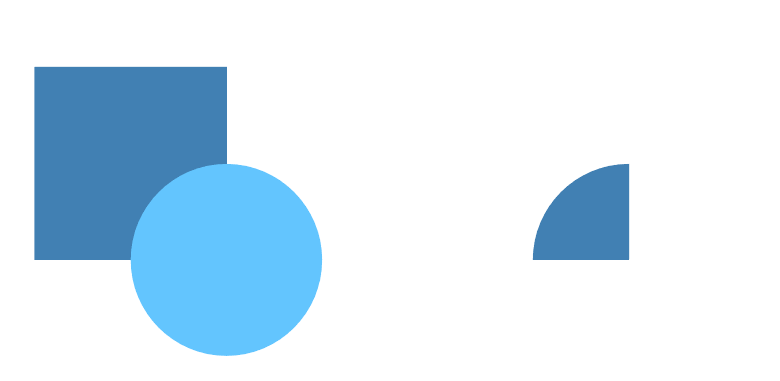
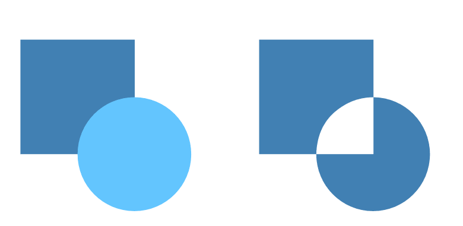
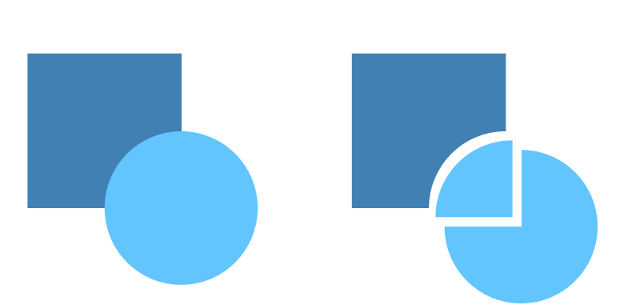
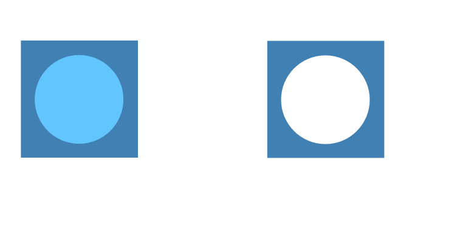
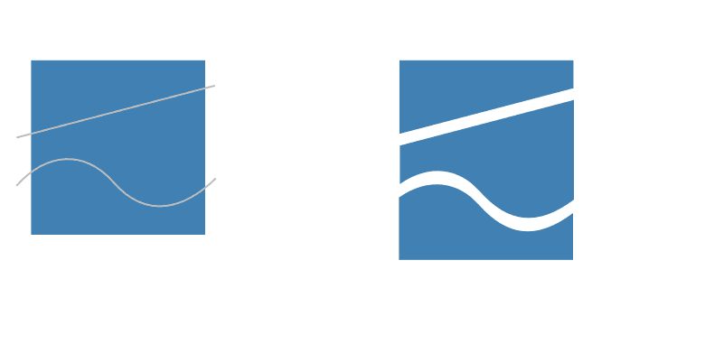

# Joining objects with Booleans

Objects can be joined together to create an unlimited variety of shapes using Boolean operations. Joining operations are permanent.

## Joining operations

There are various operations available (illustrated as before and after):

**Add**—creates a new object from the sum of the selected objects; the colour of the lowest object is used.

> **Note:** The **Add** operation can be applied to a single shape, where the resulting shape is the outline of the original shape.

**Subtract**—removes overlapped areas of the lowest object. All other selected objects are discarded.

> **Tip:** Alternatively, with objects selected, press the `Alt`  and click a 'key' object to subtract from, instead of the lowest object. The key object shows with a strong outline coloured blue by default or with the containing layer's layer colour.
>
>
> 

> **Note:** **Layer>Geometry>Fill holes** will remove any holes within one or more selected shapes, filling it with the surrounding shape’s fill.

**Intersect**—creates a new object from the overlapping areas common to all selected objects.

> **Note:** For more than two objects, all objects must intersect each other.

**Xor**—merges selected objects into a composite object with transparent area where filled regions overlap.

**Divide**—splits object areas into separate objects; the object from the intersecting area retains the colour of the upper object.

*Cut away of a fully overlapping object from the object below (the residual object can be deleted).*

*Object being be split by one or more straight lines or curves.*

> **Note:** By default, the **Divide** operation will trim off any residual straight lines or curves extending beyond the shape’s outline, plus any lines/curves left over between object fragments.
>
> With the `Alt`  pressed during the operation, you can still retain the original curve(s) or line(s) instead (without trimming) but it will be split at every intersecting point.

**

 

 

 

 

 To implement join operations:**

1. Select multiple objects.
2. Do one of the following:
   - On the Toolbar, select **Add**, **Subtract**, **Intersect**, **Xor** or **Divide**.
  - From the **Layer** menu's **Geometry** submenu, select an operations command.

> **Tip:** Holding down the `Alt`  when selecting **Add**, **Subtract**, **Intersect** or **Xor** will [create a non-destructive compound](06-creating-compounds-with-boolean-operations.md).

#### SEE ALSO:

- [Draw and edit shapes](../05-drawing-curves-and-shapes/06-draw-and-edit-shapes.md)
- [Creating compounds](06-creating-compounds-with-boolean-operations.md)
- [Joining objects by shape building](07-adding-objects-by-shape-building.md)
- [Layer colours](../07-layers/14-layer-colours.md)
