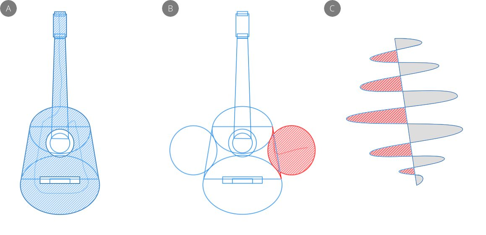
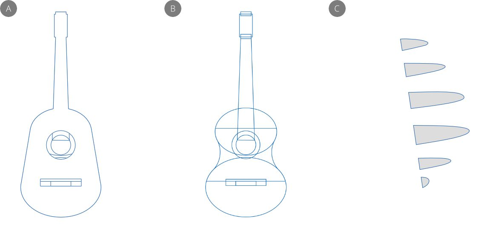
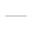

# Adding objects by shape building

Shape building adds separate shapes together to make more complex shape designs using the **Shape Builder Tool**. It can also be used to delete shape areas.

*(A) Adding shapes, (B) deleting unwanted areas, (C) deleting areas on an open filled curve.*

## About shape building

Shape building lets you add geometric and closed shapes into a single, identifiable real-world shape, e.g. a guitar, steam train silhouette, celtic knot, etc. You can also delete unwanted areas that result from overlapped shapes for interesting cutout effects. Open filled and unfilled curves can also have concave or enclosed areas deleted.

## About the Shape Builder Tool

The tool works by making an in-tool selection of 'candidate' shape areas for shape building, then either adding the selected areas together to form a new shape or removing selected areas.

Objects need to be previously selected prior to shape building. Typically, drag a marquee over the shapes you want to work with. You can then choose which objects will be shape building candidates by dragging across shape areas in different ways, i.e. using a freehand line, straight line or selection marquee.

The default tool behaviour is to build up a selection of candidate shape areas, then once you're happy with your selection you can add or delete them in a final operation. This offers maximum flexibility and experimentation while shape building in advance of committing to your changes. Alternatively, you can take an 'as-you-go' approach to shape building where different **Action** modes will add, delete or create areas immediately using the different drag methods mentioned previously.

**

 To select objects for shapebuilding:**

1. Select the **Shape Builder Tool**.
2. Drag a marquee over the objects you want to include.

> **Note:** You're not actually performing shape building at this point—just including the objects you want to work on.

**

 To add, delete or create areas:**

1. Ensure the **Shape Builder Tool** is active and objects are selected.
2. On the context toolbar, choose a **Drag method**, then drag across shape areas to include them as candidates for shape building—you can use a freehand or straight line drawn between adjacent areas, or a marquee drawn over the selected shapes. A hover-over strong outline indicates a targeted area ready for candidate selection. Once selected, linear hatching indicates the shape area is a candidate.
3. (Optional) On the context toolbar, choose a **Clean up** method for automatically removing unwanted internal or connected curves, as well as all unused geometry.
4. When you're happy with your chosen shape areas, click one of three **Action** options on the context toolbar:
   - 

     Creates a new shape from selected areas; the original affected objects are removed. Alternatively, press the **Return** .
  - 

     Deletes selected shape areas. Alternatively, press the  .
  - 

     Creates a new shape from selected areas while retaining the original selected objects.

> **Tip:** Use +, - and * keys on your numeric keypad for the above actions, respectively.

> **Tip:** To deselect any selected areas, press the `Esc` .

**

 To add, delete or create areas as-you-go:**

1. Ensure the **Shape Builder Tool** is active and objects are selected.
2. 

   

   

   On the context toolbar, enable one of the **Action** options.
3. Choose a **Drag method** to shape build with.
4. Drag from a starting area to other areas and release to add, delete or create immediately.

When adding areas, the object style (fill/stroke colour, layer effects and stroke properties) from the heavily outlined area you drag from (or marquee select from) is carried over by default; dragging from outside the area will pick up the currently set default stroke/fill instead. You can disable this by unchecking **Use style from first selected area** on the tool's context toolbar. Instead, the currently set default stroke/fill will be applied to the newly created area.

> **Note:** ### Modifier keys
>
>
> The following modifier keys can be used:
>
>
> - To instantly delete selected areas (instead of adding together) or manually remove unwanted curves while dragging, press the `Alt` key as you drag using any **Drag method**.
> - The `Cmd`  clears the selected areas when clicked and makes a new layer selection of the clicked object.
> - `Shift` `Enter` creates a new shape from selected areas.

#### SEE ALSO:

- [Selecting objects](01-selecting-objects.md)
- [Shape Builder Tool](../22-tools/design-tools/16-shape-builder-tool.md)
- [Keyboard shortcuts for operations](../26-keyboard-shortcuts/01-keyboard-shortcuts.md)
