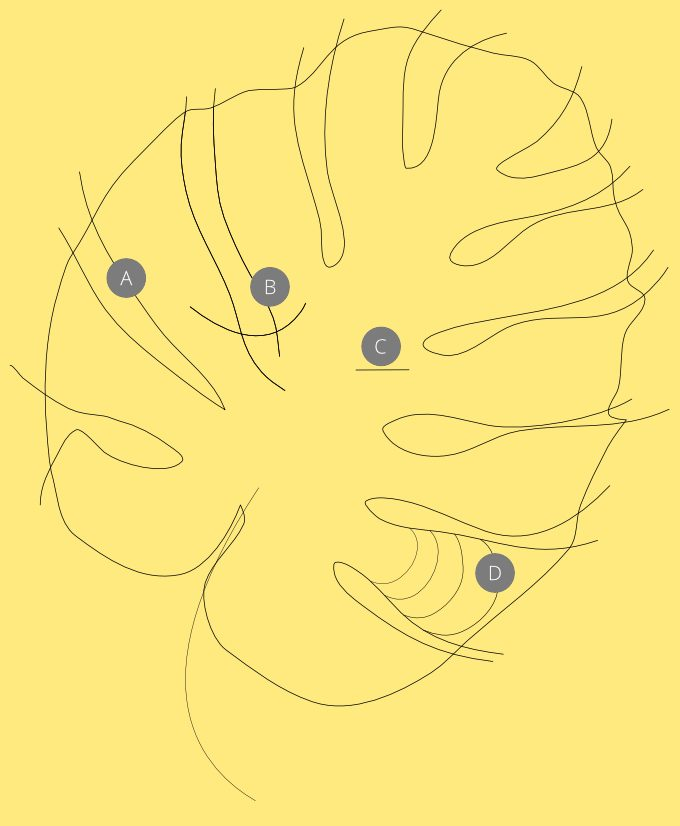
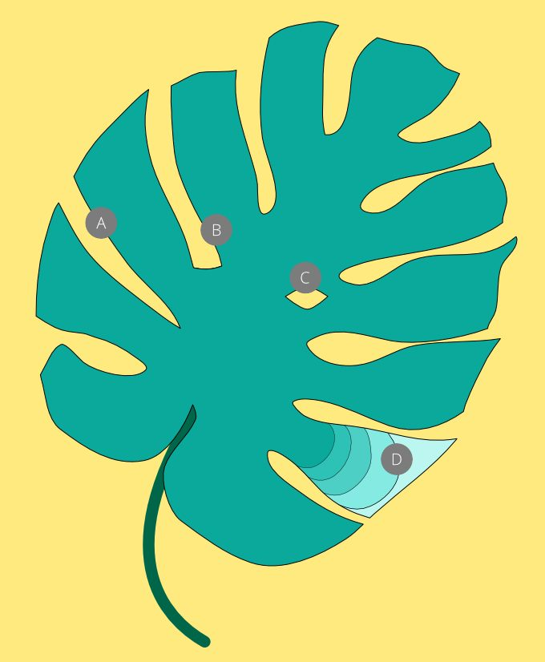
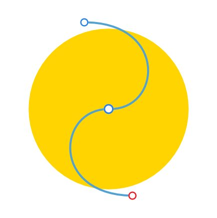
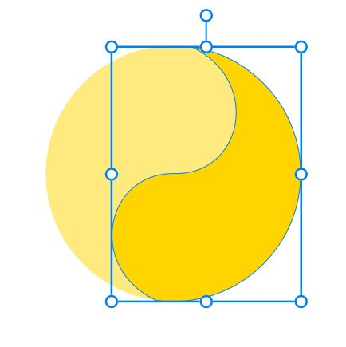

# Cutting objects

Objects can be easily cut up in various ways using the Knife Tool or a Divide Boolean operation.

*Knife Tool: (A) Single-stroke cut and delete, (B) Intersecting multi-stroke cut and delete, (C) Single-stroke cut and separate, (D) Multi-stroke cut and recolour of fragments.*

*Knife Tool: (A) Cutting a single curve with two one-click scissor cuts and (B) cutting multiple straight lines simultaneously using a single-stroke cut. Unwanted curve fragment(s) are subsequently deleted in both.*

*Divide Boolean operation: splitting an object with a Bézier curve (drawn with the Pen Tool).*

## About cutting

Two techniques are possible using different features:

- Knife Tool—cuts objects quickly in one operation using a freeform or straight line drawn with the Knife Tool. Key features include:
   - Stroke stabilisation: smoothing of the knife stroke.
  - Autoclosing of open curves to cut out holes from objects.
  - Scissor cuts: to break open curves at a target node or anywhere on a curve segment or to break open closed shapes too.
- Divide—takes advantage of the power of the Pen Tool to create a 'cutting' Bézier curve (editable with the Node Tool) to cut from in advance of dividing up into object fragments. This approach lets you fine-tune the cutting line before cutting.

For either technique, instead of repositioning, reshaping or deleting specific fragments after cutting, you can simply recolour each fragment independently.

Cutting works irrespective of layers. You can cut across any selection of objects as long as the selection is in place.

## About partial cutting

Partially cutting into an object will create a split, i.e. a 'closed up' cut with each side of the cut touching. The appearance is of a single stroke but editing either curve (by moving overlapped/overlapping node apart) will open the cut.

 ## Intersecting cuts

When you draw a series of separate strokes that intersect each other, you create a polycurve that cuts out the underlying object.

**

 

 To cut shapes (Knife Tool):**

1. From the Pencil Tool flyout, select the **Knife Tool**.
2. 

   (Optional) Cut with a straight line by enabling **Straight Line** on the context toolbar before you drag. By default, you'll cut using a drawn freehand line.
3. (Optional) For drawn freehand lines, check **Stabiliser** on the tool's context toolbar to draw smoothed lines using a Rope Mode or Windows Mode; use the former for redirecting a smoothed path using a draggable rope that can introduce sharp corners; the latter for a consistently smooth curve.
4. Drag the cursor across the shape.
5. With the **Move Tool** enabled, do any of the following:
   - Drag the newly split fragments apart after reselection.
  - Delete an unwanted fragment by pressing the `Cmd` , clicking a fragment, then pressing the `Backspace` .
  - Select a fragment and recolour with the **Colour** panel.

**

 To cut curves (Knife Tool):**

1. From the Pencil Tool flyout, select the **Knife Tool**.
2. Do one of the following:
   - For a knife cut (creating separate curves): Drag the cursor across the curve.
  - For a scissor cut (creating a polycurve): Hover over a selected curve's target node or anywhere along a curve segment, then click to make the cut. The cursor will change to a scissors cursor.

    Use **Separate Curves** via **Layer >Geometry** and the **Move Tool** to create separate curves from the polycurve, then reposition the curves independently.

  With the `Cmd`  pressed, edit the curve(s) (Node Tool behaviour) or press the `Ctrl`  additionally to delete an unwanted segment on clicking.

> **Tip:** Use the **Layer>Geometry** option called **Cut curves with key object** to cut into curves and shapes using a previously targeted key object (assigned with `Alt`-click) in a multi-object selection. For example, you could use a morphed geometric shape to cut into underlying vector content. The stroke and fill of the key object are not considered in the cut.

**

 

 

 To cut objects using Bézier curves (Divide Boolean operation):**

1. With the **Pen Tool**, draw a Bézier curve(s) over an object.
2. With the **Move Tool**, select the curve(s) and the underlying object.
3. On the **Toolbar**, select **Divide**.

The Divide operation will remove the pen strokes by default, although you can retain them by pressing the `Alt`  during the Divide operation.

> **Note:** ### Modifier keys
>
>
> With the **Knife Tool** active, the following modifier keys can be used:
>
>
> - The `Shift` `Alt` s draw a straight knife stroke across your object from a fixed position.
> - The `Shift`  constrains a straight knife stroke to 45° intervals, including to horizontal and vertical.
> - The `Ctrl` , while it remains pressed, converts a freehand knife stroke to a straight line stroke as you draw; release the  to continue freehand knife cuts.
> - The right-mouse button, while it remains pressed, converts a freehand knife stroke to a straight line stroke as you draw; release the button to continue freehand knife cuts.
> - To delete or edit cut fragments, press the `Cmd` , then the `Backspace` .

#### SEE ALSO:

- [Knife Tool](../22-tools/design-tools/08-knife-tool.md)
- [Draw curves and shapes](../05-drawing-curves-and-shapes/02-draw-curves-and-shapes.md)
- [Edit curves and shapes](../05-drawing-curves-and-shapes/03-edit-curves-and-shapes.md)
- [Joining objects](05-joining-objects-with-boolean-operations.md)
