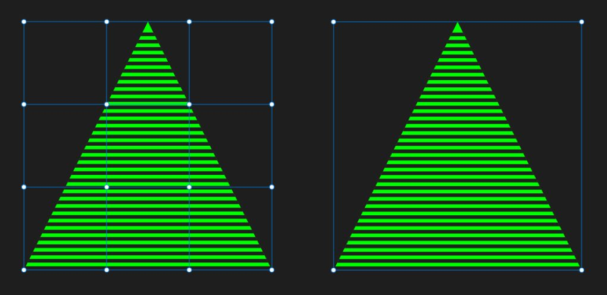
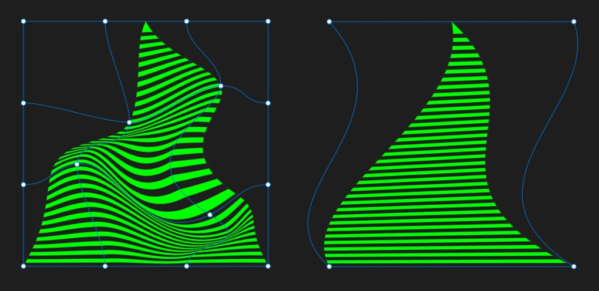

# Warping objects

The Vector Warp feature lets you warp one or more objects non-destructively. A choice of warp presets is available, with any preset being editable using a customisable warp mesh.

## About vector warps

You can warp shapes, straight lines, curves and text by applying a warp preset directly to selected objects. All warp presets apply a mesh to the objects which can be manipulated.

### Mesh, Quad and Perspective presets

With these warp presets, objects are not initially warped but need to be warped manually. The Mesh preset lets you reposition existing or manually added mesh junctions (circular nodes) as well as their control handles. Quad and Perspective presets let you drag by the mesh's corner junctions and control handles.

The presets differ because the mesh's junctions and control handles are set up specifically for mesh grid, quad and perspective warp design.

*Mesh (left) and Quad/Perspective presets (right) showing their pre-warp state (Before) and after applying a warp by editing mesh junctions (After).*

### Shaped warp presets

Different shaped warp presets can be applied automatically depending on the design you're looking for. They offer familiar and popular warps and can be a good starting point before fine-tuning the warp.

*Shaped warp presets: Arc - Horizontal, Bend - Vertical, Fish Eye, Twist (left to right).*

### Warp groups

Any warp preset will create a warp group that controls the warp. Contained objects within the warp group remain unaffected, giving the feature its non-destructive behaviour.

Warp groups behave much like ordinary groups you'll find in Affinity apps. Any group can be moved on the page, while any contained object can be dragged in or out of the group at any time.

> **Tip:** You can create warp groups within a warp group to introduce warp-in-warp effects with each warp potentially using different warping styles.

**To apply a warp preset:**

1. Select one or more objects.
2. Do one of the following:
   - 

     On the **Layers** panel, select **Warp**.
  - Select **Layer>Warp Group**.
3. On the pop-up menu, select a preset.
4. On the context toolbar, adjust settings specific to the type of warp preset chosen. For example, **Value** controls how much warping is applied while maintaining the original symmetry of shape-based warp presets.

See Editing mesh warps (below) for details of how to move and add mesh junctions, as well as adjust a junction's control handles.

**To temporarily hide the warp to show unwarped objects:**

- On the context toolbar, select **Mute Mesh**.

**To convert to curves:**

- On the context toolbar, select **Convert to Curves**.

The object is turned into a closed shape made up of curves. For text, each text character is converted to a separate curve. The resulting curves are grouped automatically.

## Editing warps

Once warped, you can edit the warp using the **Node Tool** in a similar way to editing a curve, except you are actively warping as you edit, as opposed to reforming a curve or shape. Editing will let you reposition one or more junctions, adjust any selected junction's control handles, add junctions or reposition a mesh patch (the area enclosed by four mesh junctions).

### Selecting junctions

You can use various techniques for making multiple selections of junctions. This allows you to warp from multiple points in one operation. Selection methods include:

- Marquee selection—you drag a marquee over a range of junctions to encompass them.
- Individual selection—use a modifier key to select multiple junctions one-by-one.
- Lasso/polygon selection—use a modifier to drag a lasso around junctions or draw click-by-click polygons for more precise targeting of specific junctions.

### Snapping junctions

When you reposition junctions you can make use of two types of snapping, i.e.

- Global snapping—you can snap junctions to page horizontal/vertical centre and page elements (e.g., margins and placed guides) just like snapping nodes when pen drawing.
- Junction-to-junction snapping—use context toolbar **Snap** options to align junctions to each other vertically and horizontally.

### Editing warp objects

Any contained object in a warp group can be edited independently of the group and other grouped objects. For example, you can fix a typographic error or rename the warped text at any time, or recolour a specific object.

**To edit the warp:**

- On the **Layers** panel, click the chosen warp group's layer thumbnail.
- With the **Node Tool** now active, reposition the junctions or connected control handles by dragging.

**To add new mesh junctions to the warp:**

Do any of the following within the warp's outline:

- Click on a mesh line.
- Double-click in any area enclosed by mesh lines.

The new mesh junction can then be:

- repositioned to warp the area directly under the junction.
- converted to a smooth or cusp (sharp) **Junction** on the context toolbar.

**To move a mesh patch:**

- Click anywhere within a mesh patch, i.e. the area enclosed by four junctions, to place a circular 'hollow' junction target.
- Drag the target in any direction to warp the entire patch, by moving its four junctions simultaneously and in relation to each other.

**To adjust a junction's control handles:**

- Select a junction and drag one of its control handles.

**

 To snap junctions globally:**

1. On the **Toolbar**, select **Snapping**.
2. Drag a junction to page horizontal/vertical centre or page elements (e.g., margins and placed guides).

**To align junctions using snapping:**

1. On the warp group's context toolbar, select a **Snap** menu option.
   - 

     **Align to nodes of selected curves**—will horizontally or vertically align any node you drag to any other node in the same warp group.
  - 

     **Snap all selected nodes when dragging**—will snap multiple selected nodes, when dragging, to a "target" node in the same warp group.

**To edit warp objects:**

Do any of the following:

1. With the **Move Tool** active, click on the target object in the warp group until it becomes selected.
2. Edit the object as you would normally do.

> **Note:** ### Modifier keys
>
>
> When using the Node Tool, the following modifier keys can be used to edit the mesh:
>
>
> - Pressing the `Shift`  while dragging a selected junction(s) will constrain vertically, horizontally or diagonally (45°).
> - Select junctions with the `Shift`  pressed to create multiple selections; tap individual junctions to remove from the selection.
> - Pressing the `Alt`  and dragging a control handle creates a sharp (cusp) corner on a mesh junction.
> - Pressing the `Alt`  and drag over junctions to select multiple junctions within the drawn lasso area. Alternatively, select by drawing polygonal areas click-by-click.
> - The `Alt`  temporarily overrides snapping.
> - `Cmd` + `Y` toggles between the active warp and an X-ray 'filled' view mode showing the warp muted (unwarped).

#### SEE ALSO:

- [Transforming objects](16-transforming-objects.md)
- [Grouping objects](03-grouping-objects.md)
- [Selecting and aligning nodes](../05-drawing-curves-and-shapes/07-selecting-and-aligning-nodes.md)
- [Snapping](../17-design-aids/11-snapping.md)
- [Perspective filter](../20-distortion-filters/02-perspective-filter.md)
- [Mesh Warp filter](../20-distortion-filters/01-mesh-warp-filter.md)
- [Layers panel](../23-panels/11-layers-panel.md)
