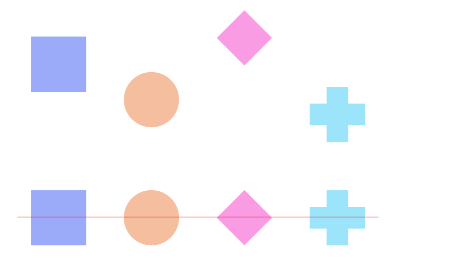

# Aligning objects

Objects can be aligned on the page accurately using the Alignment commands.

*Before and after vertical alignment applied.*

**

 To align objects:**

1. Select multiple objects.
2. Do one of the following:
   - On the Toolbar, click **Alignment**, set the **Align To** option, then an **Align Horizontally** or **Align Vertically** option from the pop-up panel. Click **Apply**.
  - From the **Layer** menu's **Alignment** submenu, select an alignment option.

The following settings can also be used from the context toolbar, either in relation to selection bounds or to a key object, designated by clicking on an object to align to with the `Alt`  pressed (the key object is identified with a strong blue outline):

- **Align Horizontal**—aligns the selected objects using the **Left** edges, **Centre** points, or **Right** edges of the objects.
- **Align Vertical**—aligns the selected objects using the **Top** edges, Centre points (**Middle**), or **Bottom** edges of the objects.

> **Note:** To align objects on different layers, **Edit All Layers** needs to be enabled.

> **Tip:** Make use of more Align options by customising the Toolbar (**View>Customise Toolbar**).

**

 To toggle Edit All Layers:**

- On the **Layers** panel, click **Edit All Layers**.

## Alignment handles

When enabled, alignment handles appear as you drag objects, allowing you to place them precisely by lining them up in accordance with other objects in your document. Alignment handles are especially useful for aligning the edges or centres of multiple selected objects to another page object or guide.

**

 To add alignment handles to a selection:**

1. With an object (or objects) selected, click on the **Move Tool**.
2. From the context toolbar, select **Show Alignment Handles**. When selected, alignment handles are displayed at the centre and edges of the selected object. Hovering over these handles displays a floating guideline across the page.
3. Drag the selected object via any alignment handle (centre or edge) to align it to a page element on the spread. This position can be snapped for accuracy.

#### SEE ALSO:

- [Distributing objects](11-distributing-and-spacing-objects.md)
