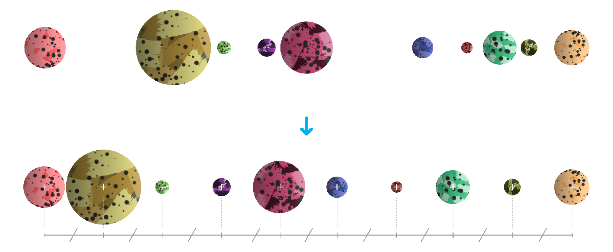
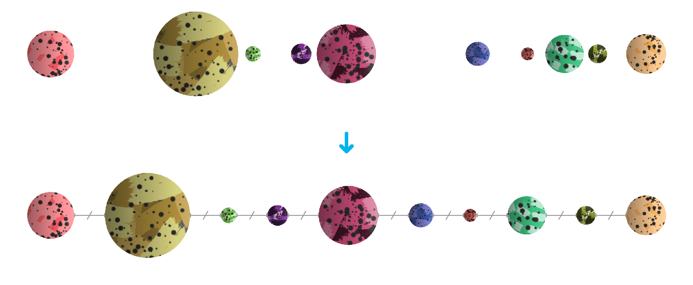

# Distributing/spacing objects

Objects can be distributed or spaced evenly within object selection bounds using alignment commands.

## Distribution and spacing

The distribution of objects involves setting an equal distance between object *centres*.

*Objects before and after distribution.*

The spacing of objects ensures there is an equal distance between object *edges*.

*Objects before and after spacing.*

**To distribute or space objects (by menu):**

1. Select multiple objects.
2. From the **Layer** menu's **Alignment** submenu, select a Space or Distribute option.

**

 

 

 To space objects (by Toolbar):**

1. Select multiple objects.
2. On the Toolbar, click **Alignment**, click **Space Horizontally** or **Space Vertically** from the pop-up panel, and then click **Apply**.

> **Note:** With **Auto Distribute** selected (default), the objects are spaced evenly within the selection bounds. If this option is off, a specified distance between objects can be set in an input box adjacent to the option.

> **Note:** Make use of advanced distribute options in-panel by customising the Toolbar (**View>Customise Toolbar**).

#### SEE ALSO:

- [Aligning objects](10-aligning-objects.md)
