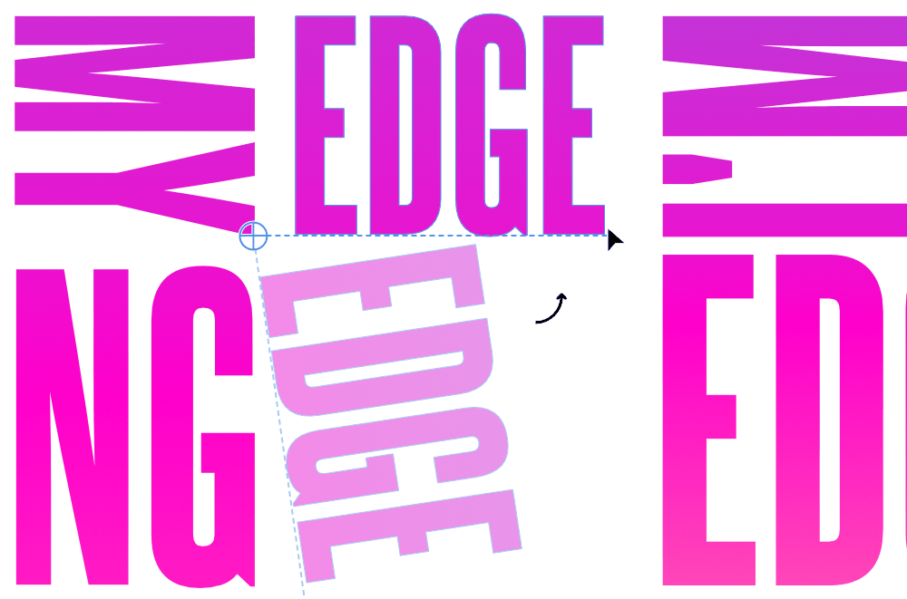

# Transforming objects

Objects can be flipped, rotated, positioned and sized on the page or with absolute precision using the **Transform** panel.

*The background object has been rotated left, while the foreground object has been flipped horizontally.*

You can also transform an object about a point on its own geometry, another object's geometry or a point on the page.

*The text object is rotated about its repositioned transform origin using the Point Transform Tool.*

**

 

 

 

 To flip or rotate objects:**

1. Select one or more objects.
2. Do one of the following:
   - On the Toolbar, select a flip or rotate option.
  - From the **Layer** menu's **Transform** submenu, select a flip or rotate option.

> **Note:** You can also [rotate objects](17-rotating-and-shearing-objects.md) directly on the page by dragging the selection's rotate handle or by using the **Transform** panel.

**To position objects accurately:**

1. Select one or more objects.
2. On the **Transform** panel, change **X** and/or **Y** values.

**To nudge objects:**

1. Select one or more objects.
2. Do one of the following:
   - For nudging by a single unit of measurement: Press an arrow key.
  - For 10x the single unit of measurement: Press an arrow key with the `Shift` pressed.

> **Note:** As you nudge, measurements appear in the direction of travel.
>
>
> **macOS:**
>
> You can change nudge distances via **Affinity Designer>Settings** (or **>Preferences**) (**Tools**)
>
>
> **Windows:**
>
> You can change nudge distances via **Edit>Settings** (**Tools**)

**To size objects accurately:**

1. Select one or more objects.
2. On the **Transform** panel, change **W** and/or **H** values.

> **Note:** You can scale objects from a custom transform origin (rather than an anchor point) that has been placed prior to transforming.

**

 To transform a selected object about a specific point:**

1. With the **Point Transform Tool** selected, reposition the transform origin to your chosen 'pivot' point on the current or another object's path (or specific node), or even a random point on the page.
2. (Optional) Reposition the shape so its transform origin snaps onto another object's geometry or node.
3. Transform the selected shape by dragging from a chosen node.

> **Tip:** While using the tool, the **Transform** panel changes functionality to allow you to enter distances (ΔX, ΔY), scaling percentage (S) and angle (ΔR) in relation to the current transform origin.

> **Note:** ### Modifier keys
>
>
> When using the Point Transform Tool, the following modifiers can be used:
>
>
> - `Shift`  scales the object only.
> - `Cmd`  rotates the object only.
> - `Shift` + `Cmd`  rotates the object only (in 15° intervals).
> - `Ctrl`  moves the object.
> - Additional press of right-hand mouse button moves the object.

**

 To transform selected objects separately:**

1. Select multiple objects.
2. With the **Move Tool** selected, select **Transform Objects Separately** from the context toolbar.
3. Transform any object.

## Scale override

When an object is resized, the stroke width, layer effect radii, corner radii and text frame contents can be forced to scale by using the **Transform** panel. If **Scale with object** settings are unchecked on the object itself (stroke, layer effect, etc.) then they will be ignored.

> **Tip:** For best results, use Scale override when resizing and maintaining the object's aspect ratio.

**

 To override scaling on objects:**

1. Select an object.
2. On the **Transform** panel, enable **Scale Override**.
   Resize via the object's handles with the `Shift`  pressed.

**

 To override scaling on objects selectively:**

1. Select an object.
2. On the **Transform** panel, click the **Scale Override** down arrow to check/uncheck the following settings:
   - **Line weights**—useful when working on vector objects with a stroke. For example, you can either force or prevent scaling whilst resizing with the setting set to **Scale with object** or **Locked**, respectively.
  - **Shape corners**—to control the scaling of a shape's corners while resizing, you can either force (**Scale with object**) or prevent (**Locked** setting).
  - **Layer effect radii**—to control the scaling of the radius of a layer effect added to an object.
  - **Text frame contents**—to control the scaling of frame text while resizing; when set to **Locked** the container will scale whilst keeping text the same size. When set to **Scale with object** however, text will enlarge when resizing the container by its corner handles.

  Ensure the **Scale Override** button is enabled.
  Resize via the object's handles with the `Shift`  pressed.

#### SEE ALSO:

- [Rotating and shearing objects](17-rotating-and-shearing-objects.md)
- [Transform panel](../23-panels/22-transform-panel.md)
- [Perspective filter](../20-distortion-filters/02-perspective-filter.md)
- [Mesh Warp filter](../20-distortion-filters/01-mesh-warp-filter.md)
- [Keyboard shortcuts for transforming operations](../26-keyboard-shortcuts/01-keyboard-shortcuts.md)
