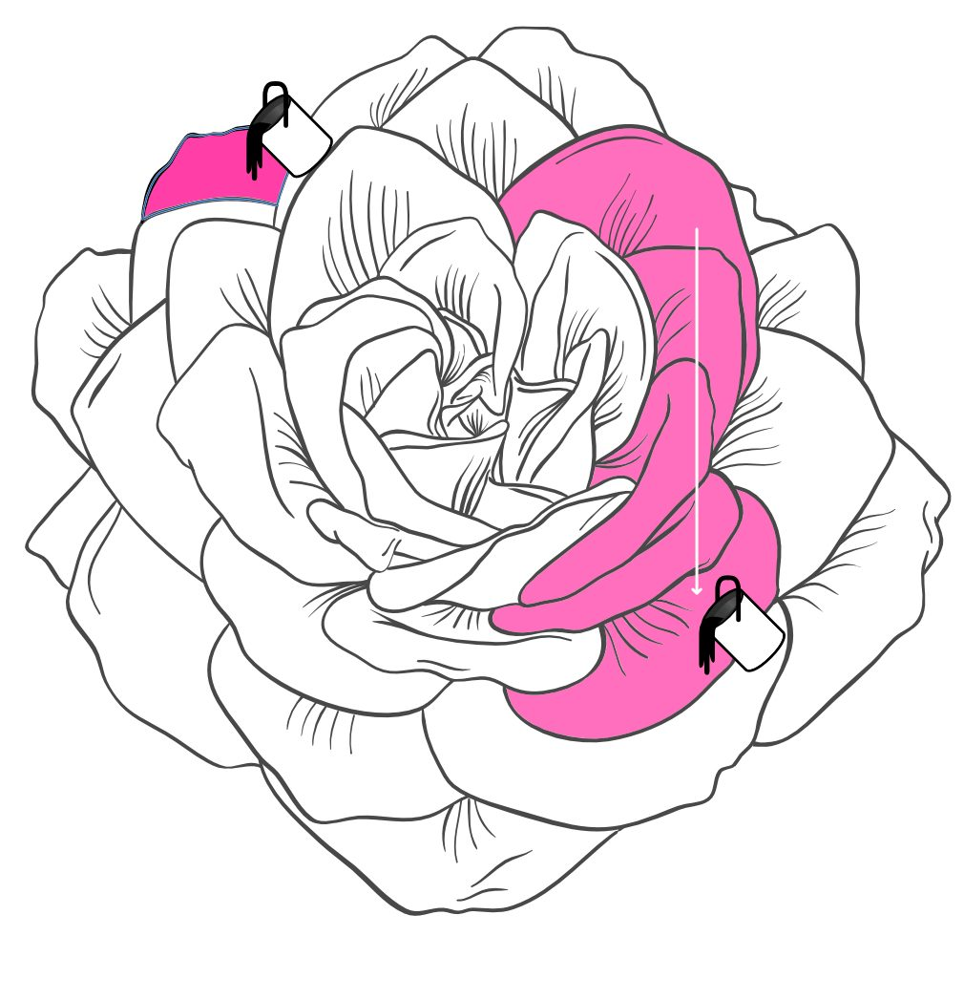
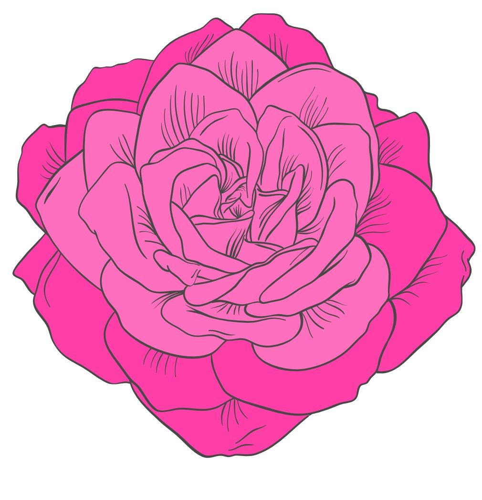
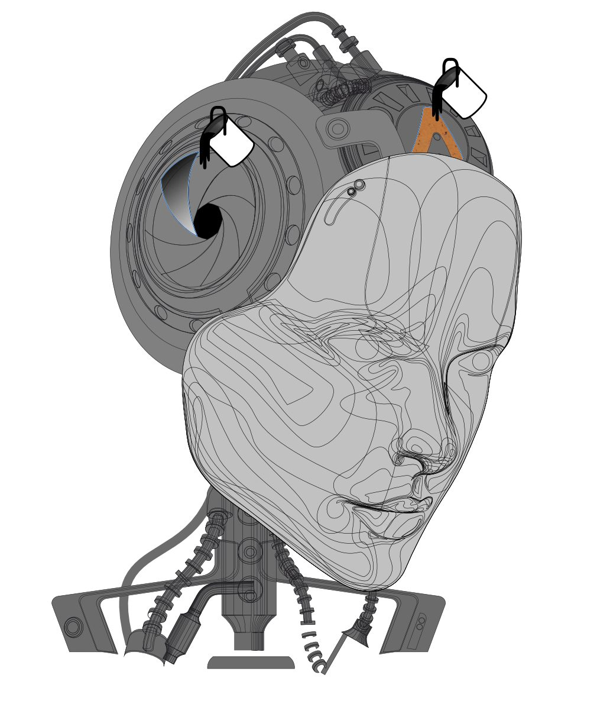
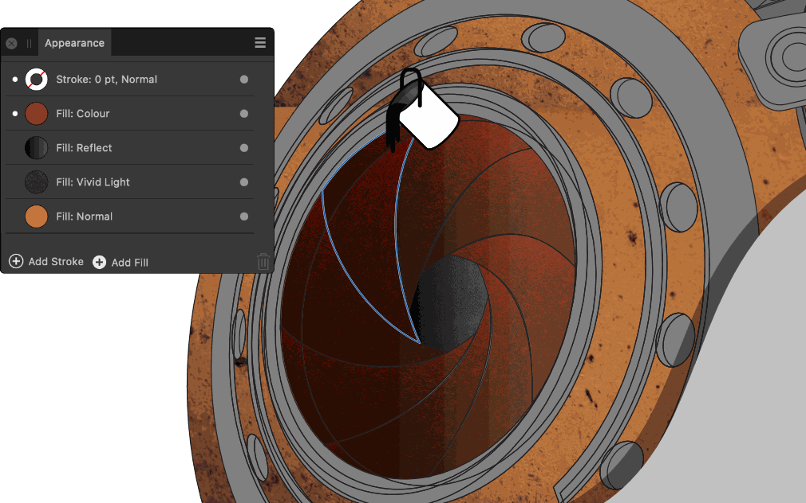
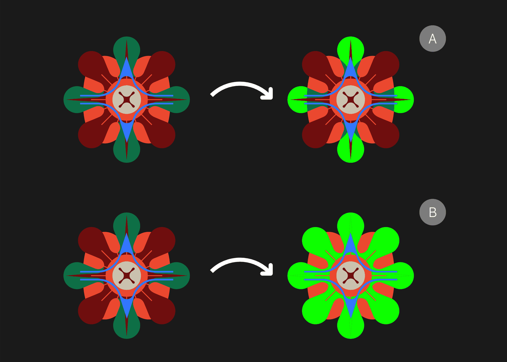

# Flooding areas

The **Vector Flood Fill Tool** lets you flood areas with colour and texture as well as areas that can't otherwise be filled because they are not closed objects. New shapes are created as a result.

*Before and after flood filling using solid colour. The Before image shows the filling of both individual areas (by clicking) or adjacent areas (by dragging).*

*Before and after flood filling using gradient fills and bitmaps.*

## About vector flood filling

Flood filling lets you 'colour in' areas of your design that can't otherwise be filled with the **Fill Tool**. This includes areas created from overlapping closed/geometric shapes as well as open curves.

The **Vector Flood Fill Tool** detects edges in your drawing and then, if a fully enclosed area is detected, it will flood fill to the area's boundary. The current solid colour (in the Tools, Colour or Swatches panels) or colour gradient (in the Swatches panel) is used for the fill, thus creating a new shape. Assets (vector and bitmap), stock images and folder images (from your operating system) can also be used to flood fill.

Some examples include:

- Flooding areas formed by crossing pencil lines
- Creating complex filled vector meshes
- Quick recolouring of individual shapes
- Recolouring areas in architectural line drawings non-destructively

Flooding is carried out by clicking on areas or dragging across multiple areas. The latter being a quick technique that avoids flooding specific objects one-by-one. You can flood fill any object even if it is not selected (filling the whole object) but you can select objects in advance if you want flooding to take into account intersecting shapes and curves.

> **Tip:** The area to be flooded must be self-contained by a curve's or shape's edges. The concave area formed from open curves cannot be flooded if not intersected by another curve.

### Fill types

The tool can flood with different types of fills, i.e.

- solid or gradient fills—from the **Colour** panel (solid fills only) or **Swatches** panel.
- vector designs—from vector assets stored in the **Assets** panel. Note that these are converted to bitmap fills.
- bitmaps—from raster assets (**Assets** panel), stock images or images dragged from Finder.
- bitmaps—from raster assets (**Assets** panel), stock images or images dragged from File Explorer.

#### Scaling with gradient and bitmap fills

You can select the layer object of any gradient or bitmap fill for editing with the **Fill Tool**—this could include swapping the gradient type, adjusting how the gradient/bitmap fill scales or how the bitmap pattern extends.

> **Note:** When applied, the gradient or bitmap fill is scaled to span all areas being flood filled. Separate areas being flooded with the same fill cannot adopt their own indedendent gradient/bitmap scaling.

#### Flood filling with multiple transparent fills

If any of the above fills have reduced opacity or have alpha, they can optionally be 'layered up' to create multi-fill effects when applied in multiples. For example, textures possessing transparency and/or transparency gradients can be placed over a base solid colour. A **Fill mode** on the tool's context toolbar lets you stack or replace fills.

*Appearance panel showing multiple semi-transparent gradient and bitmap fills on a target area.*

> **Note:** Flooding with a solid fill will always completely replace any existing semi-transparent fill stack.

#### Filling to visible boundaries

When dragging across areas to flood fill, you can enable **Fill to Visible Boundaries** to fill to overlapping shapes' outlines and either detect (and fill to) internal edges or ignore internal edges. For the latter, if shapes have the same fill colour, then the flood fill will extend the fill to encompass those shapes automatically.

*Flood filling (with green colour) with Fill to Visible Boundaries disabled (A) and enabled (B).*

**

 To flood an object with colour:**

1. Select the **Vector Flood Fill Tool**.
2. Set your preferred fill in the **Colour** or **Swatches** panel, or from the **Tools** panel.
3. (Optional) On the context toolbar, set a **Fill mode** to control if semi-transparent fills are added to, smart refilled (ignoring identical fills) or replaced in a fill stack.
4. Click on an object. This doesn't require the object to be selected.

> **Tip:** You can drag a swatch from the **Swatches** panel onto an object too; a hover-over preview will be offered.

**

 To flood an object with a bitmap fill:**

1. Select the **Vector Flood Fill Tool**.
2. Do one of the following:
   - On the context toolbar, click **Set Bitmap Fill** then navigate to and select your image. Click **Open**.
  - On the **Assets** panel, select your vector or raster asset.
  - On the **Stock** panel, search for and select a stock image.
3. (Optional) On the context toolbar, set a **Fill mode** for transparent bitmap fills as described in the previous procedure.
4. Click on an object.

Set the context toolbar's **Fit mode** to control its scaling in advance of flood filling.

**

 To flood fill areas on multiple objects that possess intersecting curves and shapes:**

1. Select the **Vector Flood Fill Tool**.
2. Drag a marquee selection over the objects whose areas you want to target, or select objects via the **Layers** panel.
3. Set your preferred colour or bitmap to flood fill.
4. 

   

   (Optional) On the context toolbar, choose an **Insertion mode** to control whether the new shape is to be clipped within the existing upper shape (**Inside**) or added between the shapes (**In-between**).
5. (Optional) On the context toolbar, set a **Fill mode** as described in the previous procedures.
6. 

   (Optional) On the context toolbar, enable **Fill to Visible Boundaries** to extend the fill to the outline of a shape or a curve's path, ignoring the areas formed by the overlap.
7. Do one of the following:
   - Click on an object.
  - Drag across multiple enclosed areas.

> **Note:** ### Modifier keys
>
>
> The following modifier keys can be used for selection of objects when flooding shapes:
>
>
> - The `Shift` and `Cmd` s add objects to the current selection when clicked.
> - The `Cmd`  clears the selected areas when clicked and makes a new layer selection of the clicked object.

#### SEE ALSO:

- [Vector Flood Fill Tool](../22-tools/design-tools/11-vector-flood-fill-tool.md)
- [Gradient and bitmap fills](../06-colour/12-gradient-and-bitmap-fills.md)
- [Using multiple strokes and fills](../05-drawing-curves-and-shapes/09-using-multiple-strokes-and-fills.md)
- [Converting objects to curves](20-convert-objects-to-curves.md)
