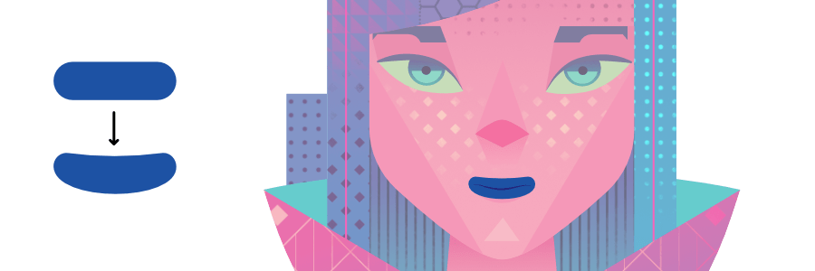

# Convert objects to curves

You can create new shapes by converting geometric shapes (created using the shape tools) into curves and then adjusting the nodes of the resulting shape.

*The rounded rectangle shape is converted to curves to allow the horizontal edges to be modified.*

The Convert to Curves operation is not limited to geometric shapes. You can convert almost any object to curves, including text.

*Text converted to curves.*

> **Warning:** Once an object has been converted to curves, it can no longer be edited in its conventional way. For example, you would not be able to change the font of text once it has been converted to curves.

> **Tip:** New shapes can also be created by joining two or more objects together in a variety of ways. For more information, see the [Joining objects](05-joining-objects-with-boolean-operations.md) topic.

**

 

 To convert a shape to curves:**

1. Select the shape with either the **Move** or the **Node Tool**.
2. Do one of the following:
   - Click **Convert to Curves** on the context toolbar.
  - From the **Layer** menu, select **Convert to Curves**.

The shape is now made from curves and the **Node Tool** is automatically selected. Segments and nodes can be modified with the Node Tool.

#### SEE ALSO:

- [Draw and edit shapes](../05-drawing-curves-and-shapes/06-draw-and-edit-shapes.md)
- [Edit curves and shapes](../05-drawing-curves-and-shapes/03-edit-curves-and-shapes.md)
- [Joining objects with Booleans](05-joining-objects-with-boolean-operations.md)
