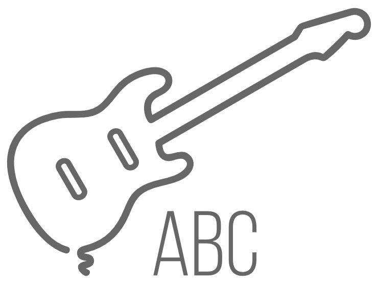
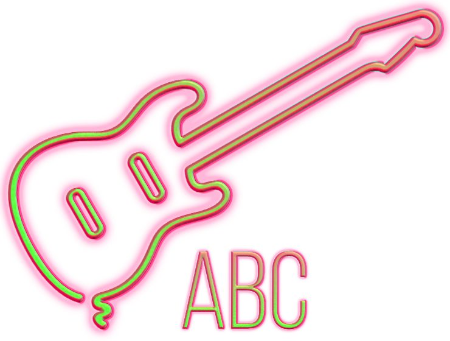

# Styles

Instead of having to create effects, fills, colours and properties for your design from scratch, the **Styles** panel can be used to apply a pre-designed style to your object (shape, artistic text or frame text). If you want to save a combination of the above for future use, these can be stored in the panel as a custom style.

> **Tip:** Styles can be copied and pasted between objects by using the **Style Picker Tool**.

*Neon style applied from the Styles panel.*

> **Tip:** If you plan to save some styles, create a custom category in the panel first.

**To apply a style:**

1. From the **Styles** panel, select a category from the pop-up menu.
2. Click on your chosen style with an object selected, or select and drag your it onto your object to apply it to the object.

**

 To create a custom category:**

1. Click Panel Preferences and choose **Add New Category** from the menu.
2. On the dialog, give the category a name, e.g. MyStyles.

**

 To rename a styles category:**

1. Choose the category you want to rename from the category pop-up menu.
2. Click Panel Preferences and choose **Rename Category** from the menu.
3. Type a new name for the category in the dialog and click **OK**.

**

 To save a style:**

1. On the **Styles** panel, select a category to save the style into.
2. Do one of the following:
   - Select the object whose style you want to save, click Panel Preferences on the **Styles** panel, then choose **Add Style from Selection** from the menu.
  - `Click`-click the object and select **Create Style**.

**

 To sample the style of an object or text:**

1. Select the **Style Picker Tool**.
2. In the document view, click an object or a character in text.

**

 To apply a sampled style to objects/text one at a time:**

After sampling a style:

1. On the context toolbar, select the style attributes you wish to apply.
2. In the document view, click an object or a word, or select a text range.
3. Repeat for any additional objects you wish to style.

**

 To apply a sampled style to multiple objects simultaneously:**

1. In the document view or on the **Layers** panel, select the objects you wish to style.
2. Select the **Style Picker Tool**.
3. On the context toolbar, select the attributes you wish to apply.
4. Sample the style of an object or a character in text.

> **Tip:** Alternatively, with a style loaded onto the Style Picker Tool, drag a selection marquee around the objects you wish to style. Optionally, pressing the `Ctrl`  while dragging selects objects which are only partially covered by the selection marquee. This behaviour can be made the default in Preferences.
>
>
> Alternatively, with a style loaded onto the Style Picker Tool, drag a selection marquee around the objects you wish to style. Optionally, pressing the right mouse button while dragging selects objects which are only partially covered by the selection marquee. This behaviour can be made the default in Preferences.

> **Preferences:** ### Settings (or Preferences)
>
>
> Related behaviours can be adjusted from [the app's settings](../27-settings-preferences/01-settings-preferences.md):
>
>
> - **Miscellaneous>Reset Object Styles**

#### SEE ALSO:

- [Styles panel](../23-panels/17-styles-panel.md)
