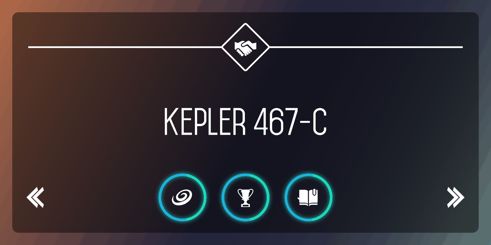
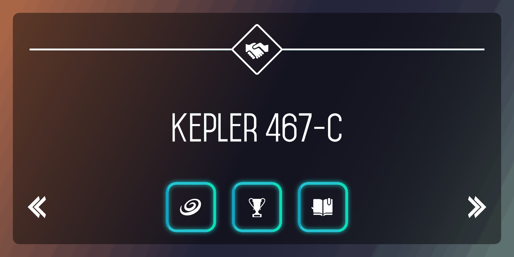
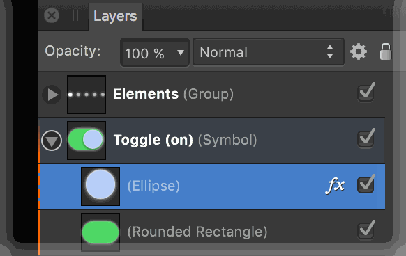

# Symbols

A symbol is an intelligent object that can be placed repeatedly in your document. Editing any one of these symbols on the page will automatically and instantly update all instances of that symbol.

*The glowing button outline is a symbol. When the shape of the button is modified on just one instance, they all change simultaneously.*

## Symbols

Symbols offer a highly efficient way of working, suitable for 'repeating' elements of design that are liable to change, e.g. logos, branding, and buttons, as well as specific adjustments. By avoiding having to edit the same elements multiple times, a symbol can be edited just once with all instances of that symbol updated automatically, even across multiple artboards. You also have the option to edit any symbol instance independently of others.

## Linking

Symbol links are automatically made when creating multiple instances of a symbol. This linkage is fundamental to symbol functionality and, by default, allows changes to symbols to be reflected across all instances.

## Synchronising

Synchronisation allows editing across all symbols, while unsynchronisation means all future editing is restricted to the current object and no longer affects the other symbol instances, until synchronisation is enabled again.

If a symbol instance no longer needs to be a symbol, it can be detached (made into a standard object) without affecting synchronisation. If all symbol instances no longer need to be symbols, you can revert them all back to standard objects.

## Editing

You can perform any edit to symbols just as you would to a standard object. You can:

- Reshape, change stroke/fills, and add effects/adjustments. Note that global colours can also be used to change colour across object independently of symbols.
- Add new 'non-symbol' objects to the symbol by dragging into the symbol group in the Layers panel.

> **Note:** A key feature of symbols is that you can edit object attributes independently of each other—this means that, when unsynchronised, a specific attribute (dimension, fill, effect, font, etc.) can be edited while the remaining attributes will still retain symbols functionality.

As a useful visual aid, symbols are indicated by an vertical orange bar on their layer entries in the Layers panel. If a symbolised object has been edited when unsynchronised a dashed orange bar is shown instead.

*The Layers panel showing symbol indicators.*

> **Note:** The Symbols panel is hidden by default. It can be switched on via the **Window** menu when working in Designer or Pixel Persona.

**

 To create a symbol:**

1. Select an object or group on the page or via the **Layers** panel.
2. On the **Symbols** panel, click **Create**.

> **Tip:** You cannot create a symbol from an object present in an existing symbol.

**To create symbol instances:**

Do one of the following:

- On the **Symbols** panel, drag a chosen symbol onto the page.
- Duplicate an existing 'on page' symbol already present on the page.

Once there are multiple instances on your page, symbol linkage allows synchronisation to occur across objects.

**To edit a symbol instance:**

- On the **Layers**, expand a chosen Symbol entry, then edit the objects within.

> **Tip:** When a symbol that comprises multiple objects is used to create symbol instances on the page, it groups the objects by default. As a result, you have to edit the objects within to affect change across all symbol instances.

**

 To disable synchronisation:**

- On the **Symbols** panel, click **Sync** to disable so any object can be independently edited. When enabled again, editing is synchronised across all symbol instances.

**

 To detach objects from symbols:**

1. Select a symbol on the page or via the **Layers** panel.
2. On the **Symbols** panel, click **Detach**.

Detaching reverts a symbol back to a standard object while keeping synchronisation enabled.

**To delete a symbol:**

- On the Symbols panel, `Click`-click the symbol and select **Delete Symbol**.

All symbol instances will revert to standard objects.

#### SEE ALSO:

- [Symbols panel](../23-panels/19-symbols-panel.md)
