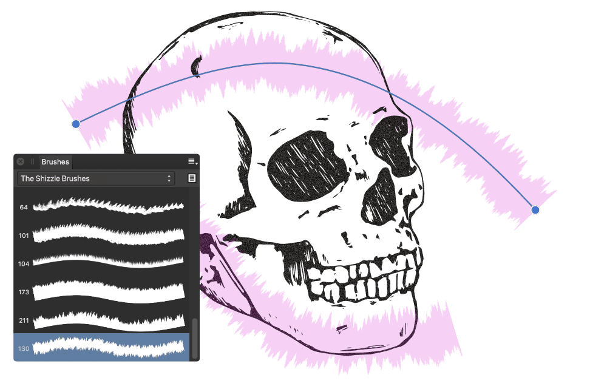

# Painting vector brush strokes

Use the Vector Brush Tool to apply vector brush strokes to your design.

## Vector painting

Affinity Designer provides an impressive selection of vector brushes for use with your Vector Brush Tool with each category containing brushes of varying properties and characteristics; vector brushes are only available via **Designer Persona**. As well as using the Vector Brush Tool to apply 'freehand' vector brush strokes to your page, brush strokes can be applied to object outlines and around photos.

A key characteristic of vector brush strokes (compared to raster brush strokes) is that they can be edited using the Node Tool after applying to the page.

Brush strokes are applied to your page using a combination of the Vector Brush Tool, the Brushes panel and the tool's context toolbar.

If you want to save a brush, these can be stored in the panel as a custom brush for future use.

> **Note:** For additional photo-realistic textures, you can use the Paint Brush Tool (e.g., spray brushes) and other brush-based tools to enhance your vector design.

**

 To paint vector brush strokes:**

1. From the **Tools** panel, select the **Vector Brush Tool** on the **Pencil Tool** flyout.
2. From the **Brushes** panel, select a brush thumbnail of your choice.
3. Adjust the context toolbar settings.
4. Drag on the page in the direction that you want the brush stroke to follow.

> **Note:** You can pick up colour as you design by using the `Alt`-key and dragging.

**To smooth brush strokes as you paint:**

- On the context toolbar, enable the **Stabiliser** option and choose one of the following:
   - **Rope mode**—drag the stroke end by a 'rope' that smooths the stroke but lets you introduce sharp corners at increasing **Length** (radius) values by redirecting the slackened rope.
  - **Window mode**—smooths the stroke by averaging the stroke's position over a **Window** whose size is configurable.

**To edit brush strokes after you paint:**

- Press the `Cmd`  to move displayed nodes and adjust control handles. Colour and opacity can be altered from the **Colour** panel.

> **Note:** With `Cmd`  pressed, you can edit other brush strokes in the same way by clicking them.

**

 To apply a vector brush stroke to a selected shape:**

1. From the **Stroke** panel, select the **Texture Line Style** and a **Width**.
2. From the **Brushes** panel, select a brush thumbnail of your choice.
3. If needed, click **Properties** to edit the brush used as your Texture Line Style via a Brush dialog.

> **Note:** Press the `Ctrl` and `Alt` s together and drag on the page. Dragging left or right will decrease or increase the brush size, respectively.
>
>
> Press the `Cmd` and `Alt` s together and drag on the page. Dragging left or right will decrease or increase the brush size, respectively.

**To retain your vector brush stroke width when changing brushes:**

- With `Alt`  pressed, select a new vector brush from the **Brushes** panel.

#### SEE ALSO:

- [Vector Brush Tool](../22-tools/design-tools/09-vector-brush-tool.md)
- [Brushes panel](../23-panels/04-brushes-panel.md)
- [Modifying vector brush strokes](02-modifying-vector-brush-strokes.md)
