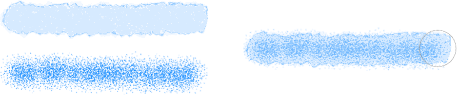

# Painting pixel brush strokes

You can use Pixel Persona to add photo-realistic textures to your vector designs using pixel brushes. Alternatively, you can use basic hard- and soft-edged pixel brushes to add shadows and highlights to your work.

*Before and after adding brush textures clipped to vector shapes.*

## Brushes

Affinity Designer provides an impressive selection of pixel brush designs for use with your Paint Brush Tool. Each category contains brushes of varying properties and characteristics.

You can also create your own pixel brushes to assist with your design work. If you want to save a brush, these can be stored in the panel as a custom brush for future use.

> **Tip:** [Clipping pixel brush strokes to vector objects](../07-layers/10-layer-clipping.md) helps to create shadows and highlights efficiently.

## Multi-brushes

This feature allows any brush to have one or more additional *sub brushes* attached to it. The sub brushes will draw over the top of the base brush as the stroke is applied. It is intended to introduce more nib variety, randomness and character to your brush stroke appearance (avoiding repetitive texture tiling) so the results are more varied and natural. Each sub brush can have a fully separate and customisable set of dynamics. You can control where the sub brushes are drawn on the stroke and how they blend with the main brush.

Sub-brushes can be created from an existing brush or as a new brush by accessing the Sub-brushes tab in the Brush - Editing dialog (double-click a pixel brush in the panel to view). You can drag and drop existing brushes from the same **Brushes** panel category directly into the tab's Sub Brushes list. Change the order in which they are added to the main brush by dragging them up or down in the list.

*Single brush strokes (left) and multi-brush stroke equivalents (right).*

**macOS:**

> **Note:** For best performance, use Metal acceleration (if available).

**Windows:**

> **Note:** For best performance, use a computer with high-end QuadCore CPUs (or better).

**

 To paint pixel brush strokes:**

1. Use the **Layers** panel to select the pixel layer that you want to work on, or create a new pixel layer.
2. From the **Tools** panel, select the **Paint Brush Tool**.
   Do one of the following:
   - On the **Brushes** panel, select a brush thumbnail of your choice. The tool uses a soft-round brush by default.
  - 

     To continue with a previously used brush (current session only): On the **Layers** panel, select **Recent brushes** on the layer entry and select a brush thumbnail from the pop-up menu.

  Adjust the context toolbar settings.
  Select a stroke colour from the **Colour** panel.
  Drag on the page in the direction that you want the brush stroke to follow.

By default, if you switch away from a brush tool, when you return to it the last used brush will be remembered (even any modified settings), with the Brushes panel automatically scrolling to the brush; switching across brush categories is automatic. You can switch off auto-scrolling/auto-switching in the Brushes panel's preferences if needed.

> **Tip:** If the selected brush tool does not paint anything, check for a **Protect alpha** option on the context toolbar. When that is enabled, the brush will not paint on the current layer’s transparent regions, only those that are opaque.

**To smooth brush strokes as you paint:**

- On the context toolbar, enable the **Stabiliser** option and choose one of the following:
   - **Rope mode**—drag the stroke end by a 'rope' that smooths the stroke but lets you introduce sharp corners at increasing **Length** (radius) values by redirecting the slackened rope.
  - **Window mode**—smooths the stroke by averaging the stroke's position over a **Window** whose size is configurable.

> **Note:** ### Modifier keys
>
>
> When using the Paint Brush Tool, the following modifier keys can be used:
>
>
> - To draw a straight brush stroke, lay down your initial stroke, then `Shift`-click at the position where your stroke is to end; keep the key pressed to continue the straight line stroke.
> - To constrain a stroke to the X-axis or Y-axis, press the `Shift`  immediately after your initial stroke is laid down, then drag along the X or Y axis to the position where your stroke is to end; keep the key pressed to continue the stroke.
> - Hold the `Alt`  and press the left mouse button to pick up a new colour under the brush to paint with.
> - Pressing `Alt`  while selecting a new raster brush retains the previous brush's width.
> - To ignore the associated tool while selecting a brush, press `Shift` and `Alt` s together.
> - Press the `Ctrl` and `Alt` s together and:
>    - Click to cycle between width and hardness, shape and spacing, and rotation attributes.
>   - Drag left/right or up/down to adjust the corresponding attribute. For example, with width and hardness attributes selected, drag left/right to adjust the first attribute and up/down to adjust the second attribute.
> - Press the `Cmd` and `Alt` s together and:
>    - Click to cycle between width and hardness, shape and spacing, and rotation attributes.
>   - Drag left/right or up/down to adjust the corresponding attribute. For example, with width and hardness attributes selected, drag left/right to adjust the first attribute and up/down to adjust the second attribute.
> - To change flow instead, hold the `Ctrl`  and press a number key.

> **Preferences:** ### Settings (or Preferences)
>
>
> Related behaviours can be adjusted from [the app's settings](../27-settings-preferences/01-settings-preferences.md):
>
>
> - **Miscellaneous>Reset Fills**
> - **Miscellaneous>Reset Brushes**
> - **User Interface>Show brush previews**
> - **User Interface>Always show brush crosshair**

#### SEE ALSO:

- [Paint Brush Tool](../22-tools/design-tools/21-paint-brush-tool.md)
- [Brushes panel](../23-panels/04-brushes-panel.md)
- [Modifying pixel brushes](02-modifying-pixel-brushes.md)
- [Keyboard shortcuts for painting operations](../26-keyboard-shortcuts/01-keyboard-shortcuts.md)
