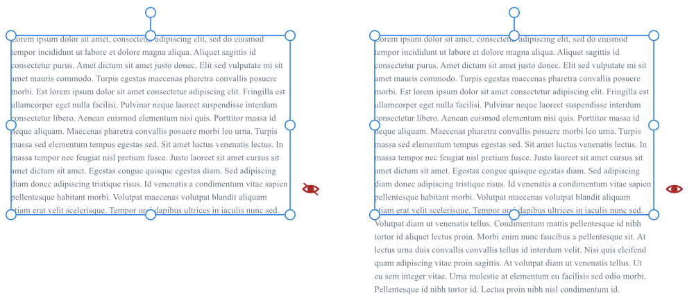
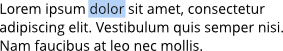
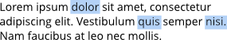
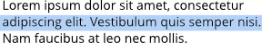
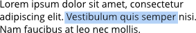
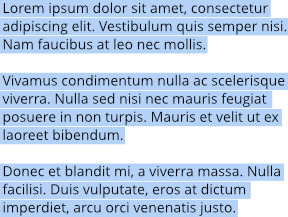

# Working with text

There are several varieties of text, Art, Frame, Path and Shape, to give you flexibility when working with typography.

Text objects contain both character and paragraph elements, making it easy to modify standard text attributes such as font, size, format, and alignment. All text types have quick access settings on the context toolbar and supporting panels and dialogs for more extensive, advanced options.

When [snapping](../17-design-aids/11-snapping.md) is switched on, the baseline of the first line in a text object will snap to the baseline of the first line in other text objects.

When performing text editing, Designer supports all standard text selection and formatting techniques and shortcuts.

The unique features of artistic text, frame text and path text are discussed in the [Artistic text](03-artistic-text.md), [Frame text](04-frame-text.md), [Text on a path](05-text-on-a-path.md) and [Shape text](06-shape-text.md) topics.

> **Note:** If you're opening Affinity documents or vector images (containing text) from another computer, the original fonts used may be missing from your computer. If so, you'll get a **Document Contains Missing Fonts** alert. The font will be substituted for a replacement system font at this time.
>
>
> When text using the missing font is selected in your document, its font name will be prefixed with a '?' on the context toolbar and on the **Character** panel.
>
>
> **macOS:**
>
> When opening a document which uses a *downloadable* font (not installed locally in macOS by default), you'll get a prompt to download it—simply click **Download** to install to macOS. Affinity Designer will then use the installed font as it would with any other font.

> **Tip:** If you're designing before full copy has been written, you can use placeholder (filler) text within your text frames to help you progress with your project. Filler text can be inserted from the **Text** menu.

> **Tip:** By default, the size of text is expressed in points, regardless of the units set within your document. If you wish text size to reflect document units, this can set in [Settings (or Preferences)](../27-settings-preferences/01-settings-preferences.md).

> **Note:** By default, all text objects are created with a blend gamma of 1.45. This can be changed in [Settings (or Preferences)](../27-settings-preferences/01-settings-preferences.md) (**Tools** section) or [modified for individual objects](../07-layers/08-layer-blend-ranges.md).

> **Note:** If there's too much text to fit in a frame, any overflowing text will be stored in an invisible overflow area. To indicate overflowing text, an adjacent eye icon appears, allowing you to show or hide the overflowing text.

**

 

 

 To select text objects for formatting:**

- With the **Move Tool** selected, do one of the following:
   - Click a text object to make formatting changes to all the text within the text object.
  - Double-click a text object to make formatting changes to sections of text within the text object.
- With either of the text tools selected, click a text object to make formatting changes to sections of text within the text object.

**To select text on the page:**

Do one of the following:

| To select... | Action | Example |
| --- | --- | --- |
| a single word | double-click |  |
| multiple words | double-click with the `Cmd`  pressed |  |
| a line | triple-click |  |
| a text range | drag with cursor. Use Shift key to select text between two insertion points. |  |
| a paragraph | quadruple-click |  |
| all paragraphs | quintuple-click |  |

**To move text:**

- With a single word, paragraph, or portion of text selected, drag and drop it where you would like to place it.

**To edit text on the page:**

1. Do one of the following:
   - Select any text tool, then click (or drag) in the text object. A standard insertion point appears at the click position.
  - Select a single word, paragraph or portion of text (see above).
2. Type to insert new text or overwrite selected text, respectively.

> **Preferences:** ### Settings (or Preferences)
>
>
> Related behaviours can be adjusted from [the app's settings](../27-settings-preferences/01-settings-preferences.md):
>
>
> - **Miscellaneous>Reset Fonts**
> - **User Interface>Show Text in points**
> - **User Interface>Always use white background for Font dropdown**

#### SEE ALSO:

- [Artistic text](03-artistic-text.md)
- [Frame text](04-frame-text.md)
- [Importing text](02-importing-text.md)
- [Path text](05-text-on-a-path.md)
- [Shape text](06-shape-text.md)
- [Character formatting](07-character-formatting.md)
- [Paragraph formatting](08-paragraph-formatting.md)
- [Style Picker Tool](../22-tools/design-tools/18-style-picker-tool.md)
- [Artistic Text Tool](../22-tools/text-tools/01-artistic-text-tool.md)
- [Frame Text Tool](../22-tools/text-tools/02-frame-text-tool.md)
- [Glyph Browser panel](../23-panels/08-glyph-browser-panel.md)
- [Keyboard shortcuts for working with text](../26-keyboard-shortcuts/01-keyboard-shortcuts.md)
