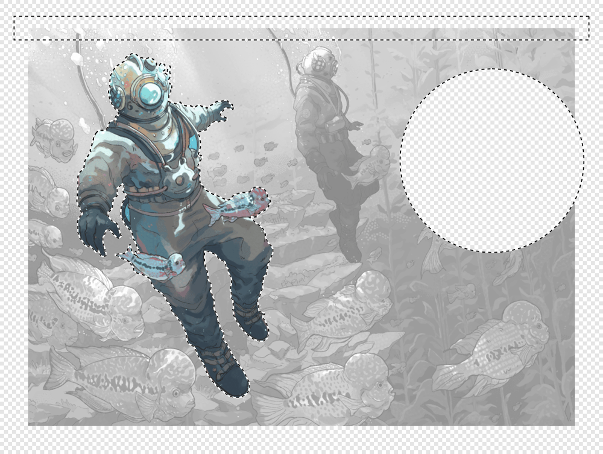

# 

 Creating pixel selections

Pixel selections can be created for focussed editing of specific pixel regions. Selection boundaries are defined depending on whether individual pixels are included or excluded.

A pixel selection is simply a drawn area on your image (bounded by a flashing dashed line, often called 'marching ants'). Various tools for pixel selections are available in the Pixel Persona. A selection is created for various reasons:

- To limit editing (e.g., painting, applying fills, etc.) to within that selection area only.
- To selectively copy pixels.
- As a precursor to creating a mask layer.
- To draw areas for removal (cutout).

Selection boundaries are defined depending on whether individual pixels are included or excluded.

Once your selection has been created, you can invert it so all included pixels are excluded and vice versa.

## Selection tools

You can create a pixel selection using the [Selection Brush Tool](../22-tools/selection-tools/03-selection-brush-tool.md) or [Marquee Selection Tools](../22-tools/selection-tools/02-marquee-selection-tools.md) or base it on a layer. Using the [Flood Select Tool](../22-tools/selection-tools/01-flood-select-tool.md), you can also define a selection of similar colour value pixels with a single click. Selections created using the Marquee tools align to individual pixels.

Once your selection has been created, you can invert it so all included pixels are excluded and vice versa.

There are several tools you can use to create pixel selections:

- 

   **Selection Brush Tool** (see [Selection Brush Tool](../22-tools/selection-tools/03-selection-brush-tool.md))
- 

   **Flood Select Tool** (see [Flooding pixel selections](07-flooding-pixel-selections.md))
- 

   **Rectangular Marquee Tool**
- 

   **Elliptical Marquee Tool**
- 

   **Column Marquee Tool**
- 

   **Row Marquee Tool**
- 

   **Freehand Selection**

## Selection modes

When working with, and creating, selections, you may have access to the following **Modes** which affect how your selection develops:

- 

   **New**—cancels all current selections and creates a new selection.
- 

   **Add**—adds areas to the current selection. If there is no selection in place, a new selection will be created.
- 

   **Subtract**—removes areas from the current selection.
- 

   **Intersect**—a new selection area is created from the overlap between the newly added selection area and the current selection.

**

 To paint a pixel selection:**

1. From the **Tools** panel, select the **Selection Brush Tool**.
2. Adjust the settings on the context toolbar.
3. Drag on your page.

> **Note:** ### Modifier keys
>
>
> When using the Selection Brush Tool, the following modifier keys can be used to aid in the creation of selections:
>
>
> - The `Cmd`  temporarily toggles **Snap to edges** setting.
> - The `Ctrl`  automatically adds areas to the current selection.
> - The `Alt`  automatically removes areas from the current selection.
> - Drag with left and right button down to automatically add areas to the current selection.

**

 

 

 

 To create a pixel selection using a Marquee Selection tool:**

1. From the **Tools** panel, select the **Rectangular**, **Elliptical**, **Row** or **Column Marquee Tool**.
2. Adjust the settings on the context toolbar.
3. Drag on your page.

> **Note:** ### Modifier keys
>
>
> When using the Marquee Selection tools, the following modifier keys can be used to aid in the creation of selections:
>
>
> - The `Shift`  constrains the marquee's proportions.
> - The `Ctrl`  automatically adds areas to the current selection.
> - The `Alt`  automatically removes areas from the current selection.
> - Drag with left and right button down to automatically add areas to the current selection.
> - The `Spacebar` repositions a rectangular or elliptical marquee selection as it is being drawn.

**

 To draw a pixel selection:**

1. From the **Tools** panel, select the **Freehand Selection Tool**.
2. On the context toolbar, choose a selection **Type**.
3. Do one of the following:
   - With **Freehand** selected, drag on the page to draw the edge of the selection and release to close the selection.
  - With **Polygon** selected, click to define the beginning of the selection and then click for every change in direction.
  - With **Magnetic** selected, click to define the beginning of the selection and then click to place a custom node position. Automatic nodes will be placed along distinct image edges as the cursor moves.
4. Double-click to close the selection (**Polygon** and **Magnetic** only).

> **Note:** ### Modifier keys
>
>
> When using the Freehand Selection Tool, the following modifier keys can be used to aid in the creation of selections:
>
>
> - The `Shift`  temporarily switches to **Polygonal** if using **Freehand**.
> - The `Shift`  temporarily switches between **Polygonal** and **Magnetic**.
> - If using **Polygonal** and **Magnetic**, dragging will temporarily invoke **Freehand**.

**To create a pixel selection from a layer:**

- On the **Layers** panel, click the chosen layer's thumbnail while pressing the `Cmd` .

**To remove a pixel selection:**

- From the **Select** menu, select **Deselect**.

**To invert a marquee selection:**

- With a selection in place, from the **Select** menu, select **Invert Pixel Selection**.

#### SEE ALSO:

- [Range pixel selections](02-range-pixel-selections.md)
- [Sampled colour pixel selections](03-sampled-colour-pixel-selections.md)
- [Modifying pixel selections](04-modifying-pixel-selections.md)
- [Marquee Selection Tools](../22-tools/selection-tools/02-marquee-selection-tools.md)
- [Selection Brush Tool](../22-tools/selection-tools/03-selection-brush-tool.md)
- [Flood Select Tool](../22-tools/selection-tools/01-flood-select-tool.md)
- [Keyboard shortcuts for selection](../26-keyboard-shortcuts/01-keyboard-shortcuts.md)
