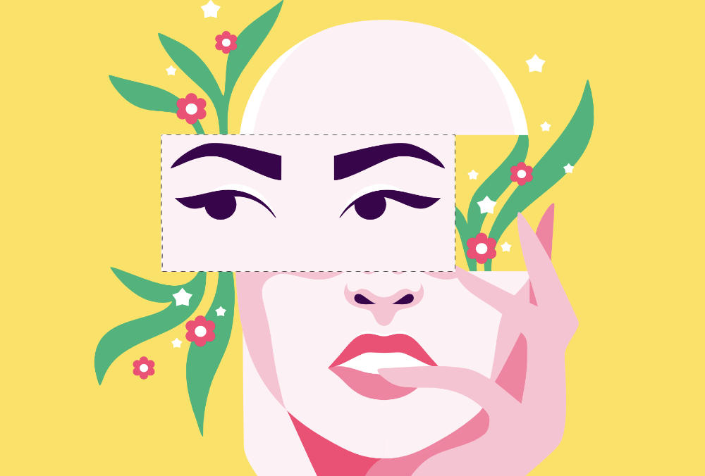

# 

 Modifying pixel selections

In the Pixel Persona, once you have a pixel selection in place, it can be modified in several ways.

You can modify your pixel selection by enlarging or shrinking it, applying a feather to its edge, and/or by smoothing its curve. These options are available from the **Select** menu as **Grow/Shrink**, **Feather**, and **Smooth**, respectively.

### Settings

The following settings can be adjusted from the relevant dialogs:

- **Radius**—controls the extent of the effect.
   - Negative values for **Grow/Shrink** will shrink the selection while positive values enlarge it.
- **Circular**—if this option is unchecked (default), resizing honours the original selection shape. When checked, the selection shape is made more rounded with increasing Radius values.

> **Tip:** Feathering can also be applied to a selection from the context toolbar.

> **Note:** In addition to the modifications discussed here, you can also [refine the edges of your selection](05-refining-pixel-selection-edges.md). This option is available from the context toolbar and the **Select** menu.

#### SEE ALSO:

- [Creating pixel selections](01-creating-pixel-selections.md)
- [Refining pixel selection edges](05-refining-pixel-selection-edges.md)
